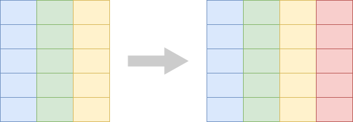

```{r setup, include=FALSE, echo=FALSE}
options(htmltools.dir.version = FALSE)
knitr::opts_chunk$set(comment = "")

library(tidyverse)
library(palmerpenguins)
library(xaringanExtra)
#xaringanExtra::use_scribble()
# ggplot2 settings so plots scale well for slide size 
theme_set(theme_gray(16))
update_geom_defaults("point", list(size = 2))
```


## Elementare Datenmanipulationen

--

- Zeilen auswählen: `filter()`

--

- Spalten auswählen: `select()`

--

- Zeilen sortieren: `arrange()`

--

- Dinge zählen: `count()`

--

- Neue Spalten erstellen: `mutate()`

---
class: center, middle

# Aber zuerst: Der Pipe Operator `%>%`

---
class: center, middle

# `%>%` wird gesprochen als "und dann"

---

## Die Pipe `%>%` füttert Daten in Funktionen

.tiny-font[
```{r}
head(penguins)
```
]

---

## Die Pipe `%>%` füttert Daten in Funktionen

.tiny-font[
```{r}
# head(penguins)

penguins %>%
  head()
```
]


---

## Die Pipe `%>%` füttert Daten in Funktionen

.tiny-font[
```{r penguins-scatter, eval = FALSE}
ggplot(penguins, aes(bill_length_mm, bill_depth_mm, color = species)) + geom_point()
```
]

.center[
```{r penguins-scatter-out, ref.label = "penguins-scatter", echo = FALSE, warning=FALSE, fig.width=6, fig.asp = 0.618, dev = "svg"}
```
]


---

## Die Pipe `%>%` füttert Daten in Funktionen

.tiny-font[
```{r penguins-scatter2, eval = FALSE}
# ggplot(penguins, aes(bill_length_mm, bill_depth_mm, color = species)) + geom_point()

penguins %>%
  ggplot(aes(bill_length_mm, bill_depth_mm, color = species)) + geom_point()
```
]

.center[
```{r penguins-scatter2-out, ref.label = "penguins-scatter2", echo = FALSE, warning=FALSE, fig.width=6, fig.asp = 0.618, dev = "svg"}
```
]

---

## Zeilen aus einer Tabelle auswählen: `filter()`

<br>

.center[
</img>
]


---

## Pinguine der Gentoo-Art auswählen

.tiny-font[
```{r}
penguins %>%
  filter(species == "Gentoo")
```
]

---

## Pinguine mit Schnabellänge > 50 mm auswählen

.tiny-font[
```{r}
penguins %>%
  filter(bill_length_mm > 50)
```
]

---

## Spalten aus einer Tabelle auswählen: `select()`

<br>

.center[
</img>
]


---

## Spalten `species`, `island` und `sex` auswählen

.tiny-font[
```{r}
penguins %>%
  select(species, island, sex)
```
]

---

## Tabellenzeilen sortieren: `arrange()`

<br>

.center[
</img>
]

---

## Pinguine nach Schnabellänge sortieren, aufsteigend

.tiny-font[
```{r}
penguins %>%
  arrange(bill_length_mm)
```
]

---

## Pinguine nach Schnabellänge sortieren, absteigend

.tiny-font[
```{r}
penguins %>%
  arrange(desc(bill_length_mm))
```
]


---

## Dinge zählen

.tiny-font[
```{r}
penguins
```
]

---

## Dinge zählen

.tiny-font[
```{r eval = FALSE}
penguins %>%
  count(species)
```

```{r echo = FALSE}
# for some reason this data frame has row names, which are indicated with
# an asterisk, which shows up as a highlighted row
x <- penguins %>%
  count(species)

row.names(x) <- NULL
x
```
]

---

## Dinge zählen

.tiny-font[
```{r}
penguins %>%
  count(species, island)
```
]

---

## Die Pipe nutzen um Analyse Pipelines zu bauen

.tiny-font[
```{r}
penguins %>%
  filter(species == "Adelie")
```
]

---

## Die Pipe nutzen um Analyse Pipelines zu bauen

.tiny-font[
```{r}
penguins %>%
  filter(species == "Adelie") %>%
  select(island, sex)
```
]


---

## Die Pipe nutzen um Analyse Pipelines zu bauen

.tiny-font[
```{r}
penguins %>%
  filter(species == "Adelie") %>%
  select(island, sex) %>%
  count(island, sex)
```
]

---
## Eine neue Tabellenspalte anlegen: `mutate()`

<br>

.center[
</img>
]

---

## Beispiel: Flügellänge in cm

.tiny-font[
```{r}
penguins %>%
  select(species, island, flipper_length_mm)
```
]

---

## Beispiel: Flügellänge in cm

.tiny-font[
```{r}
penguins %>%
  select(species, island, flipper_length_mm) %>%
  mutate(flipper_length_cm = flipper_length_mm / 10)
```
]

---

## Mehrere Spalten auf einmal anlegen

.tiny-font[
```{r}
penguins %>%
  select(species, island, flipper_length_mm) %>%
  mutate(
    flipper_length_cm = flipper_length_mm / 10,  # <- hier steht ein Komma
    flipper_length_inches = flipper_length_mm / 25.4
  )
```
]


---

## Weitere Literatur

- R for Data Science: [Kapitel 5: Data transformation](https://r4ds.had.co.nz/transform.html)
- R for Data Science: [Kapitel 18: Pipes](https://r4ds.had.co.nz/pipes.html)
- **dplyr** documentation: [Introduction to dplyr](https://dplyr.tidyverse.org/articles/dplyr.html)
- **dplyr** reference documentation: [One table verbs](https://dplyr.tidyverse.org/reference/index.html#section-one-table-verbs)


