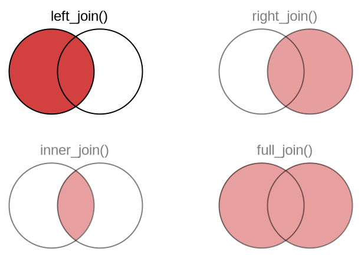

```{r setup, include=FALSE, echo=FALSE}
options(htmltools.dir.version = FALSE)
knitr::opts_chunk$set(comment = "")
library(xaringanExtra)
#xaringanExtra::use_scribble()
library(tidyverse)
library(palmerpenguins)
```


## Elementare Datenmanipulationen

.pull-left[
Letzte Sitzung:

- Zeilen auswählen: `filter()`
- Spalten auswählen: `select()`
- Zeilen sortieren: `arrange()`
- Dinge zählen: `count()`
- Neue Spalten erstellen: `mutate()`
]

---

## Elementare Datenmanipulationen

.pull-left[
Letzte Sitzung:

- Zeilen auswählen: `filter()`
- Spalten auswählen: `select()`
- Zeilen sortieren: `arrange()`
- Dinge zählen: `count()`
- Neue Spalten erstellen: `mutate()`
]

.pull-right[
Diese Sitzung:

- Teilmengen analysieren:<br>`group_by()` und `summarize()`
]

---

## Elementare Datenmanipulationen

.pull-left[
Letzte Sitzung:

- Zeilen auswählen: `filter()`
- Spalten auswählen: `select()`
- Zeilen sortieren: `arrange()`
- Dinge zählen: `count()`
- Neue Spalten erstellen: `mutate()`
]

.pull-right[
Diese Sitzung:

- Teilmengen analysieren:<br>`group_by()` und `summarize()`
- Daten umformen:<br>`pivot_wider()`, `pivot_longer()`
]

---

## Elementare Datenmanipulationen

.pull-left[
Letzte Sitzung:

- Zeilen auswählen: `filter()`
- Spalten auswählen: `select()`
- Zeilen sortieren: `arrange()`
- Dinge zählen: `count()`
- Neue Spalten erstellen: `mutate()`
]

.pull-right[
Diese Sitzung:

- Teilmengen analysieren:<br>`group_by()` und `summarize()`
- Daten umformen:<br>`pivot_wider()`, `pivot_longer()`
- Datensätze kombinieren:<br>`left_join()`, `inner_join()`, `...`
]

---

## Teilmengen analysieren: `group_by()` und `summarize()`

<br>

.center[
</img>
]

---

## Beispielanwendung für Gruppierung: Zählen

Bisher haben wir so gezählt:

.tiny-font[

```{r eval = FALSE}
penguins %>%
  count(species)
```

```{r echo = FALSE}
# for some reason this data frame has row names, which are indicated with
# an asterisk, which shows up as a highlighted row
x <- penguins %>%
  count(species)

row.names(x) <- NULL
x
```
]

--

Jetzt machen wir es auf dem komplizierten Weg


---

## Beispielanwendung für Gruppierung: Zählen

Schauen wir uns noch mal die Rohdaten an:

.tiny-font[

```{r}
penguins
```
]


---

## Beispielanwendung für Gruppierung: Zählen

Jetzt gruppieren wir die Daten:

.tiny-font[

```{r}
penguins %>%
  group_by(species)
```
]


---

## Beispielanwendung für Gruppierung: Zählen

Und zusammenfassenm mit `summarize`:

.tiny-font[

```{r eval = FALSE}
penguins %>%
  group_by(species) %>%
  summarize(
    n = n()  # n() gibt die Anzahl der Daten pro Gruppe zurück
  )
```

```{r echo = FALSE}
# remove row names
x <- penguins %>%
  group_by(species) %>%
  summarize(
    n = n()
  )

row.names(x) <- NULL
x
```

]


---

## Beispielanwendung für Gruppierung: Zählen

Jetzt gruppieren wir mit mehreren Variablen:

.tiny-font[

```{r}
penguins %>%
  group_by(species, island)
```
]

---

## Beispielanwendung für Gruppierung: Zählen

Und zusammenfassen:

.tiny-font[

```{r}
penguins %>%
  group_by(species, island) %>%
  summarize(
    n = n()  # n() gibt die Anzahl der Daten pro Gruppe zurück
  )
```

]


---

## Beispielanwendung für Gruppierung: Zählen

`count(...)` ist eine Abkürzung für `group_by(...) %>% summarize(n = n())`

--

.tiny-font.pull-left[

```{r eval = FALSE}
penguins %>%
  count(species)
```

```{r echo = FALSE}
# remove row names
x <- penguins %>%
  count(species)

row.names(x) <- NULL
x
```

]

--

.tiny-font.pull-right[

```{r eval = FALSE}
penguins %>%
  group_by(species) %>%
  summarize(
    n = n()
  )
```

```{r echo = FALSE}
# remove row names
x <- penguins %>%
  group_by(species) %>%
  summarize(
    n = n()
  )

row.names(x) <- NULL
x
```

]

--

Die Ausgabe ist exakt gleich

---

## Viele Zusammenfassungen in einem Schritt

--

.tiny-font[

```{r eval = FALSE}
penguins %>%
  group_by(species) %>%
  summarize(
    n = n(),                                      # Anzahl der Pinguine
    mean_mass = mean(body_mass_g),                # Durchschnitt des Gewichts
    max_flipper_length = max(flipper_length_mm),  # Maximum der Flügellänge
    percent_female = sum(sex == "female")/n()     # Anteil weibliche Pinguine in Prozent
  )
```
]

--

.tiny-font[

```{r echo = FALSE}
# remove row names
x <- penguins %>%
  group_by(species) %>%
  summarize(
    n = n(),                                      # number of penguins
    mean_mass = mean(body_mass_g),                # mean body mass
    max_flipper_length = max(flipper_length_mm),  # max flipper length
    percent_female = sum(sex == "female")/n()     # percent of female penguins
  )

row.names(x) <- NULL
x
```

]

--

Jede Zeile in `summarize()` erzeugt eine neue Spalte

--

Aber warum so viele `NA`s?

---

## Viele Zusammenfassungen in einem Schritt

.tiny-font[

```{r eval = FALSE}
penguins %>%
  group_by(species) %>%
  summarize(
    n = n(),
    mean_mass = mean(body_mass_g, na.rm = TRUE),
    max_flipper_length = max(flipper_length_mm, na.rm = TRUE),
    percent_female = sum(sex == "female", na.rm = TRUE)/sum(!is.na(sex))
  )
```
]

.tiny-font[

```{r echo = FALSE}
# remove row names
x <- penguins %>%
  group_by(species) %>%
  summarize(
    n = n(),
    mean_mass = mean(body_mass_g, na.rm = TRUE),
    max_flipper_length = max(flipper_length_mm, na.rm = TRUE),
    percent_female = sum(sex == "female", na.rm = TRUE)/sum(!is.na(sex))
  )

row.names(x) <- NULL
x
```

]

Wir müssen R sagen, wie es mit `NA`s umgeht

---

## Umformen: `pivot_wider()` und `pivot_longer()`

<br>

.center[
</img>
]


---

## Umformungsbeispiel: Eine breite Zusammenfassungstabelle anlegen


.tiny-font[

```{r}
penguins %>%
  count(species, island)
```
]

---

## Umformungsbeispiel: Eine breite Zusammenfassungstabelle anlegen

.tiny-font[

```{r}
penguins %>%
  count(species, island) %>%
  pivot_wider(names_from = "island", values_from = "n")
```
]

Die `NA`s bedeuten, dass hier keine Fälle existieren

---

## Und zurück ins lange Format

.tiny-font[

```{r}
penguins_wide <- penguins %>%
  count(species, island) %>%
  pivot_wider(names_from = "island", values_from = "n")

penguins_wide %>% 
  pivot_longer(cols = -species, names_to = "island", values_to = "n")
```
]


---

## Und zurück ins lange Format

Spaltenspezifikation funktioniert wie in `select()`:

.tiny-font[

```{r}
# specify columns by subtraction
penguins_wide %>% 
  pivot_longer(cols = -species, names_to = "island", values_to = "n")
```
]


---

## Und zurück ins lange Format

Spaltenspezifikation funktioniert wie in `select()`:

.tiny-font[

```{r}
# specify columns by explicit listing
penguins_wide %>% 
  pivot_longer(cols = c(Biscoe, Dream, Torgersen), names_to = "island", values_to = "n")
```

]

---

## Und zurück ins lange Format

Spaltenspezifikation funktioniert wie in `select()`:

.tiny-font[

```{r}
# specify columns by range
penguins_wide %>% 
  pivot_longer(cols = Biscoe:Torgersen, names_to = "island", values_to = "n")
```

]


---

## Datensätze kombinieren: joins

.center[
</img>
]


---

## Beispiel: Bandmitglieder und ihre Instrumente

.tiny-font.pull-left[
```{r}
# Ein paar berühmte Bandmitglieder
band_members
```
]

--

.tiny-font.pull-right[
```{r}
# Instrumente von einigen Bandmitgliedern
band_instruments
```
]

--

.tiny-font[
```{r}
left_join(band_members, band_instruments) # rechte Tabelle an linke Tabelle joinen
```
]

---

## Beispiel: Bandmitglieder und ihre Instrumente

.tiny-font.pull-left[
```{r}
# Ein paar berühmte Bandmitglieder
band_members
```
]

.tiny-font.pull-right[
```{r}
# Instrumente von einigen Bandmitgliedern
band_instruments
```
]

.tiny-font[
```{r}
right_join(band_members, band_instruments) # rechte Tabelle an linke Tabelle joinen
```
]


---

## Beispiel: Bandmitglieder und ihre Instrumente

.tiny-font.pull-left[
```{r}
# Ein paar berühmte Bandmitglieder
band_members
```
]

.tiny-font.pull-right[
```{r}
# Instrumente von einigen Bandmitgliedern
band_instruments
```
]

.tiny-font[
```{r}
inner_join(band_members, band_instruments) # nur Schnittmenge behalten
```
]


---

## Example: band members and their instruments

.tiny-font.pull-left[
```{r}
# Ein paar berühmte Bandmitglieder
band_members
```
]

.tiny-font.pull-right[
```{r}
# Instrumente von einigen Bandmitgliedern
band_instruments
```
]

.tiny-font[
```{r}
full_join(band_members, band_instruments) # alle Fälle zusammenführen
```
]


---

## Die verschiedenen joins auf einen Blick

.center[
</img>
]


---

## Die verschiedenen joins auf einen Blick

</img>

<br>

**Tip:** Im Zweifelsfall, `left_join()` verwenden

--

Die Funktion `left_join()` ist in 70–80% der Fälle der richtige Join.

---

## Weitere Literatur

- R for Data Science: [Kapitel 5.6: Grouped summaries with `summarise()`](https://r4ds.had.co.nz/transform.html?q=group_by#grouped-summaries-with-summarise)
- R for Data Science: [Kapitel 12.3: Pivoting](https://r4ds.had.co.nz/tidy-data.html?q=pivot#pivoting)
- R for Data Science: [Kapitel 13: Relational data](https://r4ds.had.co.nz/relational-data.html)
- **dplyr** documentation: [Grouped data](https://dplyr.tidyverse.org/articles/grouping.html)
- **tidyr** documentation: [Pivoting](https://tidyr.tidyverse.org/articles/pivot.html)
- **dplyr** documentation: [Mutating joins](https://dplyr.tidyverse.org/articles/two-table.html#mutating-joins-1)


