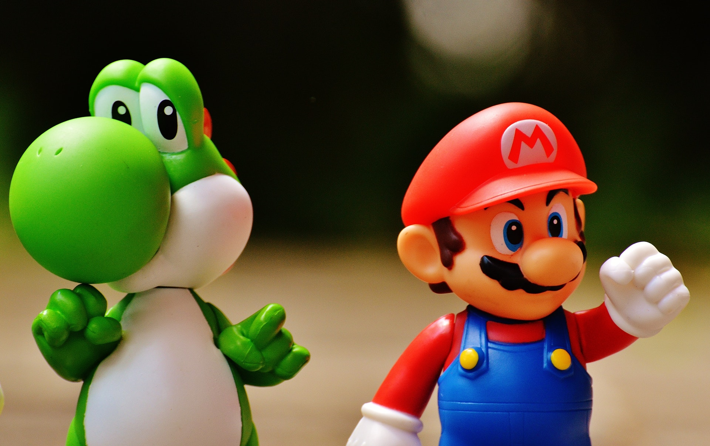
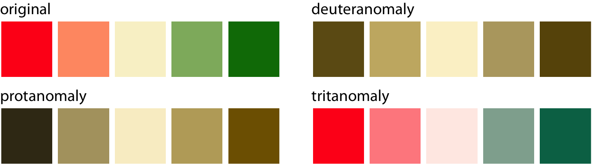
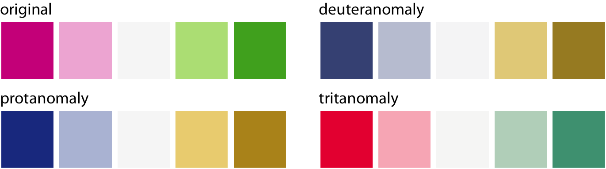

```{r setup, include=FALSE, echo=FALSE, message = FALSE}
options(htmltools.dir.version = FALSE)
knitr::opts_chunk$set(comment = "")

library(tidyverse)
library(colorspace)
library(cowplot)
library(here)

# ggplot2 settings so plots scale well for slide size 
theme_set(theme_gray(16)) # 16 for full width, 18 for half width 
update_geom_defaults("point", list(size = 2.0)) # 2 for full width, 2.5 for half width

# color space plot theme
theme_colorspace <- function(size = 12) {
  theme_minimal_grid(size, line_size = 0.2) +
  panel_border(color = "black", size = 0.4) +
  theme(
    axis.ticks.length = grid::unit(0, "pt"),
    axis.ticks = element_line(size = 0.2, color = "black"),
    strip.text = element_text(size = size)
  )
}
```

class: center middle

## Wie stellt der Computer Farben dar?

---

## Der RGB-Farbraum

.pull-left.width-50[
- rot R (0-255): Menge an rotem Licht

- grün G (0-255): Menge an grünem Licht

- blau B (0-255): Menge an blauem Licht
]

--

.pull-right.move-down-1em[

R | G | B | hex code | &nbsp;&nbsp;&nbsp;&nbsp;&nbsp;&nbsp;Farbe&nbsp;&nbsp;&nbsp;&nbsp;&nbsp;&nbsp;
---| --- | --- | --- | ---
0  | 0 | 0 | #000000 | <div style = "background-color: #000000;">&nbsp;</div>
255  | 0 | 0 | #FF0000 | <div style = "background-color: #FF0000;">&nbsp;</div>
0  | 255 | 255 | #00FFFF | <div style = "background-color: #00FFFF;">&nbsp;</div>
128  | 128 | 128 | #808080 | <div style = "background-color: #808080;">&nbsp;</div>
0 | 158 | 115 | #009E73 | <div style = "background-color: #009E73;">&nbsp;</div>
255 | 255 | 255 | #FFFFFF | <div style = "background-color: #FFFFFF;">&nbsp;</div>
]

---

## Der RGB-Farbraum

.center[
```{r rgb-viz, echo = FALSE, cache = params$cache, fig.width = 10, fig.asp = .5, dev = "svg"}
rgb_by_b <- expand_grid(
  R = seq(0, 255, by = 2),
  G = seq(0, 255, by = 2),
  B = seq(0, 255, by = 35)
)

rgb_by_b$hex <- hex(sRGB(as.matrix(rgb_by_b)/255))

rgb_by_b %>%
  ggplot(aes(R, G, fill = hex)) +
  geom_raster(na.rm = TRUE) +
  scale_fill_identity() +
  scale_x_continuous(
    name = "rot R",
    breaks = (0:5)*50,
    labels = c("0", "", "100", "", "200", "")
  ) +
  scale_y_continuous(
    name = "grün G",
    breaks = (0:5)*50,
    labels = c("0", "", "100", "", "200", "")
  ) +
  facet_wrap(
    vars(B),
    ncol = 4,
    labeller = as_labeller(function(x) glue::glue("blau B = {x}"))
  ) +
  coord_fixed(expand = FALSE) +
  theme_colorspace() +
  theme(axis.ticks.length = grid::unit(3, "pt"))
```
]

---
class: center middle

## Menschen können nicht gut über RGB Farbräume nachdenken

---

## Der HSV-Farbraum

.pull-left[

- hue H (0-360):  
  hue - Farbton

- saturation S (0-1):  
  Sättigung relativ zur Helligkeit der Farbe

- value V (0-1):  
  Subjektive Warhnehmung der Menge an Licht
]

.pull-right.move-up-1em[
```{r hsv-viz-single, echo = FALSE, cache = params$cache, fig.width = 5, fig.asp = 1, dev = "svg"}
hsv_by_h <- expand_grid(
  H = seq(0, 330, by = 30),
  S = seq(0, 1, by = .01),
  V = seq(0, 1, by = .01)
)

hsv_by_h$hex <- hex(HSV(as.matrix(hsv_by_h)))

hsv_by_h %>%
  filter(H == 90) %>%
  ggplot(aes(S, V, fill = hex)) +
  geom_raster(na.rm = TRUE) +
  scale_fill_identity() +
  scale_x_continuous(
    name = "saturation S",
    breaks = (0:4)*.25,
    labels = c("0", "", "0.5", "", "")
  ) +
  scale_y_continuous(
    name = "value V",
    breaks = (0:4)*.25,
    labels = c("0", "", "0.5", "", "1.0")
  ) +
  facet_wrap(
    vars(H),
    ncol = 6,
    labeller = as_labeller(function(x) glue::glue("hue H = {x}"))
  ) +
  coord_fixed(expand = FALSE) +
  theme_colorspace(16) +
  theme(axis.ticks.length = grid::unit(3, "pt"))
```
]


---

## Der HSV-Farbraum

.center[
```{r hsv-viz, echo = FALSE, cache = params$cache, fig.width = 10, fig.asp = .5, dev = "svg"}
hsv_by_h %>%
  ggplot(aes(S, V, fill = hex)) +
  geom_raster(na.rm = TRUE) +
  scale_fill_identity() +
  scale_x_continuous(
    name = "saturation S",
    breaks = (0:4)*.25,
    labels = c("0", "", "0.5", "", "")
  ) +
  scale_y_continuous(
    name = "value V",
    breaks = (0:4)*.25,
    labels = c("0", "", "0.5", "", "1.0")
  ) +
  facet_wrap(
    vars(H),
    ncol = 6,
    labeller = as_labeller(function(x) glue::glue("hue H = {x}"))
  ) +
  coord_fixed(expand = FALSE) +
  theme_colorspace() +
  theme(axis.ticks.length = grid::unit(3, "pt"))
```
]

---

## Der HLS Farbraum

.pull-left[
- hue H (0-360):  
  Farbton

- lightness L (0-1):  
  Helligkeit relativ zur Helligkeit eines ähnlich hellen Weißtons

- saturation S (0-1):  
  Sättigung relativ zur Helligkeit der Farbe
]

.pull-right.move-up-1em[
```{r hls-viz-single, echo = FALSE, cache = params$cache, fig.width = 5, fig.asp = 1, dev = "svg"}
hls_by_h <- expand_grid(
  H = seq(0, 330, by = 30),
  L = seq(0, 1, by = .01),
  S = seq(0, 1, by = .01)
)

hls_by_h$hex <- hex(HLS(as.matrix(hls_by_h)))

hls_by_h %>%
  filter(H == 90) %>%
  ggplot(aes(S, L, fill = hex)) +
  geom_raster(na.rm = TRUE) +
  scale_fill_identity() +
  scale_x_continuous(
    name = "saturation S",
    breaks = (0:4)*.25,
    labels = c("0", "", "0.5", "", "")
  ) +
  scale_y_continuous(
    name = "lightness L",
    breaks = (0:4)*.25,
    labels = c("0", "", "0.5", "", "1.0")
  ) +
  facet_wrap(
    vars(H),
    ncol = 6,
    labeller = as_labeller(function(x) glue::glue("hue H = {x}"))
  ) +
  coord_fixed(expand = FALSE) +
  theme_colorspace(16) +
  theme(axis.ticks.length = grid::unit(3, "pt"))
```

]

---

## Der HLS-Farbraum

.center[
```{r hls-viz, echo = FALSE, cache = params$cache, fig.width = 10, fig.asp = .5, dev = "svg"}
hls_by_h %>%
  ggplot(aes(S, L, fill = hex)) +
  geom_raster(na.rm = TRUE) +
  scale_fill_identity() +
  scale_x_continuous(
    name = "saturation S",
    breaks = (0:4)*.25,
    labels = c("0", "", "0.5", "", "")
  ) +
  scale_y_continuous(
    name = "lightness L",
    breaks = (0:4)*.25,
    labels = c("0", "", "0.5", "", "1.0")
  ) +
  facet_wrap(
    vars(H),
    ncol = 6,
    labeller = as_labeller(function(x) glue::glue("hue H = {x}"))
  ) +
  coord_fixed(expand = FALSE) +
  theme_colorspace() +
  theme(axis.ticks.length = grid::unit(3, "pt"))
```
]

---
class: center middle

## Menschen können weder in HSV noch in HLS gut denken

---

## Der LUV-Farbraum

.pull-left.width-50[

- luminance L (0-100):  
  Menge an Licht

- green/red axis u (approx. -100 to 100):  
  grün/rot Achse U

- blue/yellow axis v (approx. -100 to 100):  
  blau/gelb Achse V
]

.pull-right.move-up-2em[
```{r luv-viz-single, echo = FALSE, cache = params$cache, fig.width = 5, fig.asp = 1, dev = "svg"}
luv_by_l <- expand_grid(
  L = seq(20, 90, by = 10),
  U = seq(-80, 170, by = 1),
  V = seq(-145, 110, by = 1),
)

luv_by_l$hex <- hex(LUV(as.matrix(luv_by_l)))

luv_by_l %>%
  filter(L == 60) %>%
  ggplot(aes(U, V, fill = hex)) +
  geom_raster(na.rm = TRUE) +
  scale_x_continuous(
    name = "green/red axis u",
    breaks = (-3:3)*50,
    labels = c("", "-100", "", "0", "", "100", "")
  ) +
  scale_y_continuous(
    name = "blue/yellow axis v",
    breaks = (-3:3)*50,
    labels = c("", "-100", "", "0", "", "100", "")
  ) +
  scale_fill_identity() +
  facet_wrap(
    vars(L),
    ncol = 4,
    labeller = as_labeller(function(x) glue::glue("luminance L = {x}"))
  ) +
  coord_fixed(expand = FALSE) +
  theme_colorspace(16)
```
]


---

## Der LUV-Farbraum

.center[
```{r luv-viz, echo = FALSE, cache = params$cache, fig.width = 10, fig.asp = .5, dev = "svg"}
luv_by_l %>%
  ggplot(aes(U, V, fill = hex)) +
  geom_raster(na.rm = TRUE) +
  scale_x_continuous(
    name = "green/red axis u",
    breaks = (-3:3)*50,
    labels = c("", "-100", "", "0", "", "100", "")
  ) +
  scale_y_continuous(
    name = "blue/yellow axis v",
    breaks = (-3:3)*50,
    labels = c("", "-100", "", "0", "", "100", "")
  ) +
  scale_fill_identity() +
  facet_wrap(
    vars(L),
    ncol = 4,
    labeller = as_labeller(function(x) glue::glue("luminance L = {x}"))
  ) +
  coord_fixed(expand = FALSE) +
  theme_colorspace()
```
]

---

## Der HCL-Farbraum: Polarkoordinaten in LUV

.center.move-up-1em[
```{r hcl-viz-single, echo = FALSE, cache = params$cache, fig.width = 5.5, fig.asp = 1, dev = "svg"}

rC <- 60
hue_df <- tibble(
  t = seq(0, 2*pi, length.out = 100),
  U = rC*sin(t),
  V = rC*cos(t)
)

chroma_df <- tibble(
  U = 4*rC*sin(pi/3),
  V = 4*rC*cos(pi/3)
)

labels_df <- tibble(
  U = c(1.4*rC*sin(pi/3), 1.01*rC*sin(.8*pi)),
  V = c(1.4*rC*cos(pi/3), 1.01*rC*cos(.8*pi)),
  label = c("chroma C", "hue L")
)

luv_by_l %>%
  filter(L == 60) %>%
  ggplot(aes(U, V)) +
  geom_raster(aes(fill = hex), na.rm = TRUE) +
  geom_segment(
    data = chroma_df,
    aes(x = 0, y = 0, xend = U, yend = V),
    size = 0.2
  ) +
  geom_path(
    data = hue_df,
    size = 0.2
  ) +
  geom_text(
    data = labels_df,
    aes(label = label),
    size = 16*(12/14)/.pt,
    hjust = 0, vjust = 1
  ) +
  scale_x_continuous(
    name = "green/red axis u",
    breaks = (-3:3)*50,
    labels = c("", "-100", "-50", "0", "50", "100", "")
  ) +
  scale_y_continuous(
    name = "blue/yellow axis v",
    breaks = (-3:3)*50,
    labels = c("", "-100", "-50", "0", "50", "100", "")
  ) +
  scale_fill_identity() +
  facet_wrap(
    vars(L),
    ncol = 4,
    labeller = as_labeller(function(x) glue::glue("luminance L = {x}"))
  ) +
  coord_fixed(
    expand = FALSE,
    xlim = c(-65, 145),
    ylim = c(-120, 80)
  ) +
  theme_colorspace(16)
```
]


---

## Der HCL-Farbraum: Polarkoordinaten LUV

.move-up-1em.center[
```{r cl-planes, echo = FALSE, cache = params$cache, fig.width = 9, fig.asp = .6, dev = "svg"}
hcl_by_h <- expand_grid(
  L = seq(1, 99, by = 0.5),
  C = seq(0, 155, by = 1),
  H = seq(0, 330, by = 30)
)

hcl_by_h$hex <- hex(polarLUV(as.matrix(hcl_by_h)))

hcl_by_h %>%
  ggplot(aes(C, L, fill = hex)) +
  geom_raster(na.rm = TRUE) +
  scale_fill_identity() +
  scale_x_continuous(
    name = "chroma C",
    breaks = (0:3)*50,
    labels = c("0", "", "100", "")
  ) +
  scale_y_continuous(
    name = "luminance L",
    limits = c(0, 100),
    breaks = (0:4)*25,
    labels = c("0", "", "50", "", "100")
  ) +
  facet_wrap(
    vars(H),
    ncol = 4,
    labeller = as_labeller(function(x) glue::glue("hue H = {x}"))
  ) +
  coord_fixed(expand = FALSE) +
  theme_colorspace()
```
]

---

## Wir können HCL Farben in R erkunden

```{r eval = FALSE}
colorspace::choose_color()
```

--

</img>

--

</img>

--

</img>

---

## Wichtige Anmerkung: Hohe chroma-Werte eher meiden

--

.pull-left.width-45[
High chroma: Spielzeuge

</img>
]

???

[Photo by Pixabay from Pexels](https://www.pexels.com/photo/super-mario-and-yoshi-plastic-figure-163077/)

--

.pull-right.width-45[
Low chroma: Eleganz

</img>
]

???

[Photo by Saviesa Home from Pexels](https://www.pexels.com/photo/kitchen-island-2089698/)

---

## Einschränkungen der Farbsichtigkeit

5%–8% der Männer sind Farbenblind

--

</img>

Rot-grün Blindheit ist die häufigst Form

---

## Einschränkungen der Farbsichtigkeit

5%–8% der Männer sind Farbenblind

</img>

Blau-grün Blindheit ist selten, aber tritt auf

---

## Einschränkungen der Farbsichtigkeit

Farben wählen die auch mit Einschränkung der Farbsicht unterschieden werden können.

</img>

---

## Farbenblindheit ist schlimmer für dünne Linien und Punkte

.move-up-1em.center[
</img>
]

---

## Weitere Literatur

- Fundamentals of Data Visualization: [Kapitel 19: Common pitfalls of color use](https://clauswilke.com/dataviz/color-pitfalls.html)
- Wikipedia: [HSL and HSV](https://en.wikipedia.org/wiki/HSL_and_HSV)
- **colorspace** package documentation: [Color Spaces](https://colorspace.r-forge.r-project.org/articles/color_spaces.html)
- **colorspace** package documentation: [Apps for Choosing Colors and Palettes Interactively](https://colorspace.r-forge.r-project.org/articles/hclwizard.html)

