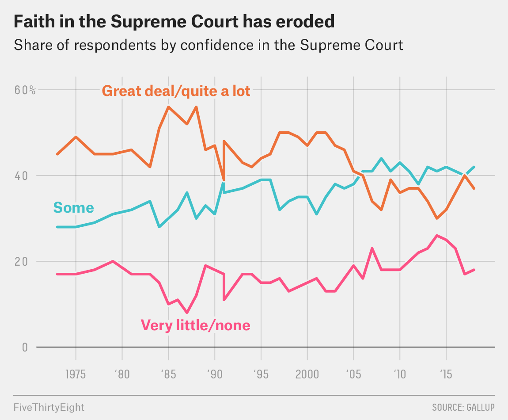
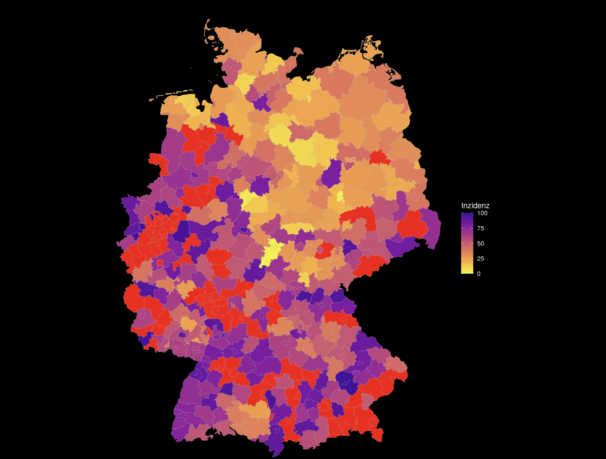
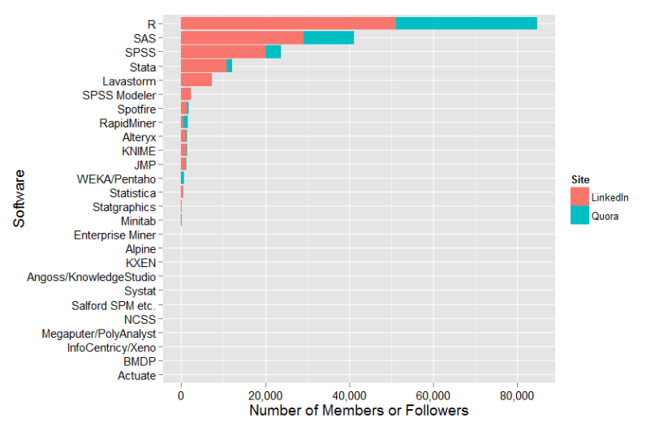
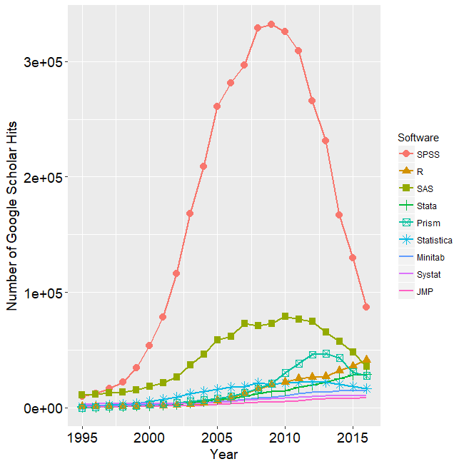
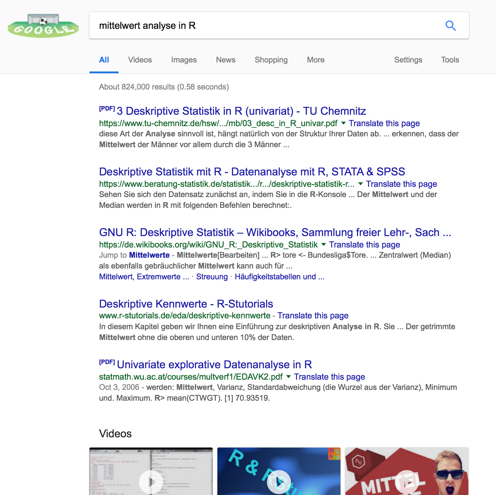

```{r setup, include=FALSE}
library(tidyverse)
library(datasets)
library(kableExtra)
```

```{r child="header.Rmd"}
```

layout: true

.footer[Fragen unter [frag.jetzt](https://frag.jetzt/participant/room/14822680). Code: 14822680]

---

# Organisatorisches

LV.Nummer: 79.41688

```{r termine, echo=FALSE, message=FALSE}
termine <-
  read_csv("settings/export_20211014_135556.csv") %>%
  mutate(Nr = 1:n()) %>%
  rename(Datum = DATUM) 

tag <- termine %>% select(WOCHENTAG) %>% magrittr::extract2(1) %>% as.factor() %>% levels()
raum <- paste(termine %>% select(ORT) %>% magrittr::extract2(1) %>% as.factor() %>% levels(), collapse = " / ")
start_zeit <- termine %>% select(VON) %>% magrittr::extract2(1) %>% as.factor() %>% levels()
end_zeit <- termine %>% select(BIS) %>% magrittr::extract2(1) %>% as.factor() %>% levels()
termine %>% select(Nr, Datum) -> termine_kurz

termine_kurz %>% slice( 1:(n() / 2) ) %>% kable("html") -> earlierdates
termine_kurz %>% slice( floor((n()/2) + 1):n()) %>% kable("html") -> laterdates
```

Termine:  `r tag`, `r start_zeit`-`r end_zeit` Uhr im Raum `r raum`

.pull-left[
`r earlierdates`
]

.pull-right[
`r laterdates`
]
---
class: center, middle
# Folien


https://t1p.de/dhnn


<!----
# GitHub Repository zur Lehrveranstaltung

https://github.com/Sumidu/EmpirischeForschungsmethoden
--->

---

# Anmeldung und Klausur

## Anmeldung

- 2 Anmeldungen: Zur Vorlesung **und** Klausur (benotete Prüfungsleistung)
- Plus 2 Anmeldungen im Seminar "Forschungsmethoden".
  - Seminar dient der Übung der Inhalte der Vorlesung.

## Klausur
- Die Veranstaltung hat einen **Selbststudiumsanteil** von 60h ~ **4h/Woche**.
- Das Seminar hat ebenfalls einen Selbststudiumsanteil von 60h ~ 4h/Woche.
- Die Klausur wird 50% Multiple-Choice- und 50% Freitext-Aufgaben sein.

---
class: center, middle
# 2 Teile und 2 Ziele

## 1. Theorie und Mathematik


## 2. Praxis und R

---

# Vorlesung und Seminar 


## Inhalt der Vorlesung
- Theorie und Grundlagen
- Einführung in die Praxis mit R

## Inhalt des Seminars
- Anwendung mit echter Forschungsfrage
- Übungen für den Umgang mit R


.center[
### **Beides** ist klausurrelevant.
]

---
class: center, middle, inverse
# Warum R?

---

# Unterschied R und SPSS
##Datenanalyse mit GUI vs. Datenanalyse als Programmiersprache
* GUI<sup>1</sup> Datenanalyse-Tools: **SPSS**, STATA, RapidMiner, etc.
* Programmiersprachen für die Datenanalyse: Python, Julia, **R**, etc.

--

.pull-left[
## SPSS
* Kostenpflichtig
* "Einfach" zu lernen
* Schnelle Analyse durch Menüführung
* Wiederholung von Analysen nur bei Anwendung von Syntax
* Schlechte Visualisierung
]

--

.pull-right[
## R
* Kostenfrei
* Cross-Plattform kompatibel
* Höherer Lernaufwand
* Analyse erfordert das Schreiben eines Programms
* Wiederholung eingebaut
* Reproduzierbarkeit
* Druckreife Visualisierung, Gute Integration in Publishing Prozesse
]

.footnote[ [1] Graphical User Interface. Programme mit Maussteuerung.] 

---


# Vorteile von R im Detail (exemplarisch)

## Reproduzierbarkeit (Reproducibility)
* Im Sinne von Open-Science, nachvollziehbare Analysen
* Im Sinne der Arbeitserleichterung (z.B. neue, gleiche Studie)

```{r reproducibility, echo=FALSE, out.width="100%"}
knitr::include_graphics("figs/orga/reproducibility.jpg")
```


---

# Einsatz im Berufsleben

.pull-left[
```{r fivethirtyeight, echo=FALSE, out.width="100%"}

```
]

.pull-right[
```{r orga/bbc, echo=FALSE, out.width="100%"}
knitr::include_graphics("figs/orga/bbc.png")
```

```{r coronamapR, echo=FALSE, out.width="100%"}

```
]

.footnote[
Quelle: http://fivethirtyeight.com, bbc.com
]

---
# Ist R wichtiger auf dem Arbeitsmarkt?
## 
.pull-left[
Größere und aktivere Community
```{r linkedin_quora_2015, echo=FALSE, out.width="100%"}

```
.figurecaption[**Abb. 1:** Anzahl LinkedIn Jobs und Quora Member 2015 ]
]

--

.pull-right[
Gewinnt wissenschaftlich Bedeutung
```{r academicuse, echo=FALSE, out.width="100%"}

```
.figurecaption[**Abb. 2:** Anzahl wissenschaftlicher Veröffentlichungen auf Google Scholar]
]
.footnote[
Quelle: http://r4stats.com/articles/popularity/
]

???

Anmerkung zu Abb. 2:SPSS ist möglicherweise de-facto Standard und wird deshalb nicht mehr explizit "genannt".


---
# Datenvisualisierung mit R
.pull-left[
```{r datavis, echo=F, fig.width=6, fig.height=8}
ggplot(mtcars, aes(x = mpg, y = hp, color = factor(cyl))) +
  geom_point() + geom_smooth(method = "lm", formula = y ~ x) +
  labs(
    title = "Benzinverbrauch und Motorleistung",
    x = "Meilen pro Gallone",
    y = "PS",
    color = "Anzahl Zylinder",
    shape = "Gangschaltung"
  ) + theme_classic(base_size = 18) +
  theme(legend.position = "bottom")

```

]

--
.pull-right[
Eine (langer) Befehl in R:
```{r datavisdemo, echo=T, eval=F, fig.width=6, fig.height=8}
ggplot(mtcars) +
  aes(x=mpg) +
  aes(y=hp) +
  aes(color=factor(cyl))) + 
  geom_point() + 
  geom_smooth(method="lm", 
              formula=y~x) + 
  labs(
    title="Benzinverbrauch und Motorleistung", 
    x="Meilen pro Gallone", 
    y="PS", 
    color="Anzahl Zylinder", 
    shape="Gangschaltung")
```
]

---
class: center, middle, inverse
# Wie schaff ich das überhaupt?


---

# Lernmaterialien

## e-Learning der RWTH Aachen und Partner

<!--- Alle Kursmaterialien: https://www.calerovaldez.com/course/methoden/ -->
- In Moodle werden sämtliche Inhalte zur Verfügung gestellt.
- Flipped Classroom
- DataCamp Übungsraum (online Trainingstool)
- Videoaufzeichnungen der Veranstaltungen + Tutorials
- Slack Channel für Austausch untereinander


## Literatur zur Veranstaltung

- Döring/Bortz - Forschungsmethoden und Evaluation

- Online-Bücher: 
  <!--- Computational Communication Sciene, Link: https://bookdown.org/andrecalerovaldez/ccs/-->
  - R for Data Science, Link: http://r4ds.had.co.nz
  - R for Social Science, Link: http://socviz.co/ 
  - Modern Dive: https://moderndive.com/index.html
  
---

# Zusätzliches Material

Es gibt hunderte Webseiten, Bücher, Foren zur R:
- http://compcogscisydney.org/learning-statistics-with-r/ 
- http://compcogscisydney.org/psyr/ 
- http://www.sthda.com/english/
- https://www.statmethods.net/index.html
- https://www.r-bloggers.com/
- Cheat-Sheets: https://www.rstudio.com/resources/cheatsheets/

## Twitter-Hashtags und User:

Twitter-Account anlegen und nach Hashtag suchen und Usern folgen.

Hashtags:
- \#rlang, #rstats, #r4ds, #rladies

User: 
- @RLangTip, @RBloggers, @rOpenSci, @RLadiesGlobal, @hadleywickham, @juliasilge


---

# Was tun wenn etwas nicht funktioniert?

Google!
```{r googlesearch, echo=FALSE, out.width="100%"}

```


---
class: inverse, center, middle
## .yellow[ [Zurück zur Übersicht](index.html)]
  
  
  
  
  
