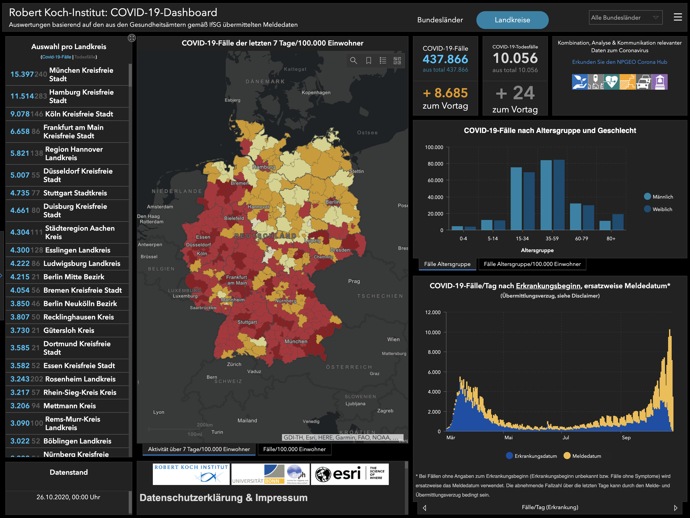

```{r setup, include=FALSE}
library(tidyverse)
library(datasets)
```

```{r child="header.Rmd"}
```


class: center, middle, inverse
# Was tun Sie in 5 Jahren?

---
class: center, middle, inverse

```{r coronamap, echo=FALSE}
# All defaults

```


---

class: center, middle

```{r coronaapp, echo=FALSE}
# All defaults

```


---
# Neuer Job
 - Leiter Abteilung User Experience - KI und Privatsphäre

--

 - Verschiedene Wege der Realisierung
    - Dezentrale Datenspeicherung, Zentrale Datenspeicherung
    - freiwillige Meldung, verpflichtende Meldung, Opt-Out
    - Proximity Detection, GPS-Tracking, WLAN-Netzwerke 
--

 - Wählen Sie eine Strategie der Umgestaltung der App
    - Budget 500.000 Euro
    - Präsentieren Sie Ihre Entscheidung dem Board of Directors

---
# Wie gehen Sie vor?

## Begründung der Vorgehensweise
- Warum dieser Weg?
- Welche Datengrundlage?
- Mit welcher Sicherheit?

--

## Rechtfertigung der Ausgaben
- Wie viel Wert sind Ihre Daten?
- Sind die 500.000 Euro gut investiert?


---

# Was sind Forschungsmethoden?

> Methoden sind Prozessbeschreibungen, die wiederholbar und flexibel einsetzbar sind, mit dem Zweck den wissenschaftlichen Erkenntnisgewinn zu strukturieren, zu formalisieren und gegen Fehler abzusichern.

## Dazu gehören:
* Empirische Datenerhebungsmethoden
  * Qualitative Methoden: Interviews, Fokusgruppen, Social Media Analysen, etc.
  * Quantitative Methoden: Fragebogen, Experiment, Web-Mining, etc.

* Datenanalytische Methoden
  * Qualitative Methoden: Grounded Theory, Inhaltsanalyse, etc.
  * Quantiative Methoden: Deskriptive Datenanalyse, Statistische Hypothesentests,  


---
class: center, middle
# Warum überhaupt Methoden?

---

# Wissenschaftlicher Erkenntnisgewinn
basiert in den Sozial- und Humanwissenschaften auf der: 
- systematischen Sammlung, Aufbereitung und Analyse von empirischen Daten 
- im Rahmen eines geordneten und dokumentierten Forschungsprozesses. 

Unter Einsatz von sozialwissenschaftlichen Methoden:
- Untersuchungsplanung
- Stichprobenziehung
- Datenerhebung
- Datenaufbereitung und Datenanalyse. 

Der empirische Forschungsprozess ist theoriebasiert, d.h. wissenschaftliche Theorien über den Gegenstand und Forschungsmethodik werden
angewendet und geprüft oder gebildet und weiterentwickelt. 

Erst mit Bezug auf Theorien sind empirische Daten sinnvoll interpretierbar.
.footnote[
Definition nach Döring/Bortz.
]
---

# Nicht-wissenschaftlicher Erkenntnisgewinn?

--

Vorgehensweise? Grenzen?

- Autorität 

--
- Religion

--
- Tradition

--
- Gesunder Menschenverstand

--
- Intuition

--
- Anekdotische Evidenz

--
- Logik


--
Sind diese Quellen des Erkenntnisgewinns schlecht?


--
Angemessenheit des Problems $\checkmark$
---
# Warum also wissenschaftliche Methoden?

--

## Menschen sind schlechte Beobachter

Menschen wurden durch die Evolution geschaffen als "Survival Machine". 
- sämtliche physiologische, affektive, kognitive und soziale Funktionen dienen dem Überleben oder Replizieren

--

"Objektive" Sinneswahrnehmung ist für das Überleben unbedeutend. Deshalb gibt es z.B.:
- schnelle Gesichts- und Emotionserkennung :-) 
- Agency-Bias<sup>*</sup>, availability heuristic, confirmation bias,  
- Theory of the Mind,
- Ultrakurzwellenblindheit, etc. 

--

Ein Sinn für objektive "Wahrheit" fehlt.

.footnote[
<sup>*</sup>Bias: Systematische kognitive Verzerrung, aufgrund des Einsatzes einer kognitiven Heuristik.<br>
Heuristik: Entscheidungsabkürzung, einfach "auszuwerten", Fehlerbehaftet.
]

---

class: center, middle

# Ziel von Methoden
Forschungsmethoden sollen Verzerrungen minimieren oder kontrollieren. 

Objektivierung der Erfahrungswirklichkeit

---

# Methoden in der Kommunikationswissenschaft
- Kommunikationswissenschaftliche Kontexte sind naturgemäß komplex<sup>1</sup>.
.footnote[
<sup>1</sup> Komplex Probleme: Schwierige Probleme, hohe Anzahl Teilprobleme und hochgradig vernetzt.
]

--
- Sie variieren mit dem jeweiligen Kontext, dem Medieneinsatz, der Art und der Anzahl kommunikationswissenschaftlicher Akteure

--
- Um solche komplexen Gegenstände zu beschreiben, analysieren und gegebenenfalls zu veränden, müssen die Einflussgrößen und ihre Verbindungen untereinander identifiziert werden.

--
- Das kann mit unterschiedlichen Foki passieren: Nutzergruppen, Anwendungskontexte, Medien etc.

--
- Je nach Fokus und Forschungsfrage sind unterschiedlich Methoden angezeigt.


---
# Die berufsweltliche Anforderung
- Gegenstand (also Kommunikation) ist schnellen Medienwechseln unterworfen
- Für viele der neuen Medien gibt es noch keine kommunikative Etikette

--
**Unklar** ist ...
- inwieweit sich der kommunikative Gegenstand mit den jeweiligen Kontexten verändert (Kontextsensitivität).

--
- die Beziehung zwischen Informationsbedarfen/-wünschen/-notwendigkeiten und der adäquaten kommunikativen Strategie („Was“ und „Wie“ und „Wann“).

--
- die Auswirkung der Unterschiedlichkeit von Fähigkeiten und Vorwissen einer zunehmend diversen Kundschaft (User Diversity).

---

# Bewältigung der Anforderungen

## Methoden auswählen
- Verständnis darüber, welche Methoden und Verfahren was messen 
- Fähigkeit, einen *Faktorenraum* aufzuspannen, ein Konzept der jeweils agierenden Größen

--

## Methoden durchführen
- Verständnis von *Methodenvorraussetzung* und deren Einhaltung
- Verständnis der Ergebnisse und deren Aufbereitung (Visualisierung und Deutung)

--

## Methoden bewerten
- Verständnis darüber, wann welche Methoden zwar möglicherweise genau sind, aber zu komplett verzerrten Ergebnissen führen
- Verständnis darüber, welche *Spezifität/Sensitivität* und welche *Diagnostizität* Methoden haben und welche *Ökonomie* der Verfahren angezeigt ist

---
class: inverse, center, middle
## .yellow[ [Zurück zur Übersicht](index.html)]
