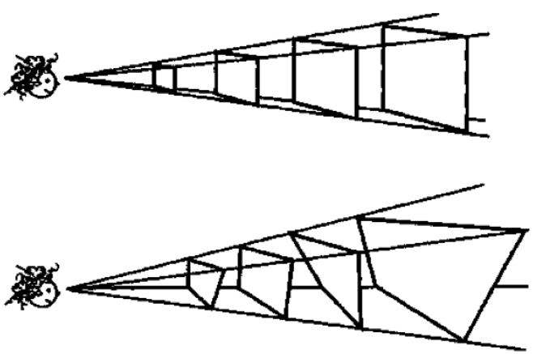
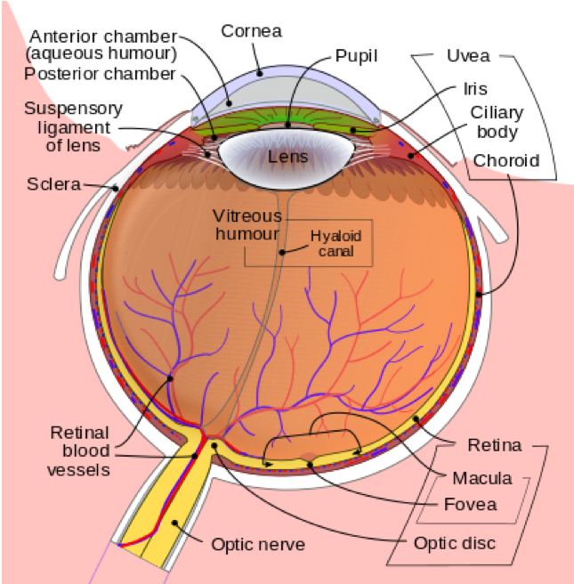
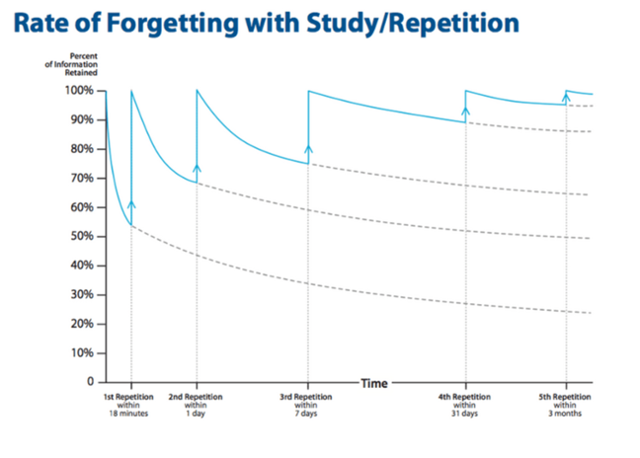
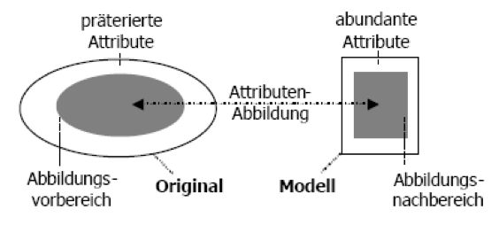
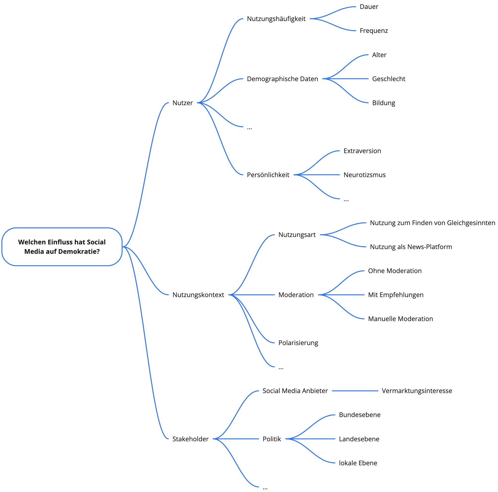

```{r setup, include=FALSE}
library(tidyverse)
library(datasets)
library(kableExtra)
```

```{r child="header.Rmd"}
```

---
# Wiederholung 

## Prozess: Wissenschaftlichen Erkenntnisprozess

--

1. Theorie-geleitetes Vorgehen
1. Struktur des Prozesses
1. Sammeln von empirischen Daten
1. Aufbereiten von empirischen Daten
1. Analysieren von empirischen Daten
1. Dokumentation des Prozesses
 
--

## Gründe: Schwierigkeiten menschlicher Wahrnehmung
1. Kein "Sinn" für objektive Wahrheit
1. Menschliche Sinne dienen dem Überleben

--

## Ziel: Reduktion von Verzerrung, Objektivierung 

---
class: inverse, middle, center

# .yellow[Gründe für Methoden]
Exkurs: visuelle Wahrnehmung

---
# Wahrnehmung ist "Computation"

--

.pull-left[
- Visuelle Informationen sind mehrdeutig
- für jedes 2-Dimensionale-Abbild gibt es unendliche viele mögliche Urbilder
- Bidirektionaler Prozess
  - Bottom-Up (Sensorik zum Perzept)
  - Top-Down (Perzept zur Sensorik)

- Berechnung und Steuerung von Wahrnehmung

]

.pull-right[
```{r pinker-vision, echo=FALSE, out.width="100%"}

```
.figurecaption[Aus (Pinker, 1999)]

]

.footnote[Pinker, S. (1999). How the mind works. *Annals of the New York Academy of Sciences*, 882(1), 119-127.]

---
# Ames Room Illusion

```{r roomillusion, echo=FALSE, out.width="100%"}
knitr::include_graphics("figs/qualiquanti/roomillusion.gif")
```


---
# Grenzen der visuellen Wahrnehmung
.pull-left[

Die Fovea:
- kleiner Bereich mit hoher Zapfendichte
- Schärfster Bereich des Sehens
- 0.5  2° des Sichtfeldes

Nur hier sieht man farbig und scharf

Blinder Fleck am Sehnerv
]

.pull-right[

.figurecaption[ Quelle: Wikipedia ]
]

---

background-image: url("figs/qualiquanti/fovea-example.png")
background-size: cover


---


.pull-left[
##Beispiel Top-Down Prozess


Quelle: [Wikipedia](https://de.wikipedia.org/wiki/Optische_T%C3%A4uschung)
]

.pull-right[
## Vergessen und Erinnern


Ebbinghaus untersuchte Erinnerung und Vergessenskurven

Interferenz:
- früher gelerntes wirkt sich auf später gelerntes aus.

]


---
# Biases und Verzerrungen

## Grenzen gelten für..
- sämtliche Sinne (Sehen, Hören, Fühlen, Riechen, Schmecken, Propriozeption, etc.)
- Aufmerksamkeit (geteilte Aufmerksamkeit, Attention inhibition, etc.)
- Erinnerung (Interferenz, Ebbinghaussche Listen, etc.)

## Warum gibt es überhaupt Grenzen?


---
class: center, middle
# 4 Gründe für Verzerrungen

--
## Zu viele Information

--
## Was soll erinnert werden?

--
## Nicht genügend Bedeutung

--
## Schnelles Handeln erforderlich


---


background-image: url("figs/qualiquanti/biases.png")
background-size: cover

[-Link-](https://en.wikipedia.org/wiki/List_of_cognitive_biases)
---
class: inverse, center, middle
>Ziel von Forschung ist es, allgemeingültige Aussagen und Theorien zu ermöglichen, die jenseits der subjektiven Meinung oder Erfahrung Einzelner Gültigkeit haben.

---
# Darum Methoden!

Auch Wissenschaftler sind nicht *gefeit* vor:
- falschem Alltagswissen
- Halbwahrheiten
- ungeprüftem Wissen
- überholtem Wissen

--

Fehler fallen nicht auf:
- Feste Überzeugung führt zur Erfüllung (self-fulfilling prophecy)
- Kognitive Dissonanz (selektive Erinnerung, preference-based information processing)

--

Trifft insbesondere Kommunikationswissenschaft:
- schneller Medienwandel
- viele verschiedene Kontexte
- falsche Übertragung
- unterschiedlichste Nutzergruppen


---
class: inverse, middle, center

# Empirische Daten und Prozesse

---

# Empirische Daten und Prozesse


1. Sammeln von empirischen Daten
2. Aufbereiten von empirischen Daten
3. Analysieren von empirischen Daten
4. Dokumentation des Prozesses

---

# Empirische Daten und Prozesse


1. Sammeln von empirischen .orange[ **Daten** ]
2. Aufbereiten von empirischen .orange[ **Daten** ]
3. Analysieren von empirischen .orange[ **Daten** ]
4. Dokumentation des Prozesses

---

# Empirische Daten und Prozesse


1. .orange[**Sammeln**] von empirischen Daten
2. .orange[**Aufbereiten**] von empirischen Daten
3. .orange[**Analysieren**] von empirischen Daten
4. .orange[**Dokumentation**] des Prozesses
---

# Empirische Daten und Prozesse


1. Sammeln von empirischen Daten
2. Aufbereiten von empirischen Daten
3. Analysieren von empirischen Daten
4. Dokumentation des Prozesses

--

## Unterschied zwischen qualitativ und quantitativ?

--

### Qualitative Daten, quantitative Daten?
 
--

### Qualitative Methoden, quantitative Methoden?
 
---

# Qualitative Daten

--

Beispiele:
- Videoaufzeichnungen
- Beobachtungen
- Audioaufzeichnungen
- Texte
- Emailinhalte
- Freitextfelder in Fragebögen
- etc. 

Daten charakterisieren den Gegenstand ohne ihn zu messen. 

Fokus auf Attribute und Eigenschaften

**Forschungsinteresse:** Qualität dieser Charakterisierung

---

# Quantitative Daten

--

Beispiele:
- Sensorische Messwerte 
- Numerische Angaben in einem Fragebogen
- Räusperhäufigkeit in einem Interview
- Anzahl Fehler beim Textlesen
- Emails
- psychometrische Skalen
- etc. 

Daten vermessen den Gegenstand ohne ihn zu charakterisieren.
- Häufigkeit, Länge, Dauer, Lage, Höhe, Gewicht

**Forschungsinteresse:** Numerische (quantitative) Zusammenhänge in den Daten entdecken oder nachweisen.


---

# Qualitative Methoden
1. .orange[**Sammeln**] von empirischen Daten
2. .orange[**Aufbereiten**] von empirischen Daten
3. .orange[**Analysieren**] von empirischen Daten
4. .orange[**Dokumentation**] des Prozesses

--
Beispiele:
- Tiefeninterview, leitfadengestützes Interview, Fokusgruppen
- Card-Sorting, Walkthrough, User-Test
- Audio- oder Video-Transkription
- Inhaltsanalyse, Medienanalyse, Diskursanalyse
- Grounded Theory, etc.

--

Fokussieren den nicht quantitativen Erkenntnisgewinn, sondern
- Gründe, Ursachen, Zusammenhänge
- Hypothesengenerierung
- Theorieentwicklung

---
# Quantitative Methoden
1. .orange[**Sammeln**] von empirischen Daten
2. .orange[**Aufbereiten**] von empirischen Daten
3. .orange[**Analysieren**] von empirischen Daten
4. .orange[**Dokumentation**] des Prozesses


--
Beispiele:
- Fragebogen, Experimente, Open-Data-APIs, etc.
- Explorative Statistik, Social-Network-Analysis
- Video-Kodierung, Skalen-Berechnungen, 
- Statistische Methoden, deskriptive Statistik, Inferenzstatistik

--

Fokussieren den quantitativen Erkenntnisgewinn:
- Modellierung und Theorieprüfung
- Beschreibung
- Hypothesenvalidierung
- Vorhersage

---
# 4 Felder Schema
Nach Datum und Methode 

--

                      |  Qualitative Daten | Quantitative Daten
----------------------|--------------------|--------------------
Qualitative Methode   |  Tiefeninterview, Fokusgruppe   | Einzelfallanalyse im Fragebogen
Quantitative Methode  |  Text-Mining       | Inferenzstatistische Analyse eines Fragebogens


---
# Anforderungen an Methoden

In der Wissenschaft existiert ein hoher Qualitätsanspruch an Ergebnisse. Deshalb sollen Methoden folgende Eigenschaften haben:
  - Generalisierbarkeit
  - Anwendbarkeit
  - Robustheit
  - Ökonomie

--

##Ziel: zuverlässige Übertragung von Realität auf ein Modell 

--

##Was ist ein Modell?

---
# Wie man eine Brücke baut


---
# Modell-Begriff


.pull-left[



]

.pull-right[
##Beschränktes Abbild der Wirklichkeit

- Pragmatismus
  - Modellzweck, Modellkontext
- Attributen-Abbildung
  - Verkürzung
  - Präterierte Attribute
  - Abundante Attribute
- Kontrastierung
  - Hervorhebung von Modelleigenschaften


]
---
# Forschungsfrage und Hypothese
Von der Forschungsfrage zum Modell.

--
## Wie wählt man eine Forschungsfrage?

--

- Literaturrecherche relevanter Ergebnisse
- Modelle und Theorien
- Identifikation von Unbekanntem in der Literatur
- Quantifizierung von qualitativen Ergebnissen
- Verknüpfung von Modellen
- Übersetzung von Beobachtung in Forschungsfragen

--

## Wie wählt man eine Hypothese?

--
Gerichtete wissenschaftliche Vermutung
- widerspruchsfreie, unbewiesene Behauptung
- messbare Faktoren
- aus der Literatur abgeleitet
- angelehnt an bestehende Modelle und Theorien


---
# Faktoren-Raum

## Was ist das?
- Identifikation der beteiligten Größen der Forschungsfrage
- Hierarchische Dekomposition des Problems 

--
- Vorbereitung zur Selektion (Occam's Razor)
  - Messbarkeit
  - Verwandte Theorien und Modelle

--

## Beispiel Forschungsfrage:

> Welchen Einfluss hat Facebook auf Demokratie?
>

.center[**Wie könnte ein Faktorenraum aussehen?**]

---

# Faktoren-Raum


<!--.img-50[ ] -->
.img-25[ ] 

.footnote[Abbildung erstellt mit miro.com]
---
# Methoden und Modell
  
Übertragung von Realität auf Modell (und zurück):
  - Faktorenraum 
  - Faktorenbeziehungen
  - Messbare Variablen und Faktoren
  - ggfs. experimentelle Variation:
    - Gezielte Variation der Faktoren zur Messung der Auswirkung

--

Gute Konzeption ist **obligatorisch!**

Methoden und Modelle sind disziplinenspezifisch.

---
class: middle
# Theorie und Empirie

1. Theorie
2. Forschungsfrage
3. Forschungshypothese und Faktorenraum
4. Präzisierung der Hypothese
5. Konzeption der Untersuchung
6. Durchführung
7. Datenanalyse
8. Interpretation der Daten
9. Implikationen für die Theorie (repeat)

---
class: inverse, center, middle
---
class: inverse, center, middle
## .yellow[ [Zurück zur Übersicht](index.html)]
  
  
  
