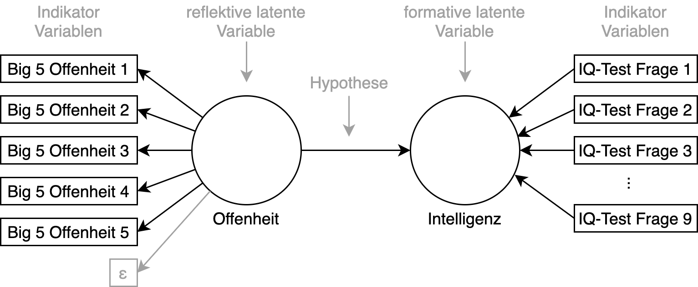

```{r setup, include=FALSE}
library(tidyverse)
library(datasets)
library(kableExtra)
```

```{r child="header.Rmd"}
```


---

# Wiederholung
## Wissenschaftstheorie, Theorie und Empirie

Kritischer Rationalismus als Grundlage der Verbindung von Theorie und Empirie

## Empirische Methoden

1. Erhebungsmethoden
2. Auswertungsmethode


---
# Übersicht über empirische Methoden

## Sammeln von Daten - Erhebungsmethoden
Hier quantitativ (z.B. Fragebogenstudie oder Experiment). Dazu gehört Wissen über:
  - Testtheorie, Stichprobenziehung, Survey-Methodik, Skalen, etc.
  
## Auswerten von Daten - Auswertungsmethoden
Deskriptive, explorative und Inferenzstatistik 
- Unterscheidung nach Methodenzweck
  - Beschreiben, Entdecken und Prüfen
- Strukturentdeckende Verfahren vs. strukturprüfende Verfahren

---
class: center,middle
# Erhebungsmethoden

## Wie können Sozialwissenschaftler Daten erheben?

## Was für Daten gibt es überhaupt?

---
# Empirische Daten

## Ergebnisse eines empirischen Mess- oder Beobachtungsprozesses
- Luftfeuchtigkeit
- Windstärke
- Körpergröße

--
- Intelligenz?
- Ängstlichkeit?

--

## Eindeutige Kodierung eines empirischen Gegenstandes
- Symbol im Modell und Entsprechung in der Realität
- Kodierung: Abbildungsprozess von Realität <=> Modell
- Präzision der Abbildung(?)

---
# Empirische Daten
## Messwerte der Endknoten des Faktorenraum
- Inhaltlich relevant für die Forschungsfrage
- Für die Messung geeignete Kodierung
- Für die Auswertung geeignete Kodierung

--

## Typischerweise Kodierung als mathematisches Symbol
- Größe in cm: **175**
- Windstärke in Bft: **12**
- Intelligenz in IQ-Punkten: **131**

--

## Transformation zwischen Kodierungen
- Bft in km/h: 12 -> >118 km/h (logarithmische Transformation)
---
class: center, middle, inverse
# .yellow[Skalenniveaus]

---
# Skalenniveaus

## Wie unterscheiden sich folgende Variablen?

- Alter
- Geschlecht
- PLZ
- Größe in cm
- Gewicht in kg
- Lieblingsfilm

---
# Skalenniveaus

--
Nominal > Ordinal > Intervall > Verhältnis
- Kardinal: Intervall, Verhältnis

--

## Nominale Daten
- Niedrigstes Skalenniveau
- Gleichheit und Ungleichheit
- Messbarkeit: Häufigkeit

--
- *Beispiel: Geschlecht, PLZ, Vorname*

--

## Ordinale Daten
- Geordnete Daten
- Kleiner/größer, vorher/nachher Beziehungen
- Messbarkeit: Häufigkeit, Reihenfolge

--
- *Beispiel: Rangliste (Tabelle), Schulnoten (sehr gut, gut)*


---
# Skalenniveaus
## Intervallskalierte Daten
- Geordnete Daten
- Zwischenwerte sind sinnvoll und gleichabständig
- Messbarkeit: Häufigkeit, Reihenfolge, Abstände

--
- *Beispiel: Datum, Intelligenzquotient*

--

## Verhältnisskalierte Daten
- Geordnet und gleichabständig
- Natürlicher Nullpunkt 
- Messbarkeit: Häufigkeit, Reihenfolge, Abstände, Verhältnisse

--
- *Beispiel: Lebensalter, Länge in cm*


---
# Skalenniveaus

## Kategoriale Variablen (Faktoren)
- Nominal, Ordinal

## Metrische Variablen (Skalen)
- Intervall, Verhältnis

--

## Diskret vs. stetige Merkmale
- Diskret: endlich viele Ausprägungen (
$\in \mathbb{N}$ )
  - Gechlecht, Schulnoten
- Stetig: unendlich viele Ausprägungen (
$\in \mathbb{R}$ )
  - Länge
- Pseudostetig: Können in stetige Ausprägungen umgerechnet werden
  - Geld


---
# Faktoren


---

# Skalen 


---
# Messtheorie
## Was bedeutet messen? Warum? Wie?
<br><br>


---
# Normierung und Eichung
## Urmeter in Frankreich
.img-50[  ]


---
# Normierung und Eichung
## Urkilogramm und Projekt Avogadro

.pull-left[ 
]
.pull-right[
Urkilo in Frankreich verlor 50 Mikrogramm
## 1.2 Mio € Projektvolumen 
Neudefinition
Silicium-Kugel mit 99,994% Reinheit
- Silicum-28
- 93,7 mm
- 30nm Abweichung
]

---
# Messungenauigkeit


---
# Messungenauigkeit


---
# Messungenauigkeit
.center[]

---
# Messgenauigkeit erhöhen
## Fehler bei der Messung sind zufällig
- Mal messen wir zu viel, mal zu wenig

## Im Durchschnitt sollte das Ergebnis korrekt sein.
- Vorraussetzung: Messfehler sind normalverteilt.

## Je mehr Messungen, desto genauer die Messung!
- Stichprobengröße, Itemanzahl

---
# Wie misst man Einstellungen, Emotionen, Haltungen?
- Lineal für "Ängstlichkeit"?
- Lineal für "Selbstvertrauen"?
- Lineal für "Internetnutzungshäufigket"?

<br /><br />

## Abstrake Messgröße

.center[** Kann man das überhaupt messen? **]

---
# Fragen stellen!

Sind sie ein ängstlicher Typ?
<form>
  <input type="radio" name="gender" value="male" checked> Ja<br>
  <input type="radio" name="gender" value="female"> Nein<br>
  <input type="radio" name="gender" value="other"> Vielleicht?  
</form> 


--

Auf einer Skala von 1-6 wie ängstlich sind Sie?
<form>
  <input type="radio" name="gender" value="1" > 1
  <input type="radio" name="gender" value="2"> 2
    <input type="radio" name="gender" value="3" checked> 3
      <input type="radio" name="gender" value="4"> 4
        <input type="radio" name="gender" value="5"> 5
          <input type="radio" name="gender" value="6"> 6
</form> 


--

<br/>
## .center[ Sind das gute Fragen?]

---
# Likert Skala
Besonderheit in der empirischen Sozialforschung. Messung von Einstellungen, Haltungen, Emotionen, etc.

## Ordinale Messskala (6-Punkt Likert Skala)
<form>
  <table style="text-align:center;">
  <tr>
  <td>Stimme gar nicht zu</td>
  <td>Stimme nicht zu</td>
  <td>Stimme eher nicht zu</td>
  <td>Stimme eher zu</td>
  <td>Stimme zu</td>
  <td>Stimme völlig zu</td>
  </tr>
  <tr>
  <td><input type="radio" name="gender" value="1" ></td>
  <td><input type="radio" name="gender" value="2" ></td>
  <td><input type="radio" name="gender" value="3" ></td>
  <td><input type="radio" name="gender" value="4" ></td>
  <td><input type="radio" name="gender" value="5" ></td>
  <td><input type="radio" name="gender" value="6" ></td>
  </tr>
  </table>
</form>
1. "Ich bin für die Einführung des Euro."
2. "Ich bevorzuge eine gemeinsame Währung in der EU."
## Mehrere Items messen dasselbe Konstrukt
- Erhöhen der Messgenauigkeit
- Pseudo-intervallskalierte Daten


---
# Reflektive Selbstauskunftskalen
## Messen latente Variablen

Die latente Variable ist ein Konstrukt oder Faktor.
  - Beispiele: Intelligenz, Gedächtnis, Emotionen, etc.

Keine tatsächliche Entität, nicht wirklich "greifbar"

Zwei  Formen der latenten Variable
- formative Messung: Wie man die latente Variable misst, bestimmt ihren Inhalt. Z.B. "Intelligenz ist das, was der Intelligenztest misst"
- reflektive Messung: sozialwissenschaftliche Tests und empirische Untersuchungsformen als Indikatoren für etwas "Dahinterliegendes"


---
# Forschungsmodell
## Notation
Forschungsfrage: Wirkt sich die Offenheit einer Person auf ihre Intelligenz aus?




---
# Antwortprozess und Störfaktoren


- In jedem Prozessschritt können Fehler passieren
- Die mittleren Schritte können ausfallen

## Typische Antwortverzerrungen:
- Zustimmungstendenz, Soziale Erwünschtheit, Anwesenheit Dritter, Sponsorship-Effekte, etc.


---
# Beispiel Skala: KUT
Misst: Kontrollüberzeugung im Umgang mit Technik.


---
# Eigenschaften
- 4 positive, 4 negative Items
- Messen alle den selben Gegenstand

- Kodierung: 1-6
- inverse Kodierung bie den Items 2, 5, 7, 8


---
# Fragebogen
##Ziel: Quantifizierung von verdeckten Wirkzusammenhängen
Grundannahmen:
- Determinismus, Empirie, Falsifizierbarkeit, Sparsamkeit

##Hypothese und Operationalisieren
- Wirkzusammenhang mathematisch beschreiben
- Bedingung und Kontrollbedingung
- Statistisches Testverfahren!

## Variablen (UV -> AV)
- Unabhängige – eher demographische / psychometrische Daten
- Abhängige – spezifische Daten

## Konfundierung
Kontrollierte Variable – Störende Einflussfaktoren


---
exclude: true
#Beispiel-Fragebogen

.center[


https://goo.gl/forms/w7afBjbwmls5zDKs2
]


---
class: inverse, center, middle
---
class: inverse, center, middle
## .yellow[ [Zurück zur Übersicht](index.html)]
