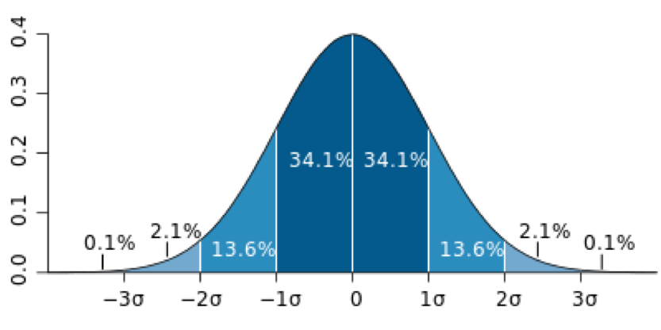

```{r setup, include=FALSE}
library(tidyverse)
library(datasets)
library(kableExtra)
modus <- function(v) {
   uniqv <- unique(v)
   uniqv[which.max(tabulate(match(v, uniqv)))]
}
```

```{r child="header.Rmd"}
```

---
# Wiederholung

## Skalenniveaus
Nomial > Ordinal > Intervall

## Likert-Skala
Kombination mehrere Ordinale => Intervall
- z.B. KUT (8 Items)
- Berechnung der Skala über Mittelwert der Items (`psych` package)


---
class: inverse, center, middle
# .yellow[Deskriptive Statistik]

---
# Ausgangslage

## Unsere Daten sind bereinigt 
- Variablen sind umbenannte (Codebook)
- Nur noch relevante Spalten (`select` oder über `df[,c()]`)
- Sinnlose Einträge gefiltert
- Faktoren sind Faktoren (`factor()` or `ordered()`)
  - Ordinale Skalen haben eine Ordnung bekommen
- Skalen sind berechnet

## Daten kommunizieren

- Was tun wir um effizient Daten zu kommunizieren?

--
- Tabelle aller Daten?

--

Wir laden alle daten in eine Variable `df`.

---
# Deskriptive Statistik


```{r raw_data_table, fig.width=6, echo=F}
library(dataforsocialscience)
df <- robo_care
DT::datatable(
  df[,c(1,2,5,6,7,8)], fillContainer = FALSE, options = list(pageLength = 7) )

```


---

# Deskriptive Statistik
Die deskriptive (beschreibende) Statistik hat zum Ziel, empirische Daten durch Kennzahlen und Tabellen (auch: Maßzahlen oder Parameter) *und* Grafiken übersichtlich darzustellen und zu ordnen. 

- Große Mengen an Daten sind unübersichtlich
- Wir brauchen eine kompaktere Darstellung, die die "Essenz" der Daten wiedergibt.

--

## Zentrale Tendenz
- Wo liegt das "Zentrum" der Daten?

## Dispersion
- Wie streuen die Daten um das "Zentrum"?


---
class: inverse, center, middle
# .yellow[Zentrale Tendenz]

---
# Zentrale Tendenz (Lagemaße)

## Was bedeutet das: "Zentrum" der Daten?

--
Der Schwerpunkt oder der Punkt der meisten Häufung!

--

- Was bedeutet es in Abhängigkeit der Skalenniveaus?

--

## Verschiedene Maße für die zentrale Tendenz
 Je nach Skalenniveau und Verteilung
- Modus (Nomial)
- Median (Ordinal)
- Mittelwert (Intervall)


---
# Modus

## Modus ist der häufigste Wert der Verteilung
Kann durch einfaches Auszählen (table) gefunden werden
```{r gender_table}
table(df$gender)
```

--

`weiblich` ist der Modus unserer Daten


---
# table Funktion
Der Modus lässt sich auch von intervall-skalierten Daten berechnen
```{r age_table}
table(df$age)
```

--
Was ist hier der Modus?
```{r age_modus}
max(table(df$age))
```


---
class: inverse, center, middle
# .yellow[Verteilung der Daten]


---
# Graphiken mit GGPlot2


---
# Zeichnen
- Zum Überprüfen hilft ein Blick in den Plot der Variable
- Quickplot aus dem `ggplot2` package ist hilfreich (Teil des Tidyverse).

```{r qplot_gender, fig.height=4}
qplot(df$gender) 

```

---
# Zeichnen
- Zum Überprüfen hilft ein Blick in den Plot der Variable
- Quickplot aus dem `ggplot2` package ist hilfreich (Teil des Tidyverse).

```{r qplot_label, fig.height=4}
qplot(df$gender) + xlab("Geschlecht")

```

---
# Zeichnen von intervall-skalierten Daten
```{r qplot_age, echo=T, fig.height=4}
qplot(df$age)
```


---
# Zeichnen von intervall-skalierten Daten
```{r qplot_age_label, echo=T, fig.height=4}
qplot(df$age) + xlab("Alter")
```

---
# Zeichnen von intervall-skalierten Daten
```{r qplot_age_bins10, echo=T, fig.height=4}
qplot(df$age, binwidth = 10) + xlab("Alter")
```

---
# Zeichnen von intervall-skalierten Daten
```{r qplot_age_bins1, echo=T, fig.height=4}
qplot(df$age, binwidth = 1) + xlab("Alter")
```

---
# Histogramm
```{r age_histogram, echo=F, fig.height=3}
qplot(df$age, binwidth = 1) + xlab("Alter") + ylab("Absolute Häufigkeit")
```
Dient zum Darstellen der Verteilung
- Einsortieren der Datenpunkt in "bins" oder "buckets" (de: Dosen)
- Balkenhöhe entspricht Menge an Datenpunkten in jedem Bin
- Höhepunkt ist Modus (bei `binwidth = 1`)


---
# Median

Der Median ist der Wert der Daten der in der Mitte steht.
Dafür sortiert man die Daten "aufsteigend" und zählt die Daten.
Man teilt die Anzahl durch 2 und wählt somit den Datenpunkt der in der Mitte der Verteilung steht.
- Berechnung mit der Funktion `median`

```{r median_rep, eval=F}
v <- c(1, 2, 3, 4, 5)

median(v)
```

---
# Median

Der Median ist der Wert der Daten der in der Mitte steht.
Dafür sortiert man die Daten "aufsteigend" und zählt die Daten.
Man teilt die Anzahl durch 2 und wählt somit den Datenpunkt der in der Mitte der Verteilung steht.
- Berechnung mit der Funktion `median`

```{r median}
v <- c(1, 2, 3, 4, 5)

median(v)
```
--

## Was passiert beim Hinzufügen von Daten?
```{r median_outlier}
v <- c(1, 2, 3, 4, 5, 1000)
```

---
# Median ist aussreisserstabil
- Hinzufügen von extrem großen oder kleinen Werten 
```{r median_outlier_comparison}
v1 <- c(1, 2, 3, 4, 5)
v2 <- c(1, 2, 3, 4, 5, 1000)

median(v1)
median(v2)
```


---
# Mittelwert
## Arithmetisches Mittel
- Gleichgewichtetes Mittel
  - jeder Datenpunkt hat gleichen Einfluss auf den Mittelwert
  - Summe aller Werte durch die Anzahl der Werte teilen
$$M=\frac{1}{n}\sum_{i=1}^nx_i$$
- über die Funktion `mean` 


```{r mean}
v <- c(1, 2, 3, 4, 5)
mean(v)
```

---
# Ausreisserstabilität
Was passiert wenn man Aussreisser hinzufügt?
```{r mean_outlier, fig.height=2}
v1 <- c(1, 2, 3, 4, 5)
mean(v1)
v2 <- c(1, 2, 3, 4, 5, 1000)
mean(v2)
```


--
## Der Mittelwert ist sensibel gegen Ausreisser.


---
# Verschiedene Mittelwerte

## Arithmetisches Mittel
Summative Methoden (addieren durch N teilen)
$$M=\frac{1}{n}\sum_{i=1}^nx_i$$
Häufig geschrieben als (echter Mittelwert):
$$\mu=\frac{1}{N}\sum_{i=1}^Nx_i$$
und (gemessener Mittelwert):
$$\bar{x}=\frac{1}{n}\sum_{i=1}^nx_i$$ 


---
# Verschiedene Mittelwerte
## Geometrisches Mittel
Multiplikative Methode (multiplizieren n-te Wurzel ziehen)
- Kommt zum Einsatz wenn es um Mittelwerte aus verschiedenen Skalen geht geht
$$M_{geom}=\sqrt[n]{\prod_{i=1}^nx_i}$$
---
# Verschiedene Mittelwerte
## Harmonisches Mittel
Kehrwert des arithmetischen Mittels der Kehrwerte
- Kommt zum Einsatz wenn es um Verhältnisse geht
$$M_{harm}=\frac{n}{\sum_{i=1}^n\frac{1}{x_i}}$$

---
class:center
#Zentrale Tendenz


---
class: inverse, center, middle
# .yellow[Dispersion]


---
# Dispersion
- Wie weit "streuen" die Daten (im Mittel)

```{r qplot_hist_mean, echo=F, fig.height=4}
qplot(df$age, binwidth = 1) + xlab("Alter") + ylab("Absolute Häufigkeit") + geom_vline(aes(xintercept = mean(df$age)), color = "red")
```


---
# Dispersionsmaße

## Varianz
Die Varianz misst die Streuung der Messwerte zu einem Mittelwert (M)
- Quadrat der Abweichung vom Mittelwert wird summiert und dann durch die Anzahl der Werte geteilt.
- Quadrat verhindert negative Werte
$$\sigma ^{2}={\frac {1}{N}}\sum \limits _{i=1}^{N}(x_{i}-\mu )^{2}$$

--

Und als empirische Varianz:
$$VAR={\frac {1}{n}}\sum \limits _{i=1}^{n}(x_{i}-\bar{x})^{2}$$

Nachteil: Abweichung ist in quadratischen Einheiten


<!--TODO Text auf Folie-->

---
# Standardabweichung
- Durch Wurzelziehen verschwinden die quadratischen Einheiten.


$$SD=+{\sqrt {{\frac {1}{n}}\sum \limits _{i=1}^{n}\left(x_{i}-{\overline {x}}\right)^{2}}}$$



---
# Standardabweichung (SD) in R

```{r sd}
sd(df$age)
```

```{r hist_sd, echo=F, fig.height=4}
qplot(df$age, binwidth = 1) + xlab("Alter") + ylab("Absolute Häufigkeit") + 
  geom_vline(aes(xintercept = mean(df$age)), color="red") +
  geom_vline(aes(xintercept = mean(df$age)+sd(df$age)), color="blue") +
  geom_vline(aes(xintercept = mean(df$age)-sd(df$age)), color="blue") 
```

---
# Standardfehler (SE) in R
Standardabweichung ist unabhängig von der Stichprobengrößen.
Normierung über Anzahl der Datenpunkte.
```{r se}
n <- dim(df)[1]
sd(df$age) / sqrt(n)
```

```{r hist_se, echo=F, fig.height=4}
qplot(df$age, binwidth = 1) + xlab("Alter") + ylab("Absolute Häufigkeit") + 
  geom_vline(aes(xintercept = mean(df$age)), color="red") +
  geom_vline(aes(xintercept = mean(df$age)+sd(df$age)/ sqrt(dim(df)[1])), color="blue") +
  geom_vline(aes(xintercept = mean(df$age)-sd(df$age)/ sqrt(dim(df)[1])), color="blue") 
```

---
## Übersicht aller Deskriptive Parameter in R
- im `psych` Package
```{r describe, warning=F, eval=F}
psych::describe(df) 
```
.tiny[
```{r describe_show, warning=F, echo=F}
psych::describe(df) %>% kable()
```
]

---
# Sonstige deskriptive Statistiken
**Range** oder Variationsbreite: Distanz von Minimum zu Maximum

**Trimmed mean** Mean der inneren 80% (ohne 20% Ausreisser)

**Median absolute Deviation** Spalte `mad` aus `describe`

**Quartile** Daten in 4 gleichgroße Teile aufteilen.

**Interquartile-Range** Abstand zwischen Teil 1 und 4

**Perzentil** Grenze für x% viele Werte. Bsp. 90-Perzentil, Grenze unter der 90% der Werte liegen.

---
class: inverse, center, middle
---
class: inverse, center, middle
## .yellow[ [Zurück zur Übersicht](index.html)]
  
  
  
