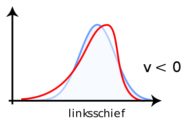
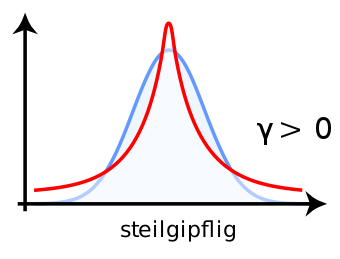
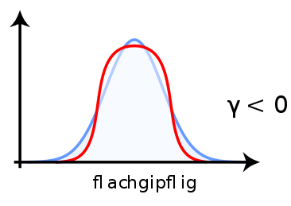

```{r setup, include=FALSE}
#library(plyr)
library(tidyverse)
library(datasets)
library(kableExtra)
```

```{r child="header.Rmd"}
```

---
# Wiederholung

## Skalenniveaus
Nomial > Ordinal > Intervall

--

## Deskriptive Statistik
Zentrale Tendenz - Mittelwert:
--
$$M=\frac{1}{n}\sum_{i=1}^nx_i$$

Dispersion - Varianz und Standardabweichung:
--

.pull-left[
$$\sigma ^{2}={\frac {1}{N}}\sum \limits _{i=1}^{N}(x_{i}-\mu )^{2}$$ 
]
.pull-right[
$$SD=+{\sqrt {{\frac {1}{n}}\sum \limits _{i=1}^{n}\left(x_{i}-{\overline {x}}\right)^{2}}}$$
]


---
class: inverse, middle, center
#.yellow[Was ist Wahrscheinlichkeit?]

---
# Wahrscheinlichkeit und Zufall
>Die Wahrscheinlichkeit (Probabilität) ist eine Einstufung von Aussagen und Urteilen nach dem Grad der Gewissheit (Sicherheit).

--

## Was ist überhaupt Zufall? 
- Gibt es überhaupt Zufall? Deterministische Welt?
- Gibt es unterschiedliche Arten von Zufall? 


--

### Beispiele:
- Münzwurf

--
- Würfelwurf

--
- Eingehende Nachrichten

--
- Körpergröße

--
- Anzahl Einwohner pro Stadt

---
# Münzwurf oder Bernoulli-Verteilungen
- Konvention: *p* Probability. 
$$p \in [0;1]$$
- *p = 0.5* bedeutet 50% Wahrscheinlichkeit, *p = 0.05* bedeute 5% Wahrscheinlichkeit

--

Trifft ein Ereignis ein oder nicht? Werfen wir Kopf.gray[(oder Zahl)].
- Faire Münze *p = 0.5*. Wenn *p = 1*, dann immer Kopf.

- Gegenwahrscheinlichkeit: *(1 - p)*

--
  - *p = 0.3* , dann *(1 - p) = 0.7*, also 30% Kopf, 70% Zahl.

--

## Bernoulli ist nur ein Event. Ein Münzwurf.
- Mehrfacher Münzwurf, Anzahl Kopf -> Binomial-Verteilung

---
# Plot von Bernoulli


.pull-left[
## Fairer Münzwurf (*p = 0.5*)
```{r fair_coin, echo=F, fig.height=3, fig.width=4, warning=FALSE}


fair_coin <- tibble(prob = c(0.5, 0.5), result = c("Zahl", "Kopf"))

fair_coin %>% ggplot() + aes(y = prob, x = result) + geom_col() + theme_minimal(base_size = 20) +
  labs(x = "Ergebnis", y = "Wahrscheinlichkeit") + ylim(c(0, 1))


```
]

--

.pull-right[
## Unfairer Münzwurf (*p = 0.25*)
```{r unfair_coin, echo=F, fig.width=4, fig.height=3}

unfair_coin <-
  tibble(prob = c(0.75, 0.25),
         result = c("Zahl", "Kopf"))

unfair_coin %>% ggplot() + aes(y = prob, x = result) + geom_col() + theme_minimal(base_size = 20) +
  labs(x = "Ergebnis", y = "Wahrscheinlichkeit") + ylim(c(0, 1))


```
]

--
## Fairer Münzwurf (*p = 0.5*) - Binomial 9x
```{r unfair_coin2, echo=F, fig.width=8, fig.height=2.5}

unfair_coin <-
  tibble(prob = (dbinom(c(0:9), 9, 0.5)), result = paste0(0:9, "x"))

unfair_coin %>% ggplot() + aes(y = prob, x = result) + geom_col() + theme_minimal(base_size = 20) +
  labs(x = "Anzahl Kopf", y = "Wahrsch.") + ylim(c(0, 0.3))


```

---
# Würfelwurf oder Gleichverteilung
Einfaches Beispiel: 6-seitiger fairer Würfel
- *P(1) = 1/6*, *P(2) = 1/6*, ...
- *p = 1/6*

--

```{r fair_dice, echo=FALSE, fig.height=3}
fair_dice <-
  tibble(prob = dunif(x = c(1:6), min = 0, max = 6), result = paste0(1:6))
fair_dice %>% ggplot() + aes(y = prob, x = result) + geom_col() + theme_minimal(base_size = 20) +
  labs(x = "Anzahl Augen", y = "Wahrsch.") + ylim(c(0, 0.3))


```


## Jedes Ereignis ist gleichwahrscheinlich!

---
# Nachrichteneingang oder Poisson-Verteilung

--
- Wir kriegen im Schnitt $\lambda$ (lambda) Nachrichten pro Stunde (Rate) 
- Wahrscheinlichkeit für genau *k* an Nachrichten in einer Stunde

Beispiel: 4 Nachrichten pro Stunden, 1h Fitness

--


```{r poisson, echo=FALSE, fig.height=4}

messages <- data.frame(prob = dpois(lambda = 4, x = c(0:20)), k = 0:20)

messages %>% ggplot() + aes(y = prob, x = k) + geom_col() + theme_minimal(base_size = 20) +
  labs(x = "Anzahl Nachrichten", y = "Wahrsch.", subtitle = "Lambda = 4") + ylim(c(0, 0.3))
```
---
# Gauss'sche oder Normalverteilung

--

```{r gaussian, echo = FALSE, fig.height=5}
gaus <-
  data.frame(prob = (dnorm(c(seq(
    -4, 4, 0.5
  )))), x = seq(-4, 4, 0.5))

gaus %>% ggplot() + aes(x = x, y = prob) + geom_col() + theme_minimal(base_size = 20) +
  labs(x = "Wert", y = "Wahrscheinlichkeit", subtitle = "Standard-Normalverteilung") + ylim(c(0, 0.4))

```

---
# Gauss'sche oder Normalverteilung
In der Natur sind viele Dinge normalverteilt. Warum?
  * Körpergröße
  * Persönlichkeitseigenschaften
  * Baumhöhe?

--

## 
* Normalverteilung ist das Ergebnisse der Summe von anderen Verteilungen.
* Alle Zufallsprozesse, die man summiert, werden normalverteilt

---
class: center, middle, inverse

# .yellow[Stichproben]

---
# Stichproben

- Stichproben können von der Idealverteilung abweichen
- je kleiner die Stichprobe, desto größer die mögliche Abweichung
- je größer die Stichprobe, desto unwahrscheinlicher eine große Abweichung

## Verschiedene Sampling Methoden
- Zufallsstichproben (engl. random sampling)
  - Geschichtete Zufallsstichprobe (engl. stratified sampling, z.B: nach Altersgruppen)
  - Klumpenstichproben (engl. cluster sampling, z.B. Erstis vs. Masterkandidaten)
- Nichtzufällige Stichproben
  - Convenience Sampling
  - Judgement Sampling
  - Snowball Sampling
  - Quoten Sampling 

---
# Stichprobenverzerrung

## Störungen durch Stichprobeneffekte
- Non-response bias: Wer nimmt nicht teil?
- Response bias: Wer gibt falsche Antworten?
- Selection Bias: Unbekannte Verzerrung der Auswahlmethode (z.B. Telefonstichprobe)
- Self-selection bias: Selbst-Zuordnung zu einer Gruppe
- Participation bias: Wie sind typische Teilnehmer gestrickt?
- Coverage bias: Fehlende Abdeckung (z.B. Haushalt ohne Telefon)

---
# Würfel-Experiment 1
```{r seedset, echo=FALSE}
set.seed(0)
```

```{r throw_dice}
n <- 100
x <- rdunif(n, 1, 6)  # Werfe einen Würfel mit Seiten 1-6 n-mal
```

```{r plot_throw_dice, echo=FALSE, fig.height=4}
# Plot the histogram
ggplot(as.data.frame(x)) + 
  aes(x = x) + 
  geom_histogram(bins = 7) + 
  scale_x_continuous("Anzahl Augen ...", breaks = c(1:6),  limits = c(0.5,6.5)) + 
  labs(title = "100 Würfelwürfe", y = "Häufigkeit") +
  theme_minimal(base_size = 20) +
  NULL
```

---
# Würfel-Experiment 2

```{r throw_dice_2}
n <- 100
x <- rdunif(n, 1, 6)  
```

```{r plot_throw_dice_2, echo=FALSE, fig.height=4}
# Plot the histogram
ggplot(as.data.frame(x)) + 
  aes(x = x) + 
  geom_histogram(bins = 7) + 
  scale_x_continuous("Anzahl Augen ...", breaks = c(1:6),  limits = c(0.5,6.5)) + 
  labs(title = "100 Würfelwürfe", y = "Häufigkeit") +
   theme_minimal(base_size = 20) +
 NULL
```

---
# Würfel-Experiment 3

```{r throw_dice_3}
n <- 100
x <- rdunif(n, 1, 6)  
```

```{r plot_throw_dice_3, echo=FALSE, fig.height=4}
# Plot the histogram
ggplot(as.data.frame(x)) + 
  aes(x = x) + 
  geom_histogram(bins = 7) + 
  scale_x_continuous("Anzahl Augen ...", breaks = c(1:6),  limits = c(0.5,6.5)) + 
  labs(title = "100 Würfelwürfe", y = "Häufigkeit") +
   theme_minimal(base_size = 20) +
 NULL
```

---
# 4 Würfel-Experimente
```{r throw_dice_4, echo=F, fig.height=6, message=FALSE}
# Throw a six sided dice 1000 times
x_large <- rdunif(40, 1, 6)  
sample <- rep(  1:4, 10)

df <- data.frame(x = x_large, sample)
# Plot the histogram (only for small samples)
ggplot(df) + 
  aes(x = x) + 
  geom_histogram(bins = 7) + 
  #geom_vline(data = ddply(df, "sample", summarize, meanx = mean(x)), aes(xintercept=meanx), col = "red") +
  scale_x_continuous("Augen", breaks = c(1:6),  limits = c(0.5,6.5)) + 
  labs(title = "4x 10 Würfelwürfe", y = "Häufigkeit") +
  facet_wrap(~sample, ncol = 2) +
   theme_bw(base_size = 20) +
 NULL

df %>% group_by(sample) %>% dplyr::summarise(mx = sum(x)) %>% ungroup() -> mdf

print(paste0("Summe: ", mdf$mx))
```


---
# 1000 x 10 Würfelwürfe
```{r thousand_dices, echo=FALSE, fig.height=6, message=FALSE, warning=FALSE}
#set.seed(1000)
x_large <- rdunif(10000, 1, 6)
sample <- rep(1:1000, 10)
df <- data.frame(x = x_large, sample)
df %>% group_by(sample) %>% 
  dplyr::summarise(mx = sum(x)) %>% 
  ungroup() -> mdf

mdf %>% ggplot() +
  aes(x = mx) +
  geom_histogram(bins = 30) +
  #geom_density(adjust = 10) +
  #geom_vline(aes(xintercept=mean(mx)), color = "red") +
  scale_x_continuous("Würfelsumme von 10 Würfen") +
  labs(y = "Häufigkeit") +
  #facet_wrap(~sample, ncol = 5) +
  theme_minimal(base_size = 20) +
  NULL
```
--

Mittelwert = `r mean(mdf$mx)`

Standardabweichung = `r sd(mdf$mx)`


---
# Ideale Normalverteilung
- Mittelwert 0
- Standardabweichung 1
```{r standard_gaussian, echo=F}
c = curve(dnorm, -5, 5, n = 1e4, ylab = "Wahrscheinlichkeit")
```

---
# Z-Transformation
Jede Normalverteilung kann auf die Standard-Normalverteilung abgebildet werden. ** => Standardisierung**

Dafür teilt zieht man von jedem Wert den empirischen Mittelwert *(M)* und teilt das Ergebnis durch die empirische Standardabweichung *(SD)*.

$$Z = \frac{x - M}{SD}$$
--

.pull-left[
```{r left_thousand, echo=F, fig.height=5}
mdf %>% ggplot() +
  aes(x = mx) +
  geom_histogram(bins = 30) +
  #geom_density(adjust = 10) +
  #  geom_vline(aes(xintercept=mean(mx)), color = "red") +
  scale_x_continuous("Würfelsumme von 10 Würfen") +
  labs(y = "Häufigkeit") +
  #  facet_wrap(~sample, ncol = 5) +
  theme_minimal(base_size = 20) +
  NULL
```

]

--

.pull-right[
```{r right_thousand, echo=F, fig.height=5}
mdfs <- mdf
mdfs$mx <- (mdf$mx - mean(mdf$mx)) / sd(mdf$mx)
mdfs %>% ggplot() +
  aes(x = mx) +
  geom_histogram(bins = 30) +
  #geom_density(adjust = 10) +
  #  geom_vline(aes(xintercept=mean(mx)), color = "red") +
  scale_x_continuous("Würfelsumme von 10 Würfen") +
  labs(y = "Häufigkeit") +
  #  facet_wrap(~sample, ncol = 5) +
  theme_minimal(base_size = 20) +
  NULL
```

]

---
# Z-Transformation in einer Skala

```{r sidebyside, echo=F, fig.width = 10, fig.height=5}
mdboth1 <-
  data.frame(sample = mdf$sample,
             mx = mdf$mx,
             state = "vorher")
mdboth2 <-
  data.frame(sample = mdf$sample,
             mx = mdf$mx,
             state = "nachher")
mdboth2$mx <- (mdboth2$mx - mean(mdboth2$mx)) / sd(mdboth2$mx)
mdboth <- rbind(mdboth1, mdboth2)
mdboth %>% ggplot() +
  aes(x = mx, fill = state) +
  geom_histogram(bins = 40) +
  #geom_density(adjust = 10) +
  #  geom_vline(aes(xintercept=mean(mx)), color = "red") +
  scale_x_continuous("Würfelsumme von 10 Würfen") +
  labs(y = "Häufigkeit", fill = "Z-Transformation") +
  #  facet_wrap(~sample, ncol = 5) +
  theme_minimal(base_size = 20) +
  scale_fill_brewer(palette = "Set1") +
  NULL
```


---
# Schiefe (engl. skew)

## Gibt es mehr Daten links oder rechts vom Mittelwert?

.pull-left[

]

.pull-right[

]

---
# Kurtosis (Wölbung)
## Gibt es mehr Daten nah oder fern vom Mittelwert?

.pull-left[
## Leptokurtisch
leptos ~ dünn

]

.pull-right[
## Platykurtisch
platos ~ flach

]

---
# Würfelexperiement


```{r dice_overview, echo=F, fig.height=4}
mdf %>% ggplot() +
  aes(x = mx) +
  geom_histogram(bins = 30) +
  #geom_density(adjust = 10) +
  #  geom_vline(aes(xintercept=mean(mx)), color = "red") +
  scale_x_continuous("Würfelsumme von 10 Würfen") +
  labs(y = "Häufigkeit") +
  #  facet_wrap(~sample, ncol = 5) +
  theme_minimal(base_size = 20) +
  NULL
```


```{r describe, echo=FALSE}
psych::describe(mdf$mx) -> results
```

## Deskriptive Statistik
- Mittelwert *M = `r results$mean`*
- Standardabweichung *SD = `r results$sd`*
- Schiefe *v = `r results$skew`* - linksschief
- Kurtosis $\gamma$ *= `r results$kurtosis`* - schwach steilgipflig


---
# Einwohnerzahlen - Power-Law/Pareto
- Entstehen durch "Matthäus-Effekte", Netzwerkeffekte
```{r pareto, echo=FALSE, fig.height=5, message=FALSE, warning=FALSE}
library(EnvStats)
pareto_dist <- data.frame(prob = dpareto(1:30, 1.3, 1), x = 1:30)
pareto_dist %>% ggplot() + aes(y = prob, x = x) + geom_col() + theme_minimal(base_size = 20) +
  labs(x = "10.000 Einwohner", y = "Relative Häufigkeit") 

```

```{r data_generation, echo=FALSE}
df <- data.frame(nums = 1:1000, dice_dist = (rdunif(1000,6)), dist_norm = rnorm(1000), dist_pareto = rpareto(1000, 1, 4))
```


---
# Darstellungsformen für Verteilungen

.pull-left[
## Histogram
```{r uniform, echo=FALSE, fig.height=5, fig.width=5, message=FALSE, warning=FALSE}
ggplot(df) + aes(x = dice_dist) +
  geom_histogram(stat = "count") +
  labs(x = "Augen", y = "Häufigkeit", title = "Gleichverteilung") +
  theme_minimal(base_size = 20) + scale_x_continuous(breaks = c(1:6))
```
]
.pull-right[
## Boxplot
```{r unif_box, echo=FALSE, fig.height=5, fig.width=5, message=FALSE, warning=FALSE}
ggplot(df) + aes(y = dice_dist) +
  geom_boxplot() +
  labs(y = "Verteilung", title = "Gleichverteilung") +
  theme_minimal(base_size = 20) + scale_x_discrete() + coord_flip() + scale_y_continuous(breaks =
                                                                                           c(1:6))
```
]

---
# Darstellungsformen für Verteilungen

.pull-left[
## Histogram
```{r gaussian_distribution, echo=FALSE, fig.height=5, fig.width=5, message=FALSE, warning=FALSE}
ggplot(df) + aes(x = dist_norm) +
  geom_histogram() +
  labs(x = "X", y = "Häufigkeit", title = "Normalverteilung") +
  theme_minimal(base_size = 20) + scale_x_continuous(breaks = c(-4:4))
```
]
.pull-right[
## Boxplot
```{r gaussian_box, echo=FALSE, fig.height=5, fig.width=5, message=FALSE, warning=FALSE}
ggplot(df) + aes(y = dist_norm) +
  geom_boxplot() +
  labs(y = "Verteilung", title = "Normalverteilung") +
  theme_minimal(base_size = 20) + scale_x_discrete() + coord_flip() + scale_y_continuous(breaks =
                                                                                           c(-4:4))
```
]


---
# Darstellungsformen für Verteilungen

.pull-left[
## Histogram
```{r pareto_distribution, echo=FALSE, fig.height=5, fig.width=5, message=FALSE, warning=FALSE}
ggplot(df) + aes(x = dist_pareto) +
  geom_histogram() +
  labs(x = "X", y = "Häufigkeit", title = "Paretoverteilung") +
  theme_minimal(base_size = 20)
```
]
.pull-right[
## Boxplot
```{r pareto_box, echo=FALSE, fig.height=5, fig.width=5, message=FALSE, warning=FALSE}
ggplot(df) + aes(y = dist_pareto) +
  geom_boxplot() +
  labs(y = "Verteilung", title = "Paretoverteilung") +
  theme_minimal(base_size = 20) + scale_x_discrete() + coord_flip() 
```
]


---
# Übersicht über Verteilungen

---
class: inverse, center, middle
---
class: inverse, center, middle
## .yellow[ [Zurück zur Übersicht](index.html)]
