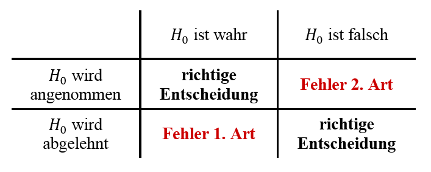

```{r setup, include=FALSE}
#library(plyr)
library(tidyverse)
library(datasets)
library(kableExtra)
library(purrr)
library(scales)
library(forecast)
library(EnvStats)
```

```{r child="header.Rmd"}
```

---
# Wiederholung
```{r distributions, echo=FALSE}
df <- data.frame(nums = 1:1000, dice_dist = (rdunif(1000,6)), dist_norm = rnorm(1000), dist_pareto = rpareto(1000, 1, 4))
```


---
# Übersicht über Verteilungen
Unterschiedliche Verteilungen für unterschiedliche Arten von Zufall
.pull-left[
## Histogramm
```{r unif_dist, echo=FALSE, fig.height=5, fig.width=5, message=FALSE, warning=FALSE}
ggplot(df) + aes(x = dice_dist) +
  geom_histogram(stat = "count") +
  labs(x = "Augen", y = "Häufigkeit", title = "Gleichverteilung") +
  theme_minimal(base_size = 20) + scale_x_continuous(breaks = c(1:6))
```
]
.pull-right[
## Histogramm
```{r gaussian_distribution, echo=FALSE, fig.height=5, fig.width=5, message=FALSE, warning=FALSE}
ggplot(df) + aes(x = dist_norm) +
  geom_histogram() +
  labs(x = "X", y = "Häufigkeit", title = "Normalverteilung") +
  theme_minimal(base_size = 20) + scale_x_continuous(breaks = c(-4:4))
```
]

---
# Wiederholung Münzwurf
## Münzwurf oder Bernoulli-Verteilungen
- Konvention: *p* Probability. 
$$p \in [0;1]$$ 
- *p = 0.5* bedeutet 50% Wahrscheinlichkeit, *p = 0.05* bedeute 5% Wahrscheinlichkeit

## Fairer Münzwurf (*p = 0.5*) - Binomial 9x
```{r binomial_distribution, echo=F, fig.width=8, fig.height=2.5}

unfair_coin <-
  tibble(prob = (dbinom(c(0:9), 9, 0.5)), result = paste0(0:9, "x"))

unfair_coin %>% ggplot() + aes(y = prob, x = result) + geom_col() + theme_minimal(base_size = 20) +
  labs(x = "Anzahl Kopf", y = "Wahrsch.") + ylim(c(0, 0.3))
```


---

# Deskriptive Statistik
Zentrale Tendenz - Mittelwert:
--
$$M=\frac{1}{n}\sum_{i=1}^nx_i$$

Dispersion - Varianz und Standardabweichung:
--

.pull-left[
$$\sigma ^{2}={\frac {1}{N}}\sum \limits _{i=1}^{N}(x_{i}-\mu )^{2}$$ 
]

.pull-right[
$$SD=+{\sqrt {{\frac {1}{n}}\sum \limits _{i=1}^{n}\left(x_{i}-{\overline {x}}\right)^{2}}}$$
]


--
Schiefe und Kurtosis

---
class: inverse, center, middle

#.yellow[Was ist Inferenz?]


---
# Inferenz

> Inferenz ist eine Schlußfolgerung mit Wahrheitsaussage.

Inferenz ist ein Teilgebiet der Logik, mit analogen Definitionen in der Linguistik, Informatik, Statistik.
- Ein logischer Schluß

--
Voraussetzung: 
- Prämissen und Gesetze oder Hypothesen und Inferenzregeln

.pull-left[

]


---
# Motivation
## Warum interessiert uns als Sozialwissenschaftler Statistik?
- Warum machen wir das alles?
- Was ist unser Nutzen?
- Warum brauchen wir Statistik?

--

## Beschreibung der Welt trotz unvollständiger Daten

- Wir erheben immer nur Stichproben (entw. Personen oder Zeitpunkte)
- Wir sind an der Regel oder der Grundgesamtheit interessiert.
- Wir brauchen *Werkzeuge* um von der Stichprobe auf die Grundgesamtheit zu gelangen.

---
# Einfaches Beispiel 
## Münzwurf: Fair oder unfair?

- Was ist Stichprobe, was ist Grundgesamtheit?

--

## Beispiel:
- Sie werfen eine Münze
- Es kommt abwechselnd: Kopf dann Zahl, Kopf, Zahl, ...

--


>Wie häufig muss man eine Münze werfen, bis man sich sicher ist, dass die Münze fair ist?

--

## Es gibt keine absolute Sicherheit bei Zufallsprozessen. 

---
# Relative Sicherheit - Konfidenz 
##Wir sind uns zu xx% sicher (konfident), dass ein Ereignis eintritt.

Wie viele Münzwürfe (Kopf + Zahl) brauchen wir, dass wir uns zu 95% sicher sind, dass die Münze fair ist?

--
## Fairness ist eine Punktschätzung (p = 0.5) und damit nicht lösbar. 

---

# Konfidenzintervall

```{r konfidenzintervall-setup, echo=F, fig.height=6}
set.seed(0)
c.level <- 0.95

btest <- function(n, num = 1){
  res <- binom.test(c(n, n), p = 0.5, conf.level = c.level )
  res$conf.int[num]
}

n <- 5
df <- data.frame(count = 1:n, mean = 0.5, ci_lo =  map_dbl(1:n,  btest, 1), ci_hi =  map_dbl(1:n,  btest, 2))

ggplot(df) + 
  aes(x= count, y=0.5, ymin = ci_lo, ymax = ci_hi) + 
  geom_point() + 
  geom_errorbar() + 
  labs(title = paste0(c.level*100,"% Konfidenzintervall"), 
       x="Anzahl Münzwürfe", 
       y="Wahrscheinlichkeit für Kopf") +  
  scale_y_continuous(labels = scales::percent_format(accuracy = 1)) +
  #scale_x_discrete(labels = waiver()) +
  NULL

```

---
# Bier und Alkohol
.pull-left[
Wir stellen uns vor: Wir proudzieren Guiness-Bier mit 4,1% Alkohol.
- Alkoholanteil unterliegt natürlichen Schwankungen und ist normalverteilt.
- Wir testen diese Behauptung.
- Wir kaufen 9 Guiness und messen einen Durschnittlichen Alkoholanteil von 3,9% mit einer Standardabweichung von 0,9%.

- Wie hoch ist die Wahrscheinlichkeit, dass die Angabe von 4,1% korrekt ist?

]
.pull-right[]

---
# Student's t-distribution
- Entwickelt von 1908 William Sealy Gosset (bei Guiness).

- t-Verteilung beschreibt die Wahrscheinlichkeit einer Abweichung von einem erwarteten Mittelwert für kleine Stichproben.
- t-Verteilung hat einen Parameter $\nu$ (gr. ny) oder *df * für degrees of freedom (*df = n-1*)

--

 

---
# Formel
Falls es Sie interessiert.
$$f(t) = \frac{\Gamma(\frac{\nu+1}{2})}{\sqrt{\nu\pi}\Gamma(\frac{\nu}{2})} (1+\frac{t^2}{\nu})^{-\frac{v+1}{2}} $$

--

mit 
$$\Gamma(z) = \int_{0}^{\infty}e^t t^{z-1} dt $$

--

.center[]
---
# Berechnung des Unterschieds einer Stichprobe

$$ t = \frac{M - \mu}{{SD} / {\sqrt{n}}}$$
--
In unserem Beispiel also:

$$ t = \frac{3,9 - 4,1}{0,9 / \sqrt{9}} = \frac{-0,2}{0,3} = - 0,\bar{6}$$

--
```{r, echo=FALSE, fig.height=3}
tcdist <- data.frame(x = seq(-4, 4, 0.1), y=dt(seq(-4, 4, 0.1), df = 8))
tcdist %>% ggplot() + aes(x,y) + geom_line() +
  labs(title = "t-Verteilung für df=8", x="t", y="p") +
  geom_vline(aes(xintercept=-0.666667), color = "red") +
  geom_area(data = data.frame(x=seq(-4, -0.666667, 0.1), y=dt(seq(-4, -0.666667, 0.1), df=8)),  alpha = 0.5, fill = "red") +
  geom_area(data = data.frame(x=seq(-0.666667,4, 0.1), y=dt(seq(-0.666667, 4, 0.1), df=8)),  alpha = 0.5, fill = "green") +
  NULL

```
---
# Integrierte Verteilung 
## Kumulative Dichte-Funktion


```{r tcd, echo=FALSE, fig.height=2.5}
tcdist %>% ggplot() + aes(x,y) + geom_line() +
  labs(title = "t-Verteilung für df=8", x="t", y="p") +
  geom_vline(aes(xintercept=-0.666667), color = "red") +
  geom_area(data = data.frame(x=seq(-4, -0.666667, 0.1), y=dt(seq(-4, -0.666667, 0.1), df=8)),  alpha = 0.5, fill = "red") +
  geom_area(data = data.frame(x=seq(-0.666667,4, 0.1), y=dt(seq(-0.666667, 4, 0.1), df=8)),  alpha = 0.5, fill = "green") +
  NULL


tdist <- data.frame(x = seq(-4, 4, 0.1), y=pt(seq(-4, 4, 0.1), df = 8))
tdist %>% ggplot() + aes(x,y) + geom_line() +
  labs(title = "Kumulative Dichtefunktion der t-Verteilung für df=8", x="t", y="p") +
  geom_vline(aes(xintercept=-0.666667), color = "red") +
  geom_area(data = data.frame(x=seq(-4, -0.666667, 0.1), y=pt(seq(-4, -0.666667, 0.1), df=8)),  alpha = 0.5, fill = "red") +
  geom_area(data = data.frame(x=seq(-0.666667,4, 0.1), y=pt(seq(-0.666667, 4, 0.1), df=8)),  alpha = 0.5, fill = "green") +
  geom_hline(aes(yintercept = 0.2618711)) +
  NULL
```
--
```{r}
pt(-0.666667, df=8)
```
---
# Interpretation

Die Wahrscheinlichkeit, dass wir eine 9er Stichprobe mit  
- $M \le 3,9$% und 
- $SD=0,9$% erhalten, 

wenn die Produktion wirklich $\mu = 4,1$% Alkoholanteil beträgt, 

ist 26,18% ( $p = 0.2618711$).

---
# Ausführung in R

- Hypothese: $\mu = 4,1$

```{r, echo=FALSE}
diver <- 1.034408
beer <- c(3.9, 3.1, 2.7, 4.8, 5.1, 3.8, 3.9, 3.9-diver, 3.9+diver)

```

Messwerte
```{r}
round(beer, 2)
t.test(beer, mu = 4.1, alternative = "less")
```


---
## Null-Hypothesen Signifikanz Test (NHST)
Jeder Test benötigt:
- Null-Hypothese $H_0$ - Wie die Welt ohne unsere Erkenntnis sein sollte.
- Alternativ-Hypothese $H_1$ - Der gefundene Wert in unserer Stichprobe.
- Freiheitsgrade (df) - Werden aus der Stichprobengröße berechnet.

Jeder Test liefert:
- eine Teststatistik, z.B. $t$
- einen Signifikanz-Wert, $p$

Wir legen fest:
- Signifikanz-Niveau $\alpha = 0.05$ - Schwelle, ab der wir die Null-Hypothese verwerfen.
  - unser p-Wert muss also kleiner sein als 0.05 


---
# Fehler 1. Art und Fehler 2. Art
- $\alpha$-Fehler: Fehler 1. Art, wird über das Signifikanz-Niveau festgelegt.
- $\beta$-Fehler: Fehler 2. Art, wird über die Stichprobengröße festgelegt.

 

--
## Was ist schlimmer?


---

 

Credit: @apreshill
---
  

---

# Sozialwissenschaftlicher Kontext
Annahme: Zufallsstichprobe (z.B. Telefonnummer zufällig wählen)

**Frage:** Wenn wir in unserer Stichprobe eine Unterschied in der Körpergröße zwischen den Geschlechtern finden, wie sicher sind wir uns, dass der Unterschied auch in Grundgesamtheit existiert?


---
# Vorwärts durch das Problem
1. Annahme: Größe der Männer ist normalverteilt, $\mu = 180$ cm, $\sigma = 15$ cm

--

2. Annahme: Größe der Frauen ist normalverteilt, $\mu = 170$ cm, $\sigma = 15$ cm

--

## Simulation in R
```{r draw-samples}
men <- rnorm(n = 10, mean = 180, sd = 15)
women <- rnorm(n = 10, mean = 170, sd = 15)
```

--
Ergebnis:
```{r}
round(men)
round(women)
```

---
# Deskriptive Statistik
```{r}
round(men)
round(women)
```

--

Mittelwert unserer Stichproben
```{r}
mean(men) 
mean(women)
```

---
# Wo liegt unsere beste Vermutung?

Männer haben eine durchschnittle Körpergröße von *M = 185cm (SD = 18)* und Frauen von *M = 165cm (SD = 10cm)*

--

>Wie wahrscheinlich ist es, dass es einen Unterschied in der Grundgesamtheit gibt?

--

68% der Männer sind zwischen 168cm und 203cm, 68% der Frauen zwischen 155cm und 175cm.

.pull-left[
```{r echo=FALSE, fig.height = 5}
df <-data.frame(gender = c(rep(1,10), rep(2,10)), height = c(women, men))

df %>% filter(gender==1) %>% pull(height) %>% gghistogram(add.normal = T, add.rug = F) + labs(x="Körpergröße") + labs(x="Körpergröße", y="Anzahl", title="Frauen")
```
]
.pull-right[
```{r echo=FALSE, fig.height = 5}
df <-data.frame(gender = c(rep(1,10), rep(2,10)), height = c(women, men))

df %>% filter(gender==2) %>% pull(height) %>% gghistogram(add.normal = T, add.rug = F) + labs(x="Körpergröße", y="Anzahl", title="Männer")
```
]

---
# Versuch über einfachen t-Test
Vergleich Männer mit Durchschnittswert Frauen.
```{r}
t.test(men, mu=165)
```
--

Ist das korrekt?

--

Nein. Es fehlt ja die Streuung bei den Frauen.
---
# t-Test unverbundene Stichprobe


```{r}
t.test(women, men)
```

--

Die Wahrscheinlichkeit, dass wir ein solches Ergebnis bekommen, obwohl es keine Unterschied gibt liegt bei 0.6679%.

## Bericht:
Es gibt einen statistisch signifikanten Unterschied in der Körpergröße zwischen Männern und Frauen *(t(14.188) = -3.173, p = .006679)*. Dieser Unterschied liegt mit 95% Sicherheit zwischen 34.9cm und 6.8 cm

---
# t-Test unverbundene Stichprobe
```{r}
t.test(women, men)
```

Wie hoch ist die $\alpha$-Fehlerwahrscheinlichkeit?

- $\alpha$-Fehler = Signifikanz-Niveau! = 5%


---
# t-Test bei verbundener Stichprobe
Messwerte liegen innerhalb der Person
- z.B. vor und nach einer Schulung

```{r}
pre <- c(10,11,10,12,10)
post <- c(12,11,15,17,12)

t.test(pre, post, paired = TRUE)

```

- Streuung liegt innerhalb der Person
- kleinere Stichproben liefern bessere Ergebnisse

---


# Zusammenfassung

- Was ist Inferenz? Schließen von Stichprobe auf Grundgesamtheit.

- NHST Test-Verfahren zum prüfen einer Hypothese. 
- Hypothesen ($H_0$ und $H_1$)
- Nur $H_0$ kann verworfen werden.
- Signifikanz-Niveau 
- Test-Statistik und p-Wert prüfen.

- $\alpha$-Fehler und $\beta$-Fehler

3 Varianten t-Tests zum Prüfen von Unterschiedshypothesen
- einfacher t-Test, independent sample t-Test, paired sample t-Test


---
class: inverse, center, middle
---
class: inverse, center, middle
## .yellow[ [Zurück zur Übersicht](index.html)]


