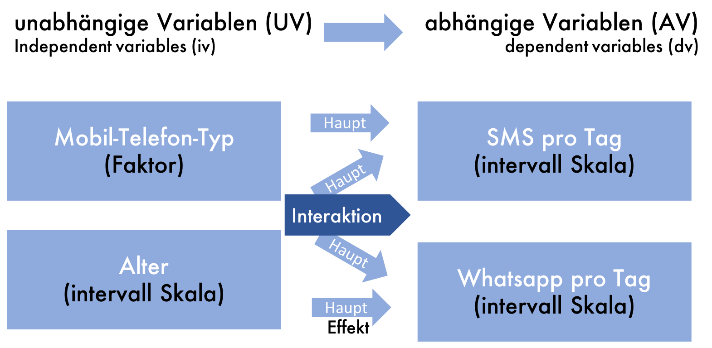

```{r setup, include=FALSE}
#library(plyr)
library(tidyverse)
library(datasets)
library(kableExtra)
library(purrr)
library(scales)
library(forecast)
library(EnvStats)
library(gghighlight)
library(jmv)
```

```{r child="header.Rmd"}
```

# Wiederholung
```{r, echo=FALSE}
df <- data.frame(nums = 1:1000, dice_dist = (rdunif(1000,6)), dist_norm = rnorm(1000), dist_pareto = rpareto(1000, 1, 4))
```

---

# T-Test und Inferenz

- Was ist Inferenz? Schließen von Stichprobe auf Grundgesamtheit.

- NHST Test-Verfahren zum prüfen einer Hypothese. 
- Hypothesen ( $H_{0}$ und $H_1$ )
- Nur $H_0$ kann verworfen werden.
- Signifikanz-Niveau $\alpha$
- Test-Statistik (t) und p-Wert prüfen.

- $\alpha$-Fehler und $\beta$-Fehler

3 Varianten t-Tests zum Prüfen von Unterschiedshypothesen
- einfacher t-Test, independent sample t-Test, paired sample t-Test

---

# Einschränkungen des t-Tests

Grenzen:
- nur 2 Gruppen
- abhängige Variable muss normalverteilt sein

Der t-Test prüft eine Unterschiedshypothese.

## Mehrere Hypothesen
Was passiert wenn wir mehrere Hypothesentests hintereinander durchführen?

---
class: center
# Beispiel: Jellybeans


---
class: center
# Beispiel: Jellybeans


---
# Alpha-Fehler Kummulierung
Viele Hypothesen auf dem gleichen Datensatz zu testen erhöht den die Wahrscheinlichkeit einen alpha-Fehler zu begehen.

Wenn man 20 Hypothesen bei Signifikanz-Niveau $\alpha = 0.05$ testet, wie hoch ist die Wahrscheinlichkeit, dass man mind. eine "falsche" H1 Hypothese annimmt? 


--
.pull-left[
```{r, echo=FALSE, fig.height=3, fig.width=5}

x <- 1:20
y <- dbinom(x, 20, 0.5)
df <- data.frame(x,y)
ggplot(df) + aes(x,y) + geom_col() + labs(title = "Binomial-Verteilung", subtitle = "20 Münzwürfe bei p = 0.5", x="k", y="p")
 
```
]


--
.pull-right[
```{r, echo=FALSE, fig.height=3, fig.width=5}

x <- 1:20
y <- dbinom(x, 20, 0.05)
df <- data.frame(x,y)
ggplot(df) + aes(x,y) + geom_col() + labs(title = "Binomial-Verteilung", subtitle = "20 Münzwürfe bei p = 0.05", x="k", y="p")

sum(y)
```
]

---
# Bonferroni Korrektur

Was kann man tun, um das zu verhindern?

--

.pull-left[
```{r, echo=FALSE, fig.height=3, fig.width=5}

x <- 1:20
y <- dbinom(x, 20, 0.05)
df <- data.frame(x,y)
ggplot(df) + aes(x,y) + geom_col() + labs(title = "Binomial-Verteilung", subtitle = "20 Münzwürfe bei p = 0.05", x="k", y="p") + ylim(0,0.4)
 
sum(y)
```
]


--
.pull-right[
```{r, echo=FALSE, fig.height=3, fig.width=5}

x <- 1:20
y <- dbinom(x, 20, 0.05 / 20)
df <- data.frame(x,y)
ggplot(df) + aes(x,y) + geom_col() + labs(title = "Binomial-Verteilung", subtitle = "20 Münzwürfe bei p = 0.05 / 20", x="k", y="p") + ylim(0,0.4)

sum(y)
```
]

Wenn man *k*-Hypothesen testen, korrigiert man $p/k$.

---
class: inverse, middle, center

# .yellow[Varianzanalyse]


---
layout:true
# Beispiel
Whatsapp per Stunde nach Handytyp

---
```{r, echo=F, fig.height=6}
df_anova <- data.frame(value=c(1,2,3,4,5,6,7,8,9), 
                       value2=c(4,5,3,6,7,5,8,5,7),
                       phone = factor(c(1,1,1,2,2,2,3,3,3), labels = c("Blackberry", "Android", "iPhone")),
                       user=paste("User", c(1:9)),
                       gender = factor(c(1,1,2,1,2,2,1,2,2), labels = c("male", "female")),
                       age = c(31,31,30,22,24,21,25,27,26))


ggplot(df_anova) + aes(x=phone, y= value, fill=phone) + 
  labs(title="3 Gruppen je 3 Teilnehmer", x = "Gruppe", y="Wert", fill="Gruppe") +
  scale_y_continuous(breaks=1:9) +
  #geom_hline(yintercept = 5, linetype="dashed", size=1) +
  geom_point(stroke =1, size=3, shape=21) -> p
p 

```

---
```{r, echo=F, fig.height=6}
p + 
  geom_line(data = data.frame(x=c(0.8,3.2), y=c(5.0,5.0)), aes(x,y), inherit.aes = FALSE, linetype="dashed", size=1) +
  geom_label(label="globaler Mittelwert", x=3, y=5.3, inherit.aes = FALSE) +
  NULL
```

$M = (1+2+3+4+5+6+7+8+9) / 9 = 45 / 9 = 5$

---
```{r, echo=F, warning=FALSE, fig.height=6}
p + 
  gghighlight(value == 3, label_key = user, use_direct_label = F) +
  geom_line(data = data.frame(x=c(0.8,3.2), y=c(5.0,5.0)), aes(x,y), inherit.aes = FALSE, linetype="dashed", size=1) +
  geom_line(data = data.frame(x=c(1,1), y=c(5.0,3)), aes(x,y), inherit.aes = FALSE, size=0.5, color="red") +
  geom_label(label="M", x=3, y=5.3, inherit.aes = FALSE) +
  NULL

```

---
.pull-left[
```{r, echo=F, warning=FALSE, fig.height=8}
p + 
  gghighlight(value == 3, label_key = user, label_params = list(size=8)) +
  geom_line(data = data.frame(x=c(0.8,3.2), y=c(5.0,5.0)), aes(x,y), inherit.aes = FALSE, linetype="dashed", size=1) +
  geom_line(data = data.frame(x=c(1,1), y=c(5.0,3)), aes(x,y), inherit.aes = FALSE, size=0.5, color="red") +
  geom_label(label="M", x=3, y=5.3, inherit.aes = FALSE, size=8) +
  theme_gray(base_size = 22) +
  NULL

```
]
.pull-right[
Residuum: 

$2^2 = 4$
]

---
.pull-left[
```{r, echo=F, warning=FALSE, fig.height=8}
p + 
  gghighlight(value == 2, label_key = user, label_params = list(size=8)) +
  geom_line(data = data.frame(x=c(0.8,3.2), y=c(5.0,5.0)), aes(x,y), inherit.aes = FALSE, linetype="dashed", size=1) +
  geom_line(data = data.frame(x=c(1,1), y=c(5.0,2)), aes(x,y), inherit.aes = FALSE, size=0.5, color="red") +
  geom_label(label="M", x=3, y=5.3, inherit.aes = FALSE, size=8) +
  theme_gray(base_size = 22) +
  NULL
```
]
.pull-right[
Residuum: 

$2^2 + 3^2 = 4+9 = 13$
]

---
.pull-left[
```{r, echo=F, warning=FALSE, fig.height=8}
p + 
  gghighlight(value == 1, label_key = user, label_params = list(size=8)) +
  geom_line(data = data.frame(x=c(0.8,3.2), y=c(5.0,5.0)), aes(x,y), inherit.aes = FALSE, linetype="dashed", size=1) +
  geom_line(data = data.frame(x=c(1,1), y=c(5.0,1)), aes(x,y), inherit.aes = FALSE, size=0.5, color="red") +
  geom_label(label="M", x=3, y=5.3, inherit.aes = FALSE, size=8) +
  theme_gray(base_size = 22) +
  NULL
```
]
.pull-right[
Residuum: 

$2^2 + 3^2 + 4^2 = 4 + 9 + 16  = 29 = R_1$
]

---
.pull-left[
```{r, echo=F, warning=FALSE, fig.height=8}
p + 
  gghighlight(value == 4, label_key = user, label_params = list(size=8)) +
  geom_line(data = data.frame(x=c(0.8,3.2), y=c(5.0,5.0)), aes(x,y), inherit.aes = FALSE, linetype="dashed", size=1) +
  geom_line(data = data.frame(x=c(2,2), y=c(5.0,4)), aes(x,y), inherit.aes = FALSE, size=0.5, color="red") +
  geom_label(label="M", x=3, y=5.3, inherit.aes = FALSE, size=8) +
  theme_gray(base_size = 22) +
  NULL
```
]
.pull-right[
Residuum: 

$1^2 = 1$

$R_1 = 29$
]

---
.pull-left[
```{r, echo=F, warning=FALSE, fig.height=8}
p + 
  gghighlight(value == 6, label_key = user, label_params = list(size=8)) +
  geom_line(data = data.frame(x=c(0.8,3.2), y=c(5.0,5.0)), aes(x,y), inherit.aes = FALSE, linetype="dashed", size=1) +
  geom_line(data = data.frame(x=c(2,2), y=c(5.0,6)), aes(x,y), inherit.aes = FALSE, size=0.5, color="red") +
  geom_label(label="M", x=3, y=5.3, inherit.aes = FALSE, size=8) +
  theme_gray(base_size = 22) +
  NULL
```
]
.pull-right[
Residuum: 

$1^2 + 0^2 + 1^2= 2 = R_2$

$R_1 = 29$
]

---
.pull-left[
```{r, echo=F, warning=FALSE, fig.height=8}
p + 
  gghighlight(value == 7, label_key = user, label_params = list(size=8)) +
  geom_line(data = data.frame(x=c(0.8,3.2), y=c(5.0,5.0)), aes(x,y), inherit.aes = FALSE, linetype="dashed", size=1) +
  geom_line(data = data.frame(x=c(3,3), y=c(5.0,7)), aes(x,y), inherit.aes = FALSE, size=0.5, color="red") +
  geom_label(label="M", x=3, y=5.3, inherit.aes = FALSE, size=8) +
  theme_gray(base_size = 22) +
  NULL
```
]
.pull-right[
Residuum: 

$2^2 = 4$

$R_1 = 29$

$R_2 = 2$
]

---
.pull-left[
```{r, echo=F, warning=FALSE, fig.height=8}
p + 
  gghighlight(value == 8, label_key = user, label_params = list(size=8)) +
  geom_line(data = data.frame(x=c(0.8,3.2), y=c(5.0,5.0)), aes(x,y), inherit.aes = FALSE, linetype="dashed", size=1) +
  geom_line(data = data.frame(x=c(3,3), y=c(5.0,8)), aes(x,y), inherit.aes = FALSE, size=0.5, color="red") +
  geom_label(label="M", x=3, y=5.3, inherit.aes = FALSE, size=8) +
  theme_gray(base_size = 22) +
  NULL
```
]
.pull-right[
Residuum:

$2^2 + 3^2= 4 + 9 = 13$

$R_1 = 29$

$R_2 = 2$
]

---
.pull-left[
```{r, echo=F, warning=FALSE, fig.height=8}
p + 
  gghighlight(value == 9, label_key = user, label_params = list(size=8)) +
  geom_line(data = data.frame(x=c(0.8,3.2), y=c(5.0,5.0)), aes(x,y), inherit.aes = FALSE, linetype="dashed", size=1) +
  geom_line(data = data.frame(x=c(3,3), y=c(5.0,9)), aes(x,y), inherit.aes = FALSE, size=0.5, color="red") +
  geom_label(label="M", x=3, y=5.3, inherit.aes = FALSE, size=8) +
  theme_gray(base_size = 22) +
  NULL
```
]
.pull-right[
Residuum:

$2^2 + 3^2 +4^2= 4 + 9 + 16 = 29 = R_3$

$R_1 = 29$

$R_2 = 2$

]


---
.pull-left[
```{r, echo=F, warning=FALSE, fig.height=8}
p + 
  gghighlight(value == 9, label_key = user, label_params = list(size=8)) +
  geom_line(data = data.frame(x=c(0.8,3.2), y=c(5.0,5.0)), aes(x,y), inherit.aes = FALSE, linetype="dashed", size=1) +
  geom_line(data = data.frame(x=c(3,3), y=c(5.0,9)), aes(x,y), inherit.aes = FALSE, size=0.5, color="red") +
  geom_label(label="M", x=3, y=5.3, inherit.aes = FALSE, size=8) +
  theme_gray(base_size = 22) +
  NULL
```
]
.pull-right[
Residuum:

$R_1 = 29$

$R_2 = 2$

$R_3 = 29$

$SS_T = R_1 + R_2 + R_3 = 60$
]


---
```{r, echo=F, warning=FALSE}
p + 
  geom_line(data = data.frame(x=c(0.6,1.4), y=c(2.0,2.0)), aes(x,y), inherit.aes = FALSE, size=1, color = 2) +
  geom_label(label="M1", x=1.3, y=2.3, inherit.aes = FALSE, size=6) +
  geom_line(data = data.frame(x=c(1.6,2.4), y=c(5.0,5.0)), aes(x,y), inherit.aes = FALSE, size=1, color = 3) +
  geom_label(label="M2", x=2.3, y=5.3, inherit.aes = FALSE, size=6) +
  geom_line(data = data.frame(x=c(2.6,3.4), y=c(8.0,8.0)), aes(x,y), inherit.aes = FALSE, size=1, color = 4) +
  geom_label(label="M3", x=3.3, y=8.3, inherit.aes = FALSE, size=6) +
  theme_gray(base_size = 22) +
  NULL
```


---
.pull-left[
```{r, echo=F, warning=FALSE, fig.height=8}
p + 
  gghighlight(value < 4, label_key = user, label_params = list(size=8)) +
  geom_line(data = data.frame(x=c(0.6,1.4), y=c(2.0,2.0)), aes(x,y), inherit.aes = FALSE, size=1, color = 2) +
  geom_label(label="M1", x=1.7, y=2, inherit.aes = FALSE, size=8) +
  geom_line(data = data.frame(x=c(1.6,2.4), y=c(5.0,5.0)), aes(x,y), inherit.aes = FALSE, size=1, color = 3) +
  geom_label(label="M2", x=2.3, y=5.3, inherit.aes = FALSE, size=8) +
  geom_line(data = data.frame(x=c(2.6,3.4), y=c(8.0,8.0)), aes(x,y), inherit.aes = FALSE, size=1, color = 4) +
  geom_label(label="M3", x=3.3, y=8.3, inherit.aes = FALSE, size=8) +
  geom_line(data = data.frame(x=c(1,1), y=c(3,1)), aes(x,y), inherit.aes = FALSE, size=0.5, color="red") +
  theme_gray(base_size = 22) +
  NULL
```
]
.pull-right[
Residuum:

$R_{w1} = 1^2 + 0^2 + 1^2 = 2$

$R_{w1} =$

$R_{w1} =$

$SS_T = 60$
]

---
.pull-left[
```{r, echo=F, warning=FALSE, fig.height=8}
p + 
  gghighlight(value > 0, label_key = user, label_params = list(size=8)) +
  geom_line(data = data.frame(x=c(0.6,1.4), y=c(2.0,2.0)), aes(x,y), inherit.aes = FALSE, size=1, color = 2) +
  #geom_label(label="M1", x=1.3, y=2.3, inherit.aes = FALSE, size=8) +
  geom_line(data = data.frame(x=c(1.6,2.4), y=c(5.0,5.0)), aes(x,y), inherit.aes = FALSE, size=1, color = 3) +
  #geom_label(label="M2", x=2.3, y=5.3, inherit.aes = FALSE, size=8) +
  geom_line(data = data.frame(x=c(2.6,3.4), y=c(8.0,8.0)), aes(x,y), inherit.aes = FALSE, size=1, color = 4) +
  #geom_label(label="M3", x=3.3, y=8.3, inherit.aes = FALSE, size=8) +
  #geom_line(data = data.frame(x=c(1,1), y=c(3,1)), aes(x,y), inherit.aes = FALSE, size=0.5, color="red") +
  theme_gray(base_size = 22) +
  NULL
```
]
.pull-right[
Residuum:

$R_{w1} = 1^2 + 0^2 + 1^2 = 2$

$R_{w2} = 2$

$R_{w3} = 2$

$SS_T = 60$
]
---
.pull-left[
```{r, echo=F, warning=FALSE, fig.height=8}
p + 
  geom_line(data = data.frame(x=c(0.6,1.4), y=c(2.0,2.0)), aes(x,y), inherit.aes = FALSE, size=1, color = 2) +
  #geom_label(label="M1", x=1.3, y=2.3, inherit.aes = FALSE, size=8) +
  geom_line(data = data.frame(x=c(1.6,2.4), y=c(5.0,5.0)), aes(x,y), inherit.aes = FALSE, size=1, color = 3) +
  #geom_label(label="M2", x=2.3, y=5.3, inherit.aes = FALSE, size=8) +
  geom_line(data = data.frame(x=c(2.6,3.4), y=c(8.0,8.0)), aes(x,y), inherit.aes = FALSE, size=1, color = 4) +
  #geom_label(label="M3", x=3.3, y=8.3, inherit.aes = FALSE, size=8) +
  #geom_line(data = data.frame(x=c(1,1), y=c(3,1)), aes(x,y), inherit.aes = FALSE, size=0.5, color="red") +
  theme_gray(base_size = 22) + 
  guides(fill=FALSE) +
  NULL
```
]
.pull-right[
Residuum:

$R_{w1} = 2$

$R_{w2} = 2$

$R_{w3} = 2$

$SS_{w} = R_{w1} + R_{w2} + R_{w3} =6$

$SS_T = 60$
]


---
.pull-left[
```{r, echo=F, warning=FALSE, fig.height=8}
p + 
  geom_line(data = data.frame(x=c(0.6,1.4), y=c(2.0,2.0)), aes(x,y), inherit.aes = FALSE, size=1, color = 2) +
  #geom_label(label="M1", x=1.3, y=2.3, inherit.aes = FALSE, size=8) +
  geom_line(data = data.frame(x=c(1.6,2.4), y=c(5.0,5.0)), aes(x,y), inherit.aes = FALSE, size=1, color = 3) +
  #geom_label(label="M2", x=2.3, y=5.3, inherit.aes = FALSE, size=8) +
  geom_line(data = data.frame(x=c(2.6,3.4), y=c(8.0,8.0)), aes(x,y), inherit.aes = FALSE, size=1, color = 4) +
  #geom_label(label="M3", x=3.3, y=8.3, inherit.aes = FALSE, size=8) +
  #geom_line(data = data.frame(x=c(1,1), y=c(3,1)), aes(x,y), inherit.aes = FALSE, size=0.5, color="red") +
  theme_gray(base_size = 22) + 
  guides(fill=FALSE) +
  NULL
```
]
.pull-right[
Sum of Squares

$SS_{w} = 6$

$SS_T = 60$

$SS_{b} = SS_T - SS_w = 54$

Freiheitsgrade bei *k* Gruppen

$df_1 = k-1 = 2$

$df_2 = n-k = 6$
]

---
layout:false

# ANOVA in R
```{r}

ANOVA(df_anova, dep="value", factors = "phone")

```


Ergebins: F-Statistik und *p* Wert
Woher kommt der *p* Wert?

--

[F-Verteilung](https://de.wikipedia.org/wiki/F-Verteilung) : $F(2,6) >$ `r qf(.95,2,6)`  für $p=0.05$

Bericht:
Es gibt einen signifikanten Haupteffekt des Handytyps auf die Anzahl von empfangenen Whatsapp-Nachrichten ( $F(2,6)= 27, p<.001$ ).


---
# Post-hoc test
Warum nicht einfach 3 t-Tests?

--
```{r}
ANOVA(df_anova, dep="value", factors = c("phone"), postHoc=c("phone"))

```


---
# One-Way ANOVA


## In R (mit jmv-library):
```{r eval=F}
ANOVA(df_anova, dep = "value", factors = "phone", postHoc = "phone")
```

---
# Two-way ANOVA


## In R (mit jmv-library):
```{r eval=F}
ANOVA(df_anova, dep = "value", factors = c("phone","gender"))
```

---
# Two-way ANOVA
```{r}
res <- ANOVA(df_anova, dep = "value", factors = c("phone","gender"), 
             emMeans = list(c("phone", "gender")))
res$main
```
---
# Two-way ANOVA (plot)
```{r fig.height=5, warning=FALSE}
res$emm
```

---
# ANCOVA

## In R (mit jmv-library):
```{r eval=F}
ancova(df_anova, dep = "value", factors = c("phone"), covs = "age")
```
---
# ANCOVA
```{r}
ancova(df_anova, dep = "value", factors = c("phone"), covs = "age")
```

---
# MANOVA

## In R (mit jmv-library):
```{r eval=F}
mancova(df_anova, deps = c("value", "value2"), factors = c("phone"))
```
---
# MANOVA
```{r eval=FALSE}
mancova(df_anova, deps = c("value", "value2"), factors = c("phone"))
```

<pre style="font-size:10pt">
```{r echo=FALSE}
mancova(df_anova, deps = c("value", "value2"), factors = c("phone"))
```
</pre>

---
# Two-way MANOVA

## In R (mit jmv-library):
```{r eval=F}
mancova(df_anova, deps = c("value", "value2"), factors = c("phone", "gender"))
```
---
# Two-way MANOVA
```{r eval=FALSE}
mancova(df_anova, deps = c("value", "value2"), factors = c("phone", "gender"))
```

<pre style="font-size:8pt">
```{r echo=FALSE}
mancova(df_anova, deps = c("value", "value2"), factors = c("phone", "gender"))
```
</pre>


---
# MANCOVA

## In R (mit jmv-library):
```{r eval=F}
mancova(df_anova, deps = c("value", "value2"), factors = c("phone"), 
        covs = c("age"))
```
---
# MANCOVA
```{r eval=FALSE}
mancova(df_anova, deps = c("value", "value2"), factors = c("phone"), 
        covs = c("age"))
```

<pre style="font-size:8pt">
```{r echo=FALSE}
mancova(df_anova, deps = c("value", "value2"), factors = c("phone"), covs = c("age"))
```
</pre>


---
# MANOVA Beispiel
```{r echo=F}
df_manova = data.frame(grade=c(1.3, 1.6, 1.9, 2.3, 2.6, 2.9, 3.0, 3.4, 3.9, 5, 1.1, 1.5, 1.4, 2.6, 2.4, 2.8, 3.3, 3.2, 3.7, 4),
                       happiness=c(1.2, 1.4, 1.7, 2.0, 2.5, 2.8, 3.0, 3.2, 3.2, 4.5, 1.0, 1.7, 1.9, 2.3, 2.6, 3.2, 3.0, 3.4, 3.9, 5),
                       course=factor(c(rep(1,10), rep(2,10)), labels=c("SPSS", "r")))
```

.pull-left[
```{r echo=F}
df_manova %>% ggplot() +
  aes(x=course, y=happiness, shape = course, color = course) +
  geom_jitter(width = 0.1, size = 4) + theme_gray(base_size = 24)

```
]

.pull-right[
```{r echo=F}
df_manova %>% ggplot() +
  aes(x=course, y=grade, shape = course, color = course) +
  geom_jitter(width = 0.1, size = 4) + theme_gray(base_size = 24)

```
]

---
# MANOVA Beispiel

```{r echo=F}
df_manova %>% ggplot() +
  aes(x=grade, y=happiness, shape = course, color = course) +
  geom_point(size = 4) + theme_gray(base_size = 24)

```

---
# MANOVA Beispiel

```{r eval=F}
mancova(df_manova, factors=c("course"), deps=c("happiness", "grade"))

```

<pre style="font-size: 10pt;">
```{r echo=F}
mancova(df_manova, factors=c("course"), deps=c("happiness", "grade"))

```
</pre>

---
# Zusammenfassung

## Alpha-Fehler Kummulierung
- alpha-Schwellen Korrektur

## ANOVA
- PostHoc Test (Tukey)

## ANCOVA
- Intervall-skalierte Covariate

## MAN(C)OVA
- Mehrere abhängige Variablen und deren Interaktion


---
class: inverse, center, middle
---
class: inverse, center, middle
## .yellow[ [Zurück zur Übersicht](index.html)]
