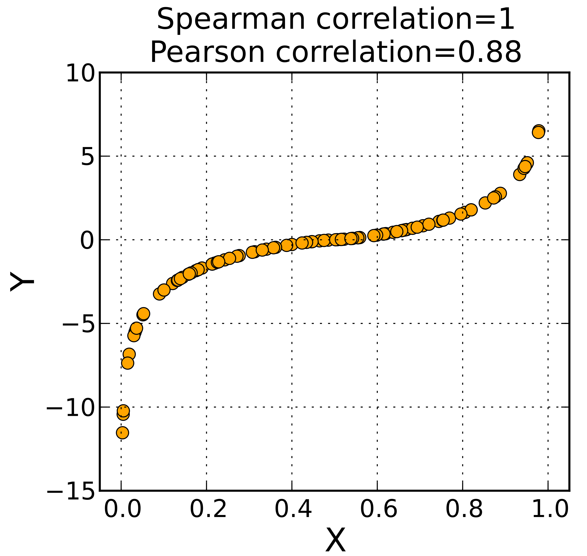

```{r setup, include=FALSE}
#library(plyr)
library(tidyverse)
library(datasets)
library(kableExtra)
library(purrr)
library(scales)
library(forecast)
library(EnvStats)
library(gghighlight)
library(jmv)
library(ggpubr)
options(htmltools.dir.version = FALSE)
options(digits = 4)
knitr::opts_chunk$set(
  cache = FALSE,
  fig.align = "center",
  dev = "png",
  fig.retina = 2,
  message = FALSE,
  comment = NA
)
theme_set(theme_gray(base_size = 16))
```

# T-Test und Inferenz

- Was ist Inferenz? Schließen von Stichprobe auf Grundgesamtheit.

- NHST Test-Verfahren zum prüfen einer Hypothese. 
- Hypothesen ( $H_{0}$ und $H_1$ )
- Nur $H_0$ kann verworfen werden.
- Signifikanz-Niveau $\alpha$
- Test-Statistik (t) und p-Wert prüfen.

- $\alpha$-Fehler und $\beta$-Fehler

3 Varianten t-Tests zum Prüfen von Unterschiedshypothesen
- einfacher t-Test, independent sample t-Test, paired sample t-Test

---

# Unterschiedshypothesen

> Gibt es einen Unterschied zwischen...

##Der t-Test für
- 2 Gruppen (within oder between subjects)
- Normalverteilte abhängige Variable

## Mehrere Hypothesen
- Varianzanalyse (ANOVA)
- One-way oder two-way
- Mit oder ohne Covariate (ANCOVA)
- Mehrere Abhängige (MANCOVA)


---
# Univariate und Multivariate Statistik

.pull-left[
## Univariate
```{r, echo=F, fig.height=5}
set.seed(0)
height <- round(rnorm(100, 170, 15), 1)
df_uni <- data.frame(height)
head(df_uni, 10)
ggplot(df_uni) + aes(height) + geom_histogram(bins = 10, fill = "black")
```
]

--

.pull-right[
## Multivariate
```{r, echo=F, fig.height=5}
shoesize <- round(runif(100, 36, 42))
df_multi <- data.frame(height,
                       shoesize)
head(df_multi, 10)
ggplot(df_uni) + aes(height, shoesize) + geom_point(size = 3, alpha = 0.8)
```
]

---
# Multivariate Statistik
```{r, echo=F}

# Scatter plot colored by groups ("Species")
sp <- ggscatter(df_multi, x = "height", y = "shoesize",
                        size = 3, alpha = 0.8) + border()                                         

# Marginal density plot of x (top panel) and y (right panel)
xplot <- gghistogram(df_multi, x = "height", bins = 10, fill = "black")
yplot <- gghistogram(df_multi, x = "shoesize", bins = 10, fill = "black")+ rotate()
# Cleaning the plots
sp <- sp + rremove("legend")
yplot <- yplot + clean_theme() + rremove("legend") 
xplot <- xplot + clean_theme() + rremove("legend")
# Arranging the plot using cowplot
library(cowplot)
plot_grid(xplot, NULL, sp, yplot, ncol = 2, align = "hv", 
      rel_widths = c(2, 1), rel_heights = c(1, 2))
```

---
# Zusammenhangshypothesen

> Gibt es einen Zusammenhang zwischen... (je mehr, desto..)

```{r, echo=FALSE, warning=FALSE}
df_sigma <- matrix(c(2,1,1,2), nrow = 2)
df <- MASS::mvrnorm(100, c(3,3), df_sigma, empirical = T)

df <- data.frame(df)

sp <- ggscatter(df, x = "X1", y = "X2",
                        size = 3, alpha = 0.8) + border()

p <- df %>% ggplot() + aes(x = X1, y = X2) + geom_point() + theme_light() 
sp <- ggExtra::ggMarginal(p, type = "histogram")
p
#sp


```
---
# Zusammenhangshypothesen

> Gibt es einen Zusammenhang zwischen... (je mehr, desto..)

```{r, echo=FALSE, warning=FALSE}
sp


```


---
# Varianz und Covarianz

$$ VAR(X) = \frac{1}{N} \sum_{i=1}^{N}{(x_i - \bar{x})^2} $$
Varianz ist die mittlere quadratische Abweichung vom Mittelwert.

--

Covarianz ist "mittlere" Abweichung zweier verbundener Variablen vom verbundenen Mittelwert.

$$COV_{xy} = \frac{1}{N-1} \sum_{i=1}^{N}{(x_{i} - \bar{x})(y_{i} - \bar{y})}$$
---
# Einfaches Beispiel

2 Variablen: x, y

3 Werte: je 2,4,6

```{r, echo=F}
df_pos <- data.frame(x=c(2,4,6), y=c(2,4,6))
kable(df_pos, row.names = T)
```


---
# Visuelle Interpretation
$$\bar{x}=$$
$$\bar{y}=$$

```{r echo=F, fig.height=5, fig.width=5}
df_pos <- data.frame(x=c(2,4,6), y=c(2,4,6))
ggscatter(df_pos, x="x", y="y", color="red", size=4) + lims(x=c(0,8), y=c(0,8))


```


---
# Visuelle Interpretation
$$\bar{x}=\frac{1}{3} (2+4+6) = 4 $$
$$\bar{y}=$$

```{r echo=F, fig.height=5, fig.width=5}

ggscatter(df_pos, x="x", y="y", color="red", size=4) + lims(x=c(0,8), y=c(0,8))


```


---
# Visuelle Interpretation
$$\bar{x}=\frac{1}{3} (2+4+6) = 4 $$
$$\bar{y}=$$

```{r echo=F, fig.height=5, fig.width=5}

ggscatter(df_pos, x="x", y="y", color="red", size=4) + lims(x=c(0,8), y=c(0,8)) + geom_vline(xintercept = 4)


```

---
# Visuelle Interpretation
$$\bar{x}=\frac{1}{3} (2+4+6) = 4 $$
$$\bar{y}=\frac{1}{3} (2+4+6) = 4$$

```{r echo=F, fig.height=5, fig.width=5}
ggscatter(df_pos, x="x", y="y", color="red", size=4) + lims(x=c(0,8), y=c(0,8)) + geom_vline(xintercept = 4) + geom_hline(yintercept = 4)
```


---
# Visuelle Interpretation
$$\bar{x}= 4 $$
$$\bar{y}= 4$$

```{r echo=F, fig.height=5, fig.width=5}
ggscatter(df_pos, x="x", y="y", color="red", size=4) + lims(x=c(0,8), y=c(0,8)) +
  geom_point(data=data.frame(x=4, y=4), aes(x=x, y=y), size = 10, alpha=0.4) 
```

---
# Visuelle Interpretation
$$\bar{x}= 4 \text{ und } \bar{y}= 4$$
$$COV_{xy} = \frac{1}{N-1} \sum_{i=1}^{N}{(x_{i} - \bar{x})(y_{i} - \bar{y})}$$

```{r echo=F, fig.height=5, fig.width=5}
ggscatter(df_pos, x="x", y="y", color="red", size=4) + lims(x=c(0,8), y=c(0,8)) +
  geom_point(data=data.frame(x=4, y=4), aes(x=x, y=y), size = 10, alpha=0.4) 
```

---
# Visuelle Interpretation
$$COV_{xy} = \frac{1}{2} \sum_{i=1}^{3}{(x_{i} - 4)(y_{i} - 4)}$$ 
--

$$= \frac{1}{2}( (x_1-4)(y_1-4) + (x_2-4)(y_2-4) + (x_3-4)(y_3-4))$$

```{r echo=F, fig.height=5, fig.width=5}
ggscatter(df_pos, x="x", y="y", color="red", size=4) + lims(x=c(0,8), y=c(0,8)) +
  geom_point(data=data.frame(x=4, y=4), aes(x=x, y=y), size = 10, alpha=0.4) 
```


---
# Visuelle Interpretation
$$COV_{xy} = \frac{1}{N-1} \sum_{i=1}^{N}{\color{red}{(x_{i} - \bar{x})}(y_{i} - \bar{y})}$$

```{r echo=F, fig.height=5, fig.width=5}
ggscatter(df_pos, x="x", y="y", color="red", size=4) + lims(x=c(0,8), y=c(0,8)) +
  geom_point(data=data.frame(x=4, y=4), aes(x=x, y=y), size = 10, alpha=0.4) + 
  geom_vline(xintercept = 4, linetype="dashed") + geom_hline(yintercept = 4, linetype="dashed") +
  geom_line(data=data.frame(x=c(2,4), y=c(2,2)), color = "red") 
```
---
# Visuelle Interpretation
$$COV_{xy} = \frac{1}{N-1} \sum_{i=1}^{N}{\color{red}{(x_{i} - \bar{x})}(y_{i} - \bar{y})}$$

```{r echo=F, fig.height=5, fig.width=5}
ggscatter(df_pos, x="x", y="y", color="red", size=4) + lims(x=c(0,8), y=c(0,8)) +
  geom_point(data=data.frame(x=4, y=4), aes(x=x, y=y), size = 10, alpha=0.4) + 
  geom_vline(xintercept = 4, linetype="dashed") + geom_hline(yintercept = 4, linetype="dashed") +
  geom_line(data=data.frame(x=c(2,4), y=c(2,2)), color = "red") +
  geom_label(data= data.frame(label=c("-2"), x=c(3), y=c(1.5)), aes(label=label, x=x, y=y), size=7)
```

---
# Visuelle Interpretation
$$COV_{xy} = \frac{1}{N-1} \sum_{i=1}^{N}{\color{red}{(x_{i} - \bar{x})}\color{blue}{(y_{i} - \bar{y})}}$$

```{r echo=F, fig.height=5, fig.width=5}
ggscatter(df_pos, x="x", y="y", color="red", size=4) + lims(x=c(0,8), y=c(0,8)) +
  geom_point(data=data.frame(x=4, y=4), aes(x=x, y=y), size = 10, alpha=0.4) + 
  geom_vline(xintercept = 4, linetype="dashed") + geom_hline(yintercept = 4, linetype="dashed") +
  geom_line(data=data.frame(x=c(2,4), y=c(2,2)), color = "red") +
  geom_line(data=data.frame(x=c(2,2), y=c(2,4)), color = "blue") +
  geom_label(data= data.frame(label=c("-2", "-2"), x=c(3,1.5), y=c(1.5,3)), aes(label=label, x=x, y=y), size=7)
```

---
# Visuelle Interpretation
$$COV_{xy} = \frac{1}{N-1} \sum_{i=1}^{N}{\color{red}{(x_{i} - \bar{x})}\color{blue}{(y_{i} - \bar{y})}}$$
$$ = \frac{1}{2}( \color{red}{-2} \cdot \color{blue}{-2} + \ldots = \frac{1}{2}( 4 + \ldots$$

```{r echo=F, fig.height=5, fig.width=5}
ggscatter(df_pos, x="x", y="y", color="red", size=4) + lims(x=c(0,8), y=c(0,8)) +
  geom_point(data=data.frame(x=4, y=4), aes(x=x, y=y), size = 10, alpha=0.4) + 
  geom_vline(xintercept = 4, linetype="dashed") + geom_hline(yintercept = 4, linetype="dashed") +
  geom_line(data=data.frame(x=c(2,4), y=c(2,2)), color = "red") +
  geom_line(data=data.frame(x=c(2,2), y=c(2,4)), color = "blue") +
  geom_label(data= data.frame(label=c("-2", "-2"), x=c(3,1.5), y=c(1.5,3)), aes(label=label, x=x, y=y), size=7)
```


---
# Visuelle Interpretation
$$COV_{xy} = \frac{1}{N-1} \sum_{i=1}^{N}{\color{red}{(x_{i} - \bar{x})}\color{blue}{(y_{i} - \bar{y})}}$$
$$ = \frac{1}{2}( \color{red}{-2} \cdot \color{blue}{-2} + 0 +\ldots = \frac{1}{2}( 4 + 0 + \ldots$$

```{r echo=F, fig.height=5, fig.width=5}
ggscatter(df_pos, x="x", y="y", color="red", size=4) + lims(x=c(0,8), y=c(0,8)) +
  geom_point(data=data.frame(x=4, y=4), aes(x=x, y=y), size = 10, alpha=0.4) + 
  geom_vline(xintercept = 4, linetype="dashed") + geom_hline(yintercept = 4, linetype="dashed") +
  geom_line(data=data.frame(x=c(2,4), y=c(2,2)), color = "red") +
  geom_line(data=data.frame(x=c(2,2), y=c(2,4)), color = "blue") +
  geom_label(data= data.frame(label=c("-2", "-2"), x=c(3,1.5), y=c(1.5,3)), aes(label=label, x=x, y=y), size=7)
```


---
# Visuelle Interpretation
$$COV_{xy} = \frac{1}{N-1} \sum_{i=1}^{N}{\color{red}{(x_{i} - \bar{x})}\color{blue}{(y_{i} - \bar{y})}}$$
$$ = \frac{1}{2}( \color{red}{-2} \cdot \color{blue}{-2} + 0 +\ldots = \frac{1}{2}( 4 + 0 + \ldots$$

```{r echo=F, fig.height=5, fig.width=5}
ggscatter(df_pos, x="x", y="y", color="red", size=4) + lims(x=c(0,8), y=c(0,8)) +
  geom_point(data=data.frame(x=4, y=4), aes(x=x, y=y), size = 10, alpha=0.4) + 
  geom_vline(xintercept = 4, linetype="dashed") + geom_hline(yintercept = 4, linetype="dashed") +
  geom_line(data=data.frame(x=c(2,4), y=c(2,2)), color = "red") +
  geom_line(data=data.frame(x=c(2,2), y=c(2,4)), color = "blue") +
  geom_label(data= data.frame(label=c("-2", "-2"), x=c(3,1.5), y=c(1.5,3)), aes(label=label, x=x, y=y), size=7) +
   geom_line(data=data.frame(x=c(4,6), y=c(6,6)), color = "red") +
  geom_line(data=data.frame(x=c(6,6), y=c(6,4)), color = "blue") 
```

---
# Visuelle Interpretation
$$COV_{xy} = \frac{1}{N-1} \sum_{i=1}^{N}{\color{red}{(x_{i} - \bar{x})}\color{blue}{(y_{i} - \bar{y})}}$$
$$ = \frac{1}{2}( \color{red}{-2} \cdot \color{blue}{-2} + 0 +\color{red}{2} \cdot \color{blue}{2} ) = \frac{1}{2}( 4 + 0 + 4) = \frac{8}{2} = 4$$

```{r echo=F, fig.height=5, fig.width=5}
ggscatter(df_pos, x="x", y="y", color="red", size=4) + lims(x=c(0,8), y=c(0,8)) +
  geom_point(data=data.frame(x=4, y=4), aes(x=x, y=y), size = 10, alpha=0.4) + 
  geom_vline(xintercept = 4, linetype="dashed") + geom_hline(yintercept = 4, linetype="dashed") +
  geom_line(data=data.frame(x=c(2,4), y=c(2,2)), color = "red") +
  geom_line(data=data.frame(x=c(2,2), y=c(2,4)), color = "blue") +
  geom_label(data= data.frame(label=c("-2", "-2"), x=c(3,1.5), y=c(1.5,3)), aes(label=label, x=x, y=y), size=7) +
   geom_line(data=data.frame(x=c(4,6), y=c(6,6)), color = "red") +
  geom_line(data=data.frame(x=c(6,6), y=c(6,4)), color = "blue") +
  geom_label(data= data.frame(label=c("2", "2"), x=c(6.5,5), y=c(5,6.5)), aes(label=label, x=x, y=y), size=7)
```

---
# Kann das R auch ?
```{r}
cov(df_pos$x, df_pos$y)
```
---
# Einfaches Beispiel 2

2 Variablen: x, y

3 Werte: je 2,4,6

```{r, echo=F}
df_pos <- data.frame(x=c(2,4,6), y=c(6,4,2))
kable(df_pos, row.names = T)
```

---
# Visuelle Interpretation
$$\bar{x}= 4 $$
$$\bar{y}= 4$$

```{r echo=F, fig.height=5, fig.width=5}
ggscatter(df_pos, x="x", y="y", color="red", size=4) + lims(x=c(0,8), y=c(0,8)) +
  geom_point(data=data.frame(x=4, y=4), aes(x=x, y=y), size = 10, alpha=0.4) 
```

---
# Visuelle Interpretation
$$COV_{xy} = \frac{1}{N-1} \sum_{i=1}^{N}{\color{red}{(x_{i} - \bar{x})}(y_{i} - \bar{y})}$$

```{r echo=F, fig.height=5, fig.width=5}
ggscatter(df_pos, x="x", y="y", color="red", size=4) + lims(x=c(0,8), y=c(0,8)) +
  geom_point(data=data.frame(x=4, y=4), aes(x=x, y=y), size = 10, alpha=0.4) + 
  geom_vline(xintercept = 4, linetype="dashed") + geom_hline(yintercept = 4, linetype="dashed") +
  geom_line(data=data.frame(x=c(2,4), y=c(6,6)), color = "red") 
```


---
# Visuelle Interpretation
$$COV_{xy} = \frac{1}{N-1} \sum_{i=1}^{N}{\color{red}{(x_{i} - \bar{x})}(y_{i} - \bar{y})}$$

```{r echo=F, fig.height=5, fig.width=5}
ggscatter(df_pos, x="x", y="y", color="red", size=4) + lims(x=c(0,8), y=c(0,8)) +
  geom_point(data=data.frame(x=4, y=4), aes(x=x, y=y), size = 10, alpha=0.4) + 
  geom_vline(xintercept = 4, linetype="dashed") + geom_hline(yintercept = 4, linetype="dashed") +
  geom_line(data=data.frame(x=c(2,4), y=c(6,6)), color = "red") +
  geom_label(data= data.frame(label=c("-2"), x=c(3), y=c(6.5)), aes(label=label, x=x, y=y), size=7)
```

---
# Visuelle Interpretation
$$COV_{xy} = \frac{1}{N-1} \sum_{i=1}^{N}{\color{red}{(x_{i} - \bar{x})}\color{blue}{(y_{i} - \bar{y})}}$$

```{r echo=F, fig.height=5, fig.width=5}
ggscatter(df_pos, x="x", y="y", color="red", size=4) + lims(x=c(0,8), y=c(0,8)) +
  geom_point(data=data.frame(x=4, y=4), aes(x=x, y=y), size = 10, alpha=0.4) + 
  geom_vline(xintercept = 4, linetype="dashed") + geom_hline(yintercept = 4, linetype="dashed") +
  geom_line(data=data.frame(x=c(2,4), y=c(6,6)), color = "red") +
  geom_line(data=data.frame(x=c(2,2), y=c(4,6)), color = "blue") +
  geom_label(data= data.frame(label=c("-2", "2"), x=c(3,1.5), y=c(6.5,5)), aes(label=label, x=x, y=y), size=7)
```

---
# Visuelle Interpretation
$$COV_{xy} = \frac{1}{N-1} \sum_{i=1}^{N}{\color{red}{(x_{i} - \bar{x})}\color{blue}{(y_{i} - \bar{y})}}$$
$$ = \frac{1}{2}( \color{red}{-2} \cdot \color{blue}{2} + \ldots = \frac{1}{2}( -4 + \ldots$$

```{r echo=F, fig.height=5, fig.width=5}
ggscatter(df_pos, x="x", y="y", color="red", size=4) + lims(x=c(0,8), y=c(0,8)) +
  geom_point(data=data.frame(x=4, y=4), aes(x=x, y=y), size = 10, alpha=0.4) + 
  geom_vline(xintercept = 4, linetype="dashed") + geom_hline(yintercept = 4, linetype="dashed") +
  geom_line(data=data.frame(x=c(2,4), y=c(6,6)), color = "red") +
  geom_line(data=data.frame(x=c(2,2), y=c(4,6)), color = "blue") +
  geom_label(data= data.frame(label=c("-2", "2"), x=c(3,1.5), y=c(6.5,5)), aes(label=label, x=x, y=y), size=7)
```

---
# Visuelle Interpretation
$$COV_{xy} = \frac{1}{N-1} \sum_{i=1}^{N}{\color{red}{(x_{i} - \bar{x})}\color{blue}{(y_{i} - \bar{y})}}$$
$$ = \frac{1}{2}( \color{red}{-2} \cdot \color{blue}{2} + 0 +\color{red}{2} \cdot \color{blue}{2} ) = \frac{1}{2}( -4 + 0 + (-4)) = -\frac{8}{2} = -4$$

```{r echo=F, fig.height=5, fig.width=5}
ggscatter(df_pos, x="x", y="y", color="red", size=4) + lims(x=c(0,8), y=c(0,8)) +
  geom_point(data=data.frame(x=4, y=4), aes(x=x, y=y), size = 10, alpha=0.4) + 
  geom_vline(xintercept = 4, linetype="dashed") + geom_hline(yintercept = 4, linetype="dashed") +
  geom_line(data=data.frame(x=c(2,4), y=c(6,6)), color = "red") +
  geom_line(data=data.frame(x=c(2,2), y=c(4,6)), color = "blue") +
  geom_label(data= data.frame(label=c("-2", "2"), x=c(3,1.5), y=c(6.5,5)), aes(label=label, x=x, y=y), size=7) +
   geom_line(data=data.frame(x=c(4,6), y=c(2,2)), color = "red") +
  geom_line(data=data.frame(x=c(6,6), y=c(2,4)), color = "blue") +
  geom_label(data= data.frame(label=c("-2", "2"), x=c(6.5,5), y=c(3,1.5)), aes(label=label, x=x, y=y), size=7)
```

---
# Kann das R auch ?
```{r}
cov(df_pos$x, df_pos$y)
```

---
# Was passiert bei Veränderung?
$$COV_{xy} = \frac{1}{N-1} \sum_{i=1}^{N}{\color{red}{(x_{i} - \bar{x})}\color{blue}{(y_{i} - \bar{y})}}$$
$$ = \frac{1}{2}( \color{red}{-2} \cdot \color{blue}{2} + 0 +\color{red}{2} \cdot \color{blue}{2} ) = \frac{1}{2}( -4 + 0 + (-4)) = -\frac{8}{2} = -4$$

```{r echo=F, fig.height=5, fig.width=5}
ggscatter(df_pos, x="x", y="y", color="red", size=4) + lims(x=c(0,8), y=c(0,8)) +
  geom_point(data=data.frame(x=4, y=4), aes(x=x, y=y), size = 10, alpha=0.4) + 
  geom_vline(xintercept = 4, linetype="dashed") + geom_hline(yintercept = 4, linetype="dashed") +
  geom_line(data=data.frame(x=c(2,4), y=c(6,6)), color = "red") +
  geom_line(data=data.frame(x=c(2,2), y=c(4,6)), color = "blue") +
  geom_label(data= data.frame(label=c("-2", "2"), x=c(3,1.5), y=c(6.5,5)), aes(label=label, x=x, y=y), size=7) +
   geom_line(data=data.frame(x=c(4,6), y=c(2,2)), color = "red") +
  geom_line(data=data.frame(x=c(6,6), y=c(2,4)), color = "blue") +
  geom_label(data= data.frame(label=c("-2", "2"), x=c(6.5,5), y=c(3,1.5)), aes(label=label, x=x, y=y), size=7)
```

---
# Covarianz ist beschreibt einen Zusammenhang
- positiv, wenn gilt: je mehr, desto mehr
- negativ, wenn gilt: je mehr, desto weniger

Die Covarianz hängt ab von der Streuung in beide Richtungen: 
- $VAR(X)$
- $VAR(Y))$
- Große Streuung => große Covarianz

---
# Beschreibung eines Zusammenhangs
- Covarianz (hängt von beiden Streuungen ab)
- Korrelation (rechnet die Streuung als Standardabwichung wieder raus)

--

$$ r = \frac{COV(XY)}{\sqrt{VAR(X)} \sqrt{VAR(Y)} } = \frac{COV(XY)}{SD(X) SD(Y)} $$

```{r}
cov(df_pos$x, df_pos$y)
sd(df_pos$x)
sd(df_pos$y)
```
--

```{r}
cor(df_pos$x, df_pos$y)
```

---
# Pearson Moment Korrelation
- wird mit $r$ beschrieben
- $r$ ist der Korrelationskoeffizient
- $r$ liegt immer zwischen -1 und 1

Vorraussetzung:
- beide Variablen sind normalverteilt

--


---
# Hypothesentest mit R
.pull-left[
```{r, echo=F, fig.height=5}
set.seed(0)
height <- rnorm(100, 175, 10)
shoesize <- runif(100, 36, 42)
df_multi <- data.frame(height, 
                       shoesize)

ggplot(df_multi) + aes(height, shoesize) + geom_point(size=3, alpha=0.8)
```
]

--

.pull-right[
```{r}
cor.test(data = df_multi, 
         ~height+shoesize)
```
 ]

```{r include=FALSE}
res <- cor.test(data=df_multi, 
         ~height+shoesize)

apastats::describe.r(res)
```

Es gibt keinen signifikanten Zusammenhang zwischen Körpergröße und Schuhgröße (`r apastats::describe.r(res)`).

---
# Alternativen
## Was tun, wenn Daten nicht normalverteilt sind?
- Spearman Rangkorrelation: $\rho$ (gr. rho)

--

```{r, warning=F}
cor.test(data = df_multi, 
         ~height+shoesize, method = "spearman")
```

--

```{r, warning=F, include=F}
res <- cor.test(data = df_multi, 
         ~height+shoesize, method = "spearman")
res$p.value
apastats::describe.r(res)
```

Es gibt keinen signifikanten Zusammenhang zwischen Schuhgröße und Körpergröße ( $\rho=`r round(res$estimate, 3)`, p=`r round(res$p.value, 3)`$ ).

---
```{r echo=FALSE, out.width="80%"}

```


---
# Alternativen 2
## Was tun, wenn Daten nicht intervallskaliert sind?

--
- Kendall's tau Rangkorrelation: $\tau$ 


--

```{r, warning=F}
cor.test(data = df_multi,
         ~ height + round(shoesize), method = "kendall")
```

--
```{r, warning=F, include = F}
res <- cor.test(data = df_multi,
                ~ height + round(shoesize), method = "kendall")

```


Es gibt keinen signifikanten Zusammenhang zwischen Schuhgröße und Körpergröße ( $\tau=0.09, p=.213$ ).

---
# Zusammenfassung
- Korrelation zum Beschreiben und Testen von Zusammenhängen
- Korrelationskoeffizient beschreibt "Stärke" des Zusammenhangs ( $r \in [-1;1]$)
- Je nach Vorraussetzung, unterschiedliche Verfahren.

## Korrelationstabelle

```{r, echo=F}
library(jmv)
jmv::corrMatrix(data = dataforsocialscience::robo_care, vars = c("robo_bed", "robo_food", "robo_med"))
```

---
class: inverse, center, middle
## .yellow[Korrelationen können nicht für die Vorhersage genutzt werden.]


