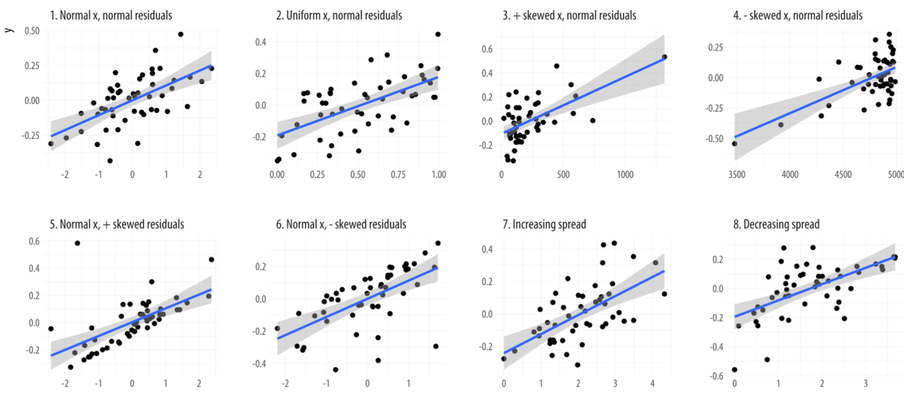
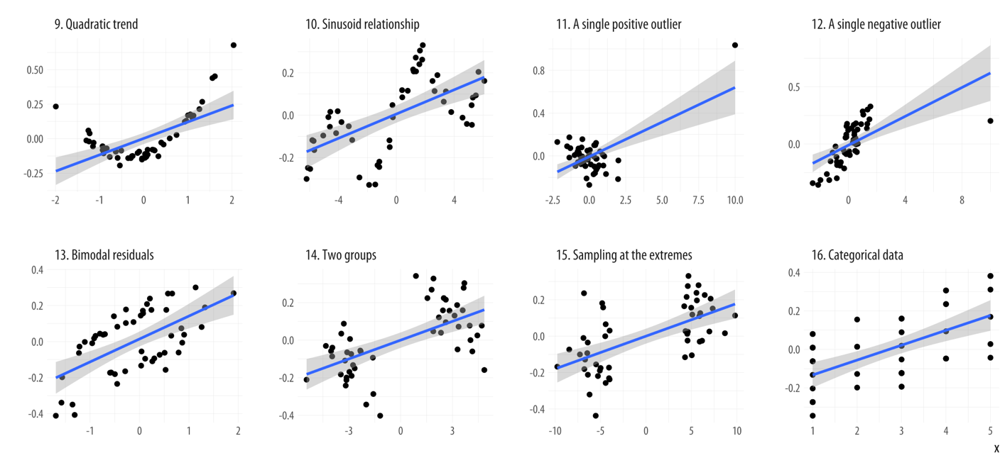

```{r setup, include=FALSE}
library(tidyverse)
library(datasets)
library(kableExtra)
library(purrr)
library(scales)
library(forecast)
library(EnvStats)
library(gghighlight)
library(jmv)
library(ggpubr)

```

```{r child="header.Rmd"}
```


# Korrelation
- Korrelation zum Beschreiben und Testen von Zusammenhängen
- Korrelationskoeffizient beschreibt "Stärke" des Zusammenhangs ( $r \in [-1;1]$)
- Je nach Vorraussetzung, unterschiedliche Verfahren.

## Korrelationstabelle

```{r, echo=F}
library(jmv)
jmv::corrMatrix(data = dataforsocialscience::robo_care, vars = c("robo_bed", "robo_food", "robo_med"))
```

---
class: inverse, center, middle
## .yellow[Korrelationen können nicht für die Vorhersage genutzt werden.]


---
# Vorhersage von Zusammenhängen

## Terminologie
- abhängige Variable: Zielvariable, soll vorhergesagt werden
- unabhägnige Variable, Prädiktor: Eingangsvariable, die für die Vorhersage verwendet werden soll.

--

## Lineares Modell
- Wir beschreiben typischer weise "lineare" Zusammenhänge
- Je mehr $a$, desto mehr $b$.

--

Beispiel:

- Je größer die Person, desto größer die Füße.
- Pro cm Körpergröße, erwarten wir mit x cm Fußlänge.

---
# Lineares Modell
```{r include=FALSE}
set.seed(4)
df_sigma <- matrix(c(2,1,1,2), nrow = 2)
df <- MASS::mvrnorm(100, c(3,3), df_sigma, empirical = T) %>% data.frame()

#df[1:10,] %>% qplot(X1, X2, data = .)
```


## Lineare Gleichung
$$ y = b \cdot x + b_0 + \epsilon $$
- $y$ = abhängige Variable (hier: Fußlänge)
- $x$ = unabhängige Variable (hier: Körpergröße)
- $b, b_0$ = Koeffizienten (slope)
- $b_0$ = Intercept (y-Achsenabschnitt)
- $\epsilon$ = Fehlerterm 

---
# Beispiel:

$$ y = 0.75 \cdot x + 1 + \epsilon $$

```{r, echo = F}
ggplot(data=data.frame()) + geom_abline(slope= 0.75, intercept = 1, linetype="dashed") + lims(x=c(-20,20), y=c(-20,20)) + geom_hline(yintercept = 0) + geom_vline(xintercept = 0) + labs(x="x", y="y") +
  geom_label(data=data.frame(label = "intercept = 1", x=0, y=0.8), aes(label=label, x=x, y=y), size=7) +
  geom_label(data=data.frame(label = "slope = 0.75", x=10, y=11), aes(label=label, x=x, y=y), size=7) +
  NULL

```

---
# Vorhersage von Daten mit linearer Regression

```{r, echo=FALSE, warning=F}
df <- data.frame(df)
df_sub <- df[1:10,]


model <- lm(data = df_sub, X2~X1)

coef_c <- model$coefficients[1]
coef_b <- model$coefficients[2]

plotformatter <- list(
  aes(X1, X2),
  geom_point(na.rm = T),
  labs(x = "X Variable", y = "Y Variable"),
  lims(x = c(-.5, 6), y = c(0, 5.5)),
  labs(title = "Lineare Regression")
)


df_sub %>% ggplot() + plotformatter 

```

---
# Vorhersage von Daten mit linearer Regression
```{r, echo=FALSE, warning=F}
(
  df_sub %>% ggplot() +
    geom_abline(
      slope = coef_b,
      intercept = coef_c,
      color = "blue"
    ) +
    plotformatter +
    #geom_text(label=paste("Steigung:", round(coef_b, digits = 2)), x=3, y=2, size = 7, nudge_y = 1) +
    NULL -> p
)

```

---
# Vorhersage von Daten mit linearer Regression

```{r, echo=F, warning=F}
p2 <- p
# for each data point
for (i in 1:10) {
  x1 <- df_sub[i, 1]
  y1 <- df_sub[i, 2]
  
  # predict the y position
  y2 <- predict(model, data.frame(X1 = x1))
  # residual?
  ydiff <- y1 - y2
  # connect the line
  p2 <- p2 + geom_line(
    data = data.frame(x = c(x1, x1), y = c(y1, y2)),
    aes(x = x, y = y, group = i),
    color = "blue",
    inherit.aes = F
  )
}
p2

```


---
# Vorhersage von Daten mit linearer Regression

```{r, echo=F, warning=F}
p2 <- p
for (i in 1:10) {
  x1 <- df_sub[i, 1]
  y1 <- df_sub[i, 2]
  
  y2 <- predict(model, data.frame(X1 = x1))
  ydiff <- y1 - y2
  p2 <- p2 + geom_line(
    data = data.frame(x = c(x1, x1), y = c(y1, y2)),
    aes(x = x, y = y, group = i),
    color = "blue",
    inherit.aes = F
  )
  p2 <-
    p2 + geom_label(label = paste("", round(ydiff, 2)),
                    x = x1,
                    y = y2 + (y1 - y2) / 2)
}
p2

```

---
# Vorhersage von Daten mit linearer Regression

```{r, echo=F, warning=F}
p2 <- p
sum_y <- 0
# for each point
for (i in 1:10) {
  x1 <- df_sub[i, 1]
  y1 <- df_sub[i, 2]
  
  # predict y pos
  y2 <- predict(model, data.frame(X1 = x1))
  ydiff <- y1 - y2
  #summarize differences
  sum_y <- sum_y + ydiff
  p2 <- p2 + geom_line(
    data = data.frame(x = c(x1, x1), y = c(y1, y2)),
    aes(x = x, y = y, group = i),
    color = "blue",
    inherit.aes = F
  )
  p2 <-
    p2 + geom_label(label = paste("", round(ydiff, 2)),
                    x = x1,
                    y = y2 + (y1 - y2) / 2)
}
  p3 <-
    p2 + geom_label(
      label = paste("SUM:", round(sum_y, 3)),
      x = 5,
      y = 1,
      size = 8
    )

p3

```

---
# Vorhersage von Daten mit linearer Regression

```{r, echo=F, warning=F}
p2 <- p
sum_y <- 0
# for each point
for (i in 1:10) {
  x1 <- df_sub[i, 1]
  y1 <- df_sub[i, 2]
  
  y2 <- predict(model, data.frame(X1 = x1))
  ydiff <- y1 - y2
  # quadratic differences
  sum_y <- sum_y + (ydiff * ydiff)
  p2 <- p2 + geom_line(
    data = data.frame(x = c(x1, x1), y = c(y1, y2)),
    aes(x = x, y = y, group = i),
    color = "blue",
    inherit.aes = F
  )
  p2 <-
    p2 + geom_label(label = paste("", round(ydiff * ydiff, 2)),
                    x = x1,
                    y = y2 + (y1 - y2) / 2)
  
}
p3 <-
    p2 + geom_label(
      label = paste("SUM:", round(sum_y, 2)),
      x = 5,
      y = 1,
      size = 8
    )
p3

```


---
# Vorhersage von Daten mit linearer Regression

```{r, echo=F, warning=F}
df_sub <- df[1:10, ] %>% bind_rows(data.frame(X1 = 6, X2 = 7))
model <- lm(data = df_sub[c(-6), ], X2 ~ X1)

coef_c <- model$coefficients[1]
coef_b <- model$coefficients[2]

df_sub %>% ggplot() +
  geom_abline(slope = coef_b,
              intercept = coef_c,
              color = "blue") +
  plotformatter +
  #geom_text(label=paste("Steigung:", round(coef_b, digits = 2)), x=3, y=2, size = 7, nudge_y = 1) +
  NULL -> p
p2 <- p
sum_y <- 0
for (i in 1:10) {
  x1 <- df_sub[i, 1]
  y1 <- df_sub[i, 2]
  
  y2 <- predict(model, data.frame(X1 = x1))
  ydiff <- y1 - y2
  sum_y <- sum_y + (ydiff * ydiff)
  p2 <- p2 + geom_line(
    data = data.frame(x = c(x1, x1), y = c(y1, y2)),
    aes(x = x, y = y, group = i),
    color = "blue",
    inherit.aes = F
  )
  p2 <-
    p2 + geom_label(label = paste("", round(ydiff * ydiff, 2)),
                    x = x1,
                    y = y2 + (y1 - y2) / 2)
  p3 <-
    p2 + geom_label(
      label = paste("SUM:", round(sum_y, 2)),
      x = 5,
      y = 1,
      size = 8
    )
}
p3

```


---


# Lineare Regression in R

.tiny[
```{r,comment=NA}

df <- dataforsocialscience::robo_care
jmv::linReg(df, dep = c("robo_bed"), covs = c("cse"), blocks = list("cse"), 
            r2Adj = T, stdEst = T, anova = T, )
```
]

---
# Bericht

Die lineare Regression zeigt, dass ein Modell mit einem Prädiktor ( $F(1,291)=21.3, p<.001, \text{adj.} r^2 = 0.065$ , siehe Tabelle 1) signifikant wird. Das Modell klärt somit 6,5% mehr Varianz auf, als der Mittelwert alleine. Ob sich jemand von einem Roboter ins Bett bringen möchte, kann mit folgender Formel vorhergesagt werden: $\text{robo_bed} = 3.319 + 0.331 \cdot \text{cse}$ .

Tabelle 1: Tabelle der linearen Regression robo_bed ~ cse

| Prädiktor  |  Koeff. B |   SE     |   t     |   p       |  Stand. Koeff. $\beta$     |
|:-----------|----------:|---------:|--------:|----------:|---------------------:|
| Interzept  |     3.319 |   0.3181 |   10.43 |   < .001  |                      |
| cse        |     0.331 |   0.0716 |    4.62 |   < .001  |            0.261     |


---
# Vorteile der linearen Regression
- Vorhersage eines Parameters durch einen (oder mehrere) andere
- Mehrere Parameter: Multiple Regression

Vorraussetzungen:
- Intervallskalierte Daten, insbesondere die abhängige Variable
- Normalverteilte Fehler 
- Homoskedastizität (Gleichheit der Fehler über die Wertebereiche aller Prädiktoren)

.pull-left[
Heteroskedastizität
```{r, echo=FALSE, out.width="50%"}
knitr::include_graphics("figs/linreg/heteroske.jpg")

```
]

---
# Andere Probleme

```{r linreg/error1.png, echo=FALSE, out.width="100%"}

```


---
# Andere Probleme
```{r error2, echo=FALSE, out.width="100%"}

```

---
# Multiple lineare Regression
```r
jmv::linReg(df, dep = c("robo_bed"), covs = c("cse", "age"), 
             blocks = list("cse", "age"), r2Adj = T, stdEst = T, anova=T)
```

<!--pre style="font-size:6pt" -->
```{r echo=FALSE}
df <- dataforsocialscience::robo_care
result <- jmv::linReg(df, dep = c("robo_bed"), covs = c("cse", "age"), blocks = list("cse", "age"), r2Adj = T, stdEst = T, anova=T)

result$models[[1]]

```
<!--/pre-->


---
# Multiple lineare Regression
```r
jmv::linReg(df, dep = c("robo_bed"), covs = c("cse", "age"), 
             blocks = list("cse", "age"), r2Adj = T, stdEst = T, anova=T)
```

```{r echo=FALSE}
result$models[[2]]
```


---
# Multiple lineare Regression
```{r echo=FALSE}
result$modelFit
result$modelComp
```


---
# Zusammenfassung

Zusammenhangshypothesen können mit Korrelation und linearer Regression untersucht werden.
- Korrelation misst nur die Stärke und Richtung: Korrelationskoeffizient
- Lineare Regression trifft eine Vorhersage: Lineare Gleichung
- Lineare Regression kann einfach auf mehrere Variablen erweitert werden.

---
class: inverse, center, middle
---
class: inverse, center, middle
## .yellow[ [Zurück zur Übersicht](index.html)]
