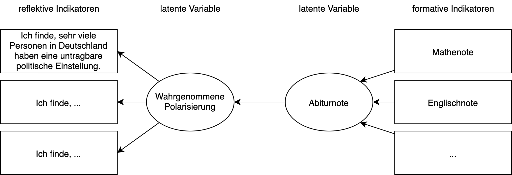
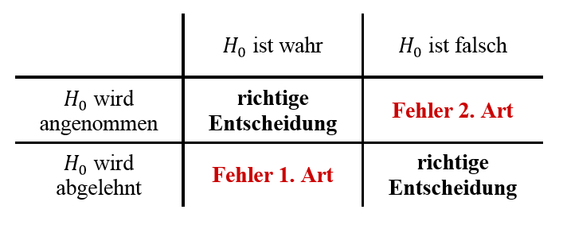

```{r setup, include=FALSE}
library(tidyverse)
library(datasets)
library(kableExtra)
library(purrr)
library(scales)
library(forecast)
library(likert)
library(jmv)
options(htmltools.dir.version = FALSE)
knitr::opts_chunk$set(cache = FALSE, fig.align = "center", dev = "png", fig.retina = 2)
theme_set(theme_gray(base_size = 16))
```


# Wiederholung
## Skalenniveaus, Messniveaus

--

  - Nominal, Ordinal, Intervall
  - `factor`, `ordered`, `numeric`

--

## Nominal 
- Test auf Gleichheit

--

## Ordinal
- Ordnungen

--

## Intervall
- Abstände und Relationen
- Für viele Verfahren benötigt (z.B. lineare Regression)

---
# Forschungsmodell
## Notation
Forschungsfrage: Wirkt sich die Schulnote auf die wahrgenommene Polarisierung aus?




---

# Deskriptive Statistik
Die deskriptive (beschreibende) Statistik hat zum Ziel, empirische Daten durch Kennzahlen und Tabellen (auch: Maßzahlen oder Parameter) *und* Grafiken übersichtlich darzustellen und zu ordnen. 

## Zentrale Tendenz

--
- Wo liegt das "Zentrum" der Daten?
- Mittelwert, Median, Modus

## Dispersion

--
- Wie streuen die Daten um das "Zentrum"?
- Varianz, Standardabweichung, AD-Streuung

## Verteilung

--
- Kurtosis (lepto-, meso-, platykurtisch)
- Schiefe (links, rechts)

---
# Übersicht über Verteilungen


---
## Null-Hypothesen Signifikanz Test (NHST)
Jeder Test benötigt:
- Null-Hypothese $H_0$ - Wie die Welt ohne unsere Erkenntnis sein sollte.
- Alternativ-Hypothese $H_1$ - Der gefundene Wert in unserer Stichprobe.
- Freiheitsgrade (df) - Werden aus der Stichprobengröße berechnet.

Jeder Test liefert:
- eine Teststatistik, z.B. $t$
- einen Signifikanz-Wert, $p$

Wir legen fest:
- Signifikanz-Niveau $\alpha = 0.05$ - Schwelle, ab der wir die Null-Hypothese verwerfen.
  - unser p-Wert muss also kleiner sein als 0.05 
  
---
# Fehler 1. Art und Fehler 2. Art
- $\alpha$-Fehler: Fehler 1. Art, wird über das Signifikanz-Niveau festgelegt.
- $\beta$-Fehler: Fehler 2. Art, wird über die Stichprobengröße festgelegt.

 


---
# Testverfahren

## Unterschiedhypothesen

--
- t-Test für Mittelwertsunterschiede 
  - simple, independent sample, depdentent sample

--
- (M)AN(C)OVA - Mittelwertsunterschide mehrere Gruppen
  - Faktoren und Covariate, univariate und multivariate, one-way und two-way

--

## Zusammenhangshypothesen

--
- Korrelation für Zusammenhänge
  - Wertebreich [-1;1]
  - 3 Varianten (Pearson, Spearman, Kendall)
  

--
- Lineare Regression
  - Prädiktion einer intervall-skalierten Variable
  - Multiple LR


---
# Schwierigkeiten für Sozialwissenschaften
- Womit können wir intervallskalierte Daten messen?

--

## Likert Skalen
- Entwickelt von Rensis Likert (5-Point Likert Scale) zum Messen von Einstellungen.
- Einzelne Items werden ordinal gemessen:
  -z.B.: KUT: 8 Items
- Dabei sind die Stufen benannt:
  - 5P: Stimme sehr zu, stimme zu, neutral, stimme nicht zu, stimme gar nicht zu
  - 6P: Stimme sehr zu, stimme zu, stimme eher zu, stimme eher nicht zu, stimme nicht zu, stimme gar nicht zu
- Skalenstufen werden ganzzahligen Werten zugeordnet (z.B.: 0-4, 0-5, 1-6, etc.)

---
# Gerarde oder ungerade?
## Gerade Likert-Skalen
- Forced choice
- Vermeiden von Antworten wird reduziert

## Ungerade Likert-Skalen
- Möglichkeit keine Meinung abzugeben
- Möglichkeit neutrale Meinung abzugeben.


## "Keine Angabe" als N+1te Option

---
# Ordinal oder Intervall
Ob einzele Items Likert-Skalen ordinal oder intervall-skalierte Daten liefert, wird immernoch diskutiert.

## Wo ist der Unterschied?

--

- Willkürliche Wahl der "Labels"

--

- Gleichabständigkeit?

--

- Auswahl der Verfahren 
  - ordinale vs. lineare Regression
  - t-Test vs. Wilcoxon signed Rank test

--

## Ab 4 (besser 8) Items intervallskaliert
- Summative Skala
- Zentraler Grenzwertsatz


---
# Visuelle Analyse von Likert Skalen

```{r, echo=F}

library(likert)
dataforsocialscience::robo_care %>% select(starts_with("robo")) %>% select(1:5) -> df_part

agree <- function(x) {
  factor(as.character(x), levels = 1:6, ordered = T, 
         labels = c("strongly disagree",
                    "disagree",
                    "rather disagree",
                    "rather sagree",
                    "agree",
                    "strongly agree"))
}

df_part %>% mutate_all(agree) %>% as.data.frame() -> df_lik 

```
 
```{r, fig.height=5}
lik <- df_lik %>% likert()
plot(lik, type = "bar")


```
Gallerie: https://github.com/jbryer/likert

---
# Numerische Analyse

```{r}
psych::describe(df_lik)
```

---
class:center, middle
# Skalenbildung
 1.Variablenauswahl (korrelierende Variablen)

 2.Faktoranalyse (Principal Component Analysis)

 3.Reliabilitätsanalyse (Cronbach's Alpha) 
 
---
<style>
.remark-code, .remark-inline-code { font-family: 'Source Code Pro', 'Lucida Console', Monaco, monospace;
                                    font-size: 75%;
                                  }
</style>                              
# Skalenbildung

- Items die stark korrelieren kommen in Betracht

```{r}
jmv::corrMatrix(df_part, vars = names(df_lik))
```


---
# Faktorenanalyse
Die Faktorenanalyse prüft ob die Varianz mehrere Variablen eine (oder mehrere) gemeinsame Dimensionen beschreiben.

## Beispiel: Big Five Persönlichkeit
- Ich bin eher zurückhaltend, reserviert. 
- Ich schenke anderen leicht Vertrauen, glaube an das Gute im Menschen. 
- Ich bin bequem, neige zur Faulheit. 
- Ich bin entspannt, lasse mich durch Stress nicht aus der Ruhe bringen. 
- Ich habe nur wenig künstlerisches Interesse. 
- Ich gehe aus mir heraus, bin gesellig. 
- Ich neige dazu, andere zu kritisieren. 
- Ich erledige Aufgaben gründlich. 
- Ich werde leicht nervös und unsicher. 
- Ich habe eine aktive Vorstellungskraft, bin fantasievoll.


---
# Faktorenanalyse
Die Faktorenanalyse prüft ob die Varianz mehrere Variablen eine (oder mehrere) gemeinsame Dimensionen beschreiben.

## Beispiel: Big Five Persönlichkeit
- Ich bin eher zurückhaltend, reserviert. (Extraversion)
- Ich schenke anderen leicht Vertrauen, glaube an das Gute im Menschen. (Verträglichkeit)
- Ich bin bequem, neige zur Faulheit. (Gewissenhaftigkeit)
- Ich bin entspannt, lasse mich durch Stress nicht aus der Ruhe bringen. (Neurotizismus)
- Ich habe nur wenig künstlerisches Interesse. (Offenheit)
- Ich gehe aus mir heraus, bin gesellig. (Extraversion)
- Ich neige dazu, andere zu kritisieren. (Verträglichkeit)
- Ich erledige Aufgaben gründlich. (Gewissenhaftigkeit)
- Ich werde leicht nervös und unsicher. (Neurotizismus)
- Ich habe eine aktive Vorstellungskraft, bin fantasievoll. (Offenheit)
---
# Faktorenanalyse
- Exploratives, strukturentdeckendes Verfahren

Erstmal 2-Dimensionaler Fall:
- Multivariate Daten, die korrelieren

```{r, warning=FALSE, fig.height=5}
psych::bfi %>% ggplot() + aes(C1, C2) + geom_jitter() + geom_smooth(method = "lm") + labs(caption="Jitter-Plot 10%")
```

---
# Faktoren-Analyse
## Was passiert da eigentlich?
Rotation der Hauptachsen zur Reduktion der Streuung in der Nebenachse

---
# Faktorenanalyse durchführen

```{r eval=FALSE, message=FALSE, warning=FALSE, include=TRUE}
jmv::pca(df_part, vars = names(df_part), 
         screePlot = TRUE, 
         eigen = TRUE, 
         kmo = TRUE, 
         bartlett = TRUE, 
         factorCor = TRUE) 

```

---
# Faktorenanalyse durchführen
## Vorraussetzungen prüfen
- Bartlett's Test muss signifikant werden
- KMO MSA > 0.8
```{r eval=T, message=FALSE, warning=FALSE, echo=F}
res <- jmv::pca(df_part, vars = names(df_part), 
         eigen = T, 
         kmo = T, 
         bartlett = T,
         factorCor = T) 
res$assump


```

---
# Faktorenanalyse durchführen
## Eigenwerte
- Aufgeklärte Varianz pro Faktor (Komponente)
- Hinweis auf Anzahl Faktoren
```{r eval=T, message=FALSE, warning=FALSE, echo=F}
res$eigen


```
---
# Faktorenanalyse durchführen
## Korrelationen der Faktoren
- Stark korrelierende Faktoren können problematisch sein
- Hängt von der Rotation ab: Varimax
```{r eval=T, message=FALSE, warning=FALSE, echo=F}
res$factorStats

```

---
# Faktorenanalyse durchführen
## Ladungen der Items auf Faktoren
- Ladungen sollten groß sein (>0.8)
- Uniqenuess zeigt an, welcher Varianzanteil im Faktor verloren geht.
```{r eval=T, message=FALSE, warning=FALSE, echo=F}
res$loadings

```

---
# Faktorenanalyse durchführen
## Screeplot
- Wo unterschreiten die Eigenwerte die simulierten Daten
```{r echo=F, message=FALSE, warning=FALSE, fig.height = 5}
jmv::pca(df_part, vars = names(df_part), screePlot = T) -> model

model$eigen$screePlot

```


---
class: center, middle
# Faktoren identifiziert!
Nächster Schritt: summative Skala bilden!

Items weglassen?

---
# Reliabilitätsanalyse

- Prüft, ob die Skala in sich reliabel misst (interne Reliabilität). 
- Passen die Items "zusammen".

- Gemessen wird "Cronbach's alpha".

## Schwellwerte Cronbach's alpha
 Internal consistency
- 0.9 ≤ α	Excellent
- 0.8 ≤ α < 0.9	Good
- 0.7 ≤ α < 0.8	Acceptable
- 0.6 ≤ α < 0.7	Questionable
- 0.5 ≤ α < 0.6	Poor
- α < 0.5	Unacceptable

---
# Reliabilität in R
```{r}
psych::alpha(df_part)
```

---
# Beispiel mit mehr Faktoren
Datensatz `bfi` aus dem `psych` paket

```{r paged.print=TRUE}

psychTools::bfi.dictionary %>% select(Item) %>%  kable()
```

---
# Beispiel mit mehr Faktoren
Datensatz `bfi` aus dem `psych` paket
```{r eval=T, message=FALSE, warning=FALSE, echo=F}
df <- psych::bfi %>% select(-gender, -education, -age)
model <- psych::pca(df, nfactors = 5)
psych::fa.diagram(model)
```


---
# Beispiel mit mehr Faktoren
Datensatz `bfi` aus dem `psych` paket

```{r eval=T, message=FALSE, warning=FALSE, echo=F}
res <- jmv::pca(df, vars = names(df), 
         eigen = T, 
         kmo = T, 
         bartlett = T,
         factorCor = T) 
res$assump

```

---
# Eigenwerte
```{r eval=T, message=FALSE, warning=FALSE, echo=F}
res$eigen
```


---
# Screeplot

```{r eval=T, message=FALSE, warning=FALSE, echo=F}
jmv::pca(df, vars = names(df), screePlot = T) -> model
model$eigen$screePlot
```

---
# Ladungen
```{r eval=T, message=FALSE, warning=FALSE, echo=F}
res$loadings

```

---
# Zusammenfassung

## Likert-Skalen
- Vor- und Nachteile
- Ordinal oder Intervall

## Faktoranalyse
- Korrelationsanalyse
- Principal-Component-Analysis (PCA)
  - Vorraussetzungen: KMO und Bartlett
  - ggfs. Korrelation
  - Eigenwerte
  - Ladungen

## Reliabilitätsanalyse


---
class: inverse, center, middle
---
class: inverse, center, middle
## .yellow[ [Zurück zur Übersicht](index.html)]
