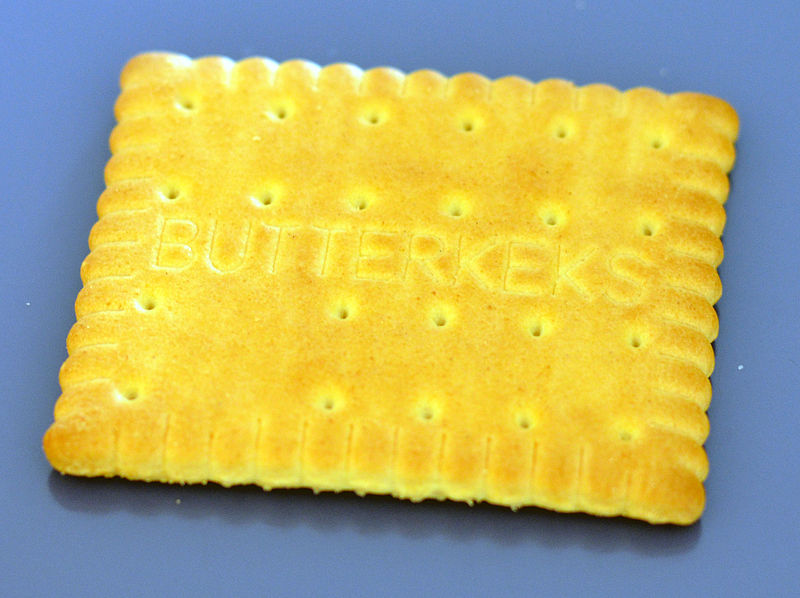

```{r setup, include=FALSE}
knitr::opts_chunk$set(echo = TRUE)
library(tidyverse)
library(knitr)
library(dataforsocialscience)
library(jmv)
set.seed(123)
options(htmltools.dir.version = FALSE)
knitr::opts_chunk$set(cache = FALSE, fig.align = "center", dev = "png", fig.retina = 2, echo = FALSE)
theme_set(theme_gray(base_size = 16))
```

```{r child="header.Rmd"}
```


# Faktorenanalyse
Die Faktorenanalyse prüft ob die Varianz mehrere Variablen eine (oder mehrere) gemeinsame Dimensionen beschreiben.

---
class: inverse, center, middle

# Wir brauchen Daten

Fiktiver Fragebogen

---

# 4 Fragen:
```{r figureoutputc1, echo=FALSE, out.width="80%"}

```

Wie gut schmecken diese Schokokekse (Schieberegler 1-6)


---

# 4 Fragen:
```{r figureoutputc2, echo=FALSE, out.width="80%"}

```
Wie gut schmecken diese Butterkekse (Schieberegler 1-6).

---

# 4 Fragen:
```{r figureoutputb1, echo=FALSE, out.width="80%"}

```

Wie gut schmeckt dieser Burger (1-6).

---

# 4 Fragen:
```{r figureoutputb2, echo=FALSE, out.width="80%"}

```
Wie gut schmeckt dieser Cheesburger (1-6).

---
# Ergebnisse

1. Proband

```{r echo=FALSE, paged.print=TRUE}
sample_size  <- 1
fdata <- data.frame(
  pseudonym = c("CookieLover"),
  cookie1 = rnorm(sample_size, 5, 0.5),
  cookie2 = rnorm(sample_size, 5, 0.5),
  burger1 = rnorm(sample_size, 2, 0.5),
  burger2 = rnorm(sample_size, 2, 0.5)
) %>% bind_rows(data.frame(
  pseudonym = c("Hmbrglr"), 
  cookie1 = rnorm(sample_size, 2, 0.5),
  cookie2 = rnorm(sample_size, 2, 0.5),
  burger1 = rnorm(sample_size, 5, 0.5),
  burger2 = rnorm(sample_size, 5, 0.5)
)) %>% bind_rows(data.frame(
  pseudonym = c("No, this is Patrick"), 
  cookie1 = rnorm(sample_size, 5, 0.5),
  cookie2 = rnorm(sample_size, 5, 0.5),
  burger1 = rnorm(sample_size, 5, 0.5),
  burger2 = rnorm(sample_size, 5, 0.5)
))


fdata %>% head(1) %>% knitr::kable(digits = 3)
```
--


```{r figureoutputcookiemon, echo=FALSE, out.width="40%"}

```

---
# Ergebnisse

Nächster Proband

```{r echo=FALSE, paged.print=TRUE}
fdata %>% head(2) %>% knitr::kable()
```

--

```{r figureoutputburglar, echo=FALSE, out.width="40%"}

```


---
# Ergebnisse

Nächster Proband

```{r echo=FALSE, paged.print=TRUE}
fdata %>% knitr::kable()
```

--

```{r figureoutputpatrick, echo=FALSE, out.width="40%"}

```

---


# Daten plotten

.pull-left[

```{r echo=FALSE}
fdata %>% ggplot() +
  aes(x = burger1, y = cookie1, color = pseudonym) +
  geom_point(size = 5) +
  scale_x_continuous(limits = c(0,7)) +
  scale_y_continuous(limits = c(0,7)) +
  theme_bw(base_size = 24)
```
]

--

.pull-right[

```{r echo=FALSE}
fdata %>% ggplot() +
  aes(x = burger2, y = cookie2, color = pseudonym) +
  geom_point(size = 5) +
  scale_x_continuous(limits = c(0,7)) +
  scale_y_continuous(limits = c(0,7)) +
  theme_bw(base_size = 24)
```
]

---
class: center, middle

# Wir haben selten nur 3 Probanden

---

# 200 Probanden

.pull-left[
```{r echo=FALSE}
sample_size <- 1000

cookie_monsters <- data.frame(
  cookie1 = rnorm(sample_size, 5, 0.5),
  cookie2 = rnorm(sample_size, 5, 0.5),
  burger1 = rnorm(sample_size, 2, 0.5),
  burger2 = rnorm(sample_size, 2, 0.5)
)

burglars <- data.frame(
  cookie1 = rnorm(sample_size, 2, 0.5),
  cookie2 = rnorm(sample_size, 2, 0.5),
  burger1 = rnorm(sample_size, 5, 0.5),
  burger2 = rnorm(sample_size, 5, 0.5)
)

slimers <- data.frame(
  cookie1 = rnorm(sample_size, 5, 0.5),
  cookie2 = rnorm(sample_size, 5, 0.5),
  burger1 = rnorm(sample_size, 5, 0.5),
  burger2 = rnorm(sample_size, 5, 0.5)
)


my_data <- cookie_monsters %>% 
  bind_rows(burglars) %>% 
  bind_rows(slimers)

my_data %>% 
  ggplot() +
  aes(x = cookie1, y = burger1) +
  geom_point(alpha = 0.5) +
  scale_x_continuous(limits = c(0,7)) +
  scale_y_continuous(limits = c(0,7)) +
  theme_bw(base_size = 24)
```
]

.pull-right[
```{r}
my_data %>% ggplot() +
  aes(x = cookie2, y = burger2) +
  geom_point(alpha = 0.5) +
  scale_x_continuous(limits = c(0,7)) +
  scale_y_continuous(limits = c(0,7)) +
  theme_bw(base_size = 24)
```

]

---

# Scatterplotmatrix

```{r}

library(GGally)
cookie_monsters %>% 
  bind_rows(burglars) %>% 
  bind_rows(slimers) %>% 
  ggpairs(diag = "blankDiag", progress = FALSE,
          lower = list(continuous = wrap("smooth", alpha = 0.1, size = 0.1)))

```


---
# Explorative Faktoranalyse

## Frage:
Liegt hinter den gemesseen Variablen ein Faktoren-Modell?
Erklärt eine tieferliegende latente Variable, die manifesten Variablen?

> z.B.: Vorliebe für süß und salzig?

--

## Zwei Verfahren

- Explorative Faktoranalyse (EFA)
- Hauptkomponentenanalyse (PCA)


---
# Explorative Faktoranalyse
```{r echo = TRUE}
my_data %>% jmv::efa()
```
Uniqueness: Varianz, die nur in dieser Variable steckt

---
# Hauptkomponentenanalyse
```{r echo=TRUE}
my_data %>% jmv::pca()
```

Uniqueness: Varianz, die nur in dieser Variable steckt

---


# Faktoranalyse
Egal, ob mit PCA oder EFA, folgende Schritte müssen gemacht werden.

## Darf ich die Faktoranalyse durchführen?
1. Bartlett-Test (Sphärizität)
2. KMO-Test (Stichprobengüte)

## Faktoranalyse durchführen

1. Scree-Plot sichten
1. Ladungstabelle sortieren und prüfen
2. Aufgeklärte Varianz prüfen

## Scoring berechnen

---
# Bartlett-Test auf Sphärizität 
Sind meine Daten multivariat normalverteilt?

```r
my_data %>% jmv::efa(bartlett = T)
```

```{r}
res <- my_data %>% jmv::efa(bartlett = T)
res$assump
```
Test muss signifikant werden! Sonst, keine Faktoranalyse!

--

> Die Daten weisen hinreichende Sphärizität für eine Faktoranalyse auf (Bartlett-Test $\chi^2(6) = 10287, p \lt .0001$).

---
# Kaiser-Meyer-Olkin Test
Sind meine Variablen in der Stichprobe hinreichend korreliert und misst jede Variable etwas "eigenes" ?

```r
my_data %>% jmv::efa(kmo = T)
```

```{r}
res <- my_data %>% jmv::efa(kmo = T)
res$assump
```
Werte müssen > 0.6 sein. Idealerweise > 0.8. Sonst, Items weglassen.

--

> Die Daten haben eine hinreichende Stichprobengüte und sind für eine Faktoranalyse geeignet (KMO > 0.6 und MSA = 0.614).

---

# Scree-Plot sichten
Wieviele Faktoren bekommen wir?
```r
my_data %>% jmv::efa(screePlot = TRUE)
```


```{r, fig.asp=0.681}
res <- my_data %>% jmv::efa(screePlot = T)
res$eigen
```
## Parallelen-Analyse
Wo schneiden sich die Linien?
---
# Ladungstabelle sortieren und prüfen

```{r echo=TRUE}
my_data %>% jmv::efa(hideLoadings = 0.0, sortLoadings = TRUE)
```
---
# Ladungstabelle sortieren und prüfen

```{r echo=TRUE}
my_data %>% jmv::efa(hideLoadings = 0.1, sortLoadings = TRUE)
```

---
# Ladungstabelle sortieren und prüfen

```{r echo=TRUE}
my_data %>% jmv::efa(hideLoadings = 0.3, sortLoadings = TRUE)
```

---
# Ladungstabelle sortieren und prüfen

```{r echo=TRUE}
my_data %>% jmv::efa(sortLoadings = TRUE)
```

--

## Wofür stehen die Faktoren?

---
# Aufgeklärte Varianz prüfen

```r
my_data %>% jmv::efa(factorSummary = T)
```


```{r}
res <- my_data %>% jmv::efa(factorSummary = T)
res$factorStats
```

--

> Das Modell mit 2 Faktoren erklärt 89% der Varianz.


---

# Scoring berechnen
Cronbach's alpha prüfen (idealerweise > 0.8).

```{r echo=T}
res <- my_data %>% 
  select(cookie1, cookie2) %>% 
  psych::alpha(check.keys = T)
summary(res)
```

--
## Items weglassen?

```{r echo=T}
res$alpha.drop
```

--

> Die Skala Cookie zeigt eine sehr gute Reliabilität (Cronbach's $\alpha = .943$).


---
# Reliabilitätsanalyse

- Prüft, ob die Skala in sich reliabel misst (interne Reliabilität). 
- Passen die Items "zusammen".

- Gemessen wird "Cronbach's alpha".

## Schwellwerte Cronbach's alpha
 Internal consistency
- 0.9 ≤ α	Excellent
- 0.8 ≤ α < 0.9	Good
- 0.7 ≤ α < 0.8	Acceptable
- 0.6 ≤ α < 0.7	Questionable
- 0.5 ≤ α < 0.6	Poor
- α < 0.5	Unacceptable

---
# Score an Daten anhängen

```{r echo=T, paged.print=TRUE}
my_new_data <- data.frame(my_data, cookie = res$scores)
my_new_data 

```
---

# Alternative mit `hcictools`

Wenn beispielsweise etablierte Skalen eingesetzt werden.

```r
my_new_data <- my_data %>% 
  hcictools::auto_score("cookie") %>% 
  hcictools::auto_score("burger")
```

```{r include=FALSE}
my_new_data <- my_data %>% 
  hcictools::auto_score("cookie") %>% 
  hcictools::auto_score("burger")
```

```{r echo=T}
my_new_data %>% sample_n(5) %>% kable()
```


---
class: center, inverse, middle
# Anwendung mit realen Daten


---
# Anwendungsbeispiel
Frage: Gibt es eine Faktorstruktur in der Akzeptanz menschlicher Pflege?

Zuerst filtern wie die Spalten, die wir brauchen.

```{r echo = TRUE}
robo_care_human <- robo_care %>% select(starts_with("human"))
```

--

Dann Voraussetzungen prüfen:
1. Bartlett-Test auf Sphärizität
2. Kaiser-Meyer-Olkin Kriterium (Stichprobeneignung)

--

2. ScreePlot sichten

--

3. Ladungstabelle sortieren und prüfen

--

4. Aufgeklärte Varianz prüfen

--
5. Reliabilitätsanalyse 

--
Berichten!

---
# 1. Schritt Voraussetzungen prüfen

.pull-left[
```{r echo=TRUE}
res <- robo_care_human %>% 
  jmv::efa(bartlett = T)

 res$assump
```
]

.pull-right[
```{r echo=TRUE}
res <- robo_care_human %>% 
  jmv::efa(kmo = T)

 res$assump
```
]

---
# Screeplot sichten

```{r echo=TRUE, fig.asp=0.681}
res <- robo_care_human %>% 
  jmv::efa(screePlot = T)

res$eigen
```

---
# Ladungstabelle sortieren und prüfen
```{r echo=TRUE, fig.asp=0.681}
loads <- robo_care_human %>% 
  jmv::efa(hideLoadings = 0.3, sortLoadings = T)

loads$loadings
```

---
# Varianzaufklärung prüfen

```{r}
res <- robo_care_human %>% jmv::efa(factorSummary = T)
res$factorStats
```

---
# Reliabilitätsanalyse 1/3

```{r echo=TRUE}
res <- robo_care_human %>% 
  select(human_wash, human_toilet, human_body, human_bath) %>% 
  psych::alpha(check.keys = T)
summary(res)
```

# Items weglassen?
```{r echo=TRUE}
res$alpha.drop
```

---
# Reliabilitätsanalyse 2/3

```{r echo=TRUE}
res <- robo_care_human %>% 
  select(human_hair_cut, human_face, human_hair_wash, human_mass) %>% 
  psych::alpha(check.keys = T)
summary(res)
```

# Items weglassen?
```{r echo=TRUE}
res$alpha.drop
```

---
# Reliabilitätsanalyse 3/3

```{r echo=TRUE}
res <- robo_care_human %>% 
  select(human_bed, human_med, human_food) %>% 
  psych::alpha(check.keys = T)
summary(res)
```

# Items weglassen?
```{r echo=TRUE}
res$alpha.drop
```


---
# Berichten


Mit den Variablen zur Akzeptanz menschlicher Pflege wurde ein explorative Faktoranalyse durchgeführt.
Die Daten weisen eine hinreichende Sphärizität auf (Bartlett-Test $\chi^2(55)=2075, p \lt .0001$). 
Zusätzlich ist die Stichprobeneignung gegeben (KMO > 0.8 und MSA = 0.892).
--
Dabei konnten drei Faktoren ermittelt werden (siehe Table: Faktorenladungen). 
Der erste Faktor (KNP) bestimmt dabei vornehmlich die Akzeptanz für körpernahe Pflege (Waschen, Toilettengang, Körper waschen, Baden). Die Skala zeigt eine sehr gute Reliabilität (Cronbach's $\alpha = .89$).
Der zweite Faktor (SERV) beeinflusst die Akzeptanz für körpernahe Pflege, die typischerweise auch als Dienstleistung angeboten wird (Haare schneiden, Haare waschen, Massagen, Gesichtspflege). Die Skala zeigt eine sehr gute Reliabilität (Cronbach's $\alpha = .86$).
Der dritte Faktor (CARE) beeinflust die Akzeptanz für allgemeine Pflegetätigkeiten (ins Bett bringen, Medikamente geben, füttern lassen). Die Skala zeigt eine sehr gute Reliabilität (Cronbach's $\alpha = .8$).
Das Modell mit drei Faktoren konnte in Summe 66% der Varianz der Items aufklären.


---
# Ladungstabelle

```{css, echo = FALSE}
.teeny .remark-code { /*Change made here*/
  font-size: 70% !important;
}
div.tiny { /*Change made here*/
  font-size: 70% !important;
}
```

.tiny[
```{r echo=T}
options(knitr.kable.NA = '')
loads$loadings$asDF %>% 
  tibble() %>% 
  kable(digits = 2, caption = "Faktorladungen der Items für menschliche Pflege", 
        col.names = c("Items", "KNP", "SERV", "CARE", "Uniqueness"))
```
]


---
class: center, middle, inverse
# Moment, da war noch was

---
# Rotationen

## Was passiert da eigentlich?
Rotation der Hauptachsen zur Reduktion der Streuung in der Nebenachse


---
```{css, echo = FALSE}
.tiny .remark-code { /*Change made here*/
  font-size: 80% !important;
}
.teeny .remark-code-line{ /*Change made here*/
  font-size: 80% !important;
}
```


# Oblimin Rotation

Faktoren dürfen nachher korrelieren!

.tiny[
```{r echo=TRUE}
robo_care_human %>% jmv::efa(rotation = "oblimin", factorCor = T)
```
]
---
# Varimax Rotation

Faktoren dürfen nachher nicht korrelieren!

.tiny[
```{r echo=TRUE}
robo_care_human %>% jmv::efa(rotation = "varimax", factorCor = T)
```
]

---
# Zusammenfassung

## Zwei Verfahren zur Faktoranalyse
1. EFA - ermittelt zugrunde liegende Faktorstruktu
2. PCA - Vereint Variablen zu so wenig Faktoren wie möglich

## Arbeitsschritte
1. Voraussetzungen prüfen
2. Faktoranalyse durchführen 
3. Skalenreliabilität prüfen
4. Skalen berechnen

---
class: inverse, center, middle
---
class: inverse, center, middle
## .yellow[ [Zurück zur Übersicht](index.html)]

