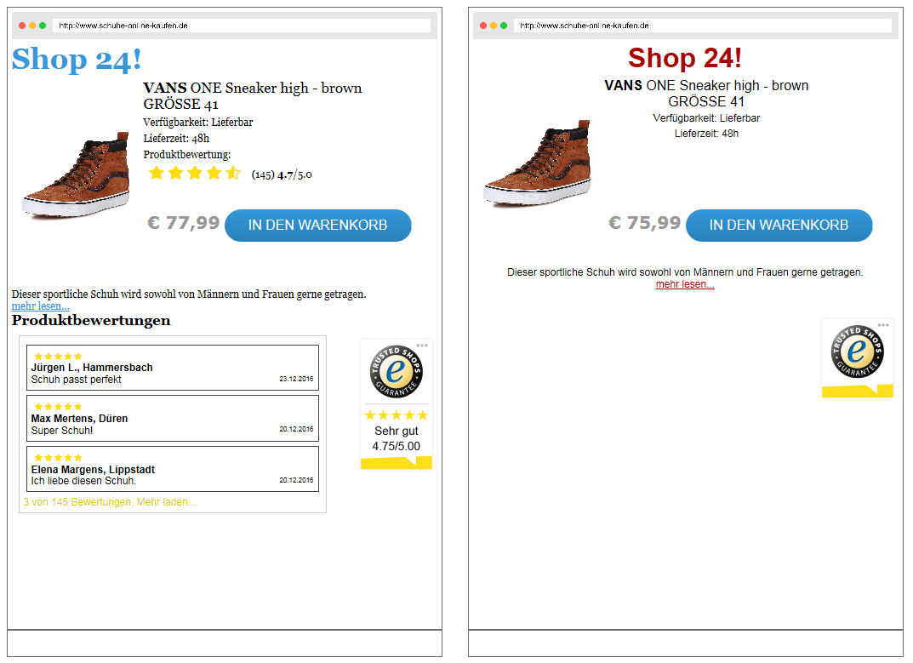
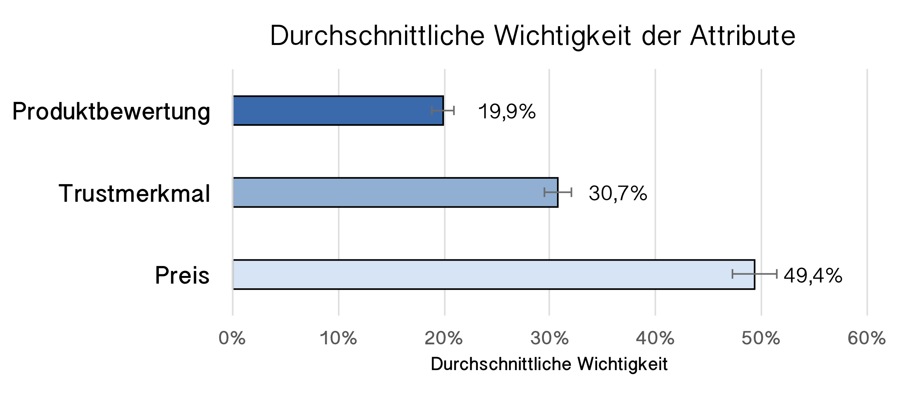
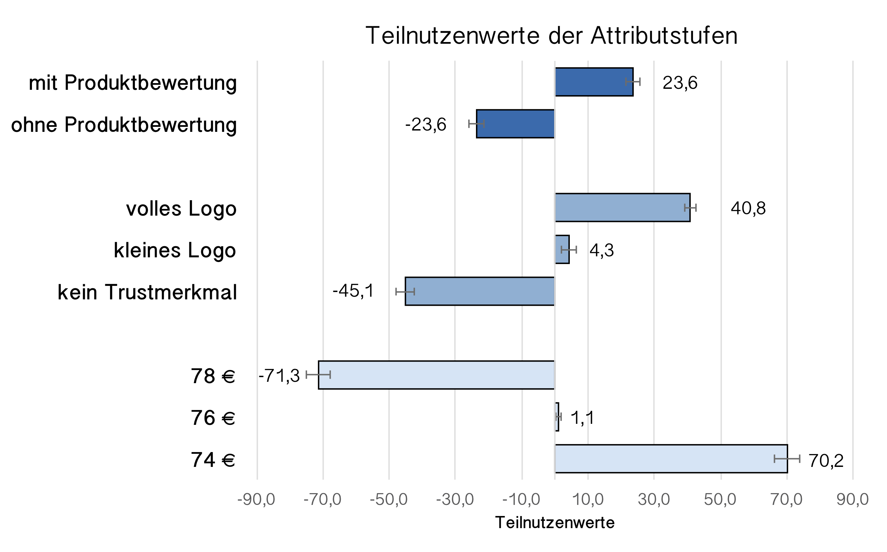
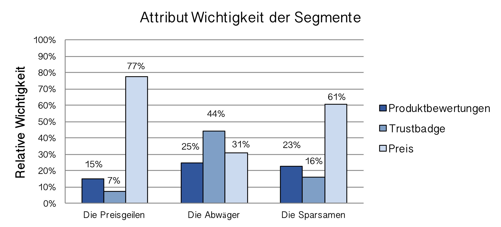

```{r setup, include=FALSE}
library(tidyverse)
library(datasets)
library(kableExtra)
library(purrr)
library(scales)
library(forecast)
library(likert)
library(jmv)
options(htmltools.dir.version = FALSE)
knitr::opts_chunk$set(cache = FALSE, fig.align = "center", dev = "png", fig.retina = 2)
theme_set(theme_gray(base_size = 16))
```

# Conjoint-Verfahren

Bisherige Erhebungsverfahren hatten das Ziel der *Parameter-Isolation*

Beispiel: 
- Trust nach McKnight et al. (2002)
  - 4 Skalen mit 3 Items auf 5-Punkt Likert Skala messen Vertrauen in z.B. Internetangebote
  - Beispiel: "Normalerweise vertraue ich Menschen, bis Sie mir einen Anlass dazu geben es nicht mehr zu tun."


Vorteile:
- Einfache Aufgabe für den Probanden
- Einfache Analyse Verfahren

Nachteile:
- Menschen bewerten für reale Entscheidunge isolierte Paramter anders als verbundene
- Überbewertung von sensiblen Parameter

---
# Conjoint Verfahren
## Bewertung einer einzel Entscheidung

- Wie wichtig ist der Preis beim Handykauf?

## Bewertung einer verbundenen Entscheidung

- Handy A: 4 Zoll Display, 8MP Kamera, 499 Euro
- Handy B: 3,5 Zoll Display, 4MP Kamera, 459 Euro

Entscheidungen werden in Realität verbunden getroffen.
- "Es gibt kein Apple Telefon mit Android."

---
# Wie misst man so etwas?
## Choice-Based Conjoint Verfahren
Festlegen von Attributen
- Bildschirmgröße, Kameragüte, Preis

Festlegen von Attributstufen
- 3,5 Zoll, 4 Zoll, 5 Zoll

## Erstellung von Conjoint Decision Tasks
- Benötigt spezielle Software, z.B.: Lighthouse Studio Sawtooth
- Software generiert Entscheidungsaufgaben und variiert dabei die Attributstufen
  - Handy A: 4 Zoll Display, 8MP Kamera, 499 Euro
  - Handy B: 3,5 Zoll Display, 4MP Kamera, 459 Euro
- Probanden wählen aus den Optionen eine Favorisierte


---
# CBC Choice-Based Conjoint
- Die Software berechnet aus den unmittelbaren Gegenüberstellungen
  - Die relative Wichtigkeit des Attributs
  - Den Teilnutzenwerte der Attributstufen

# Segmentierung der Daten
- Probanden können in ihrer Antwortstruktur unterschiedlich sein
  - Kunden, die nur auf den Preis gucken
  - Kunden, die nur auf Marke gucken
- Segmentierung von Probanden anhand von Clustering Verfahren
  - Beschreibung der Probanden anhand der Attributstufen
  
---
# Beispiel-Conjoint

## Vertraunsanbieter im Internet
- Produktbewertung 
- Siegel/Trustmerkmal
- Preis

.pull-left[

]

.pull-left[
## Vergleich
- Bewertung vs keine
- Trust groß vs. Trust klein
- Preis hoch vs Preis niedrig
]
---
# Durchschnittliche Wichtigkeit
- Berechnung mit Hierarchical Bayes Estimation

## Average Importance
- Vergleichbarkeit der Attribute

---
# Relative Teilnutzenwerde

## Relative part-worth utilities
- Vergleichbarkeit der Attributstufen innerhalb
- keine Vergleichbarkeit zwischen Attributen


---
# Segmentierung
- Relative Bewertung von drei Markt-Segmenten



---
# Conjoint-Verfahren
## Choice-based Conjoint
Vorteile:
- Modellierung von Trade-Offs und Kipppunkten
- Realistischere Bewertung von sensiblen Parametern (z.B. Privacy, Trust)

Einschränkungen:
- Große Stichprobe benötigt: 3x3 Design mit 10 Tasks: 120 Probanden
- Attribute müssen für Probanden gut "vorstellbar" sein
- Bewertungen sind für Menschen schwierig
  - zu komplexe Aufgabe führt zu Attribut-fixierung
- Komplexere Tasks mit Adaptive Conjoint oder MaxDiff-Verfahren


---
class: inverse, center, middle
---
class: inverse, center, middle
## .yellow[ [Zurück zur Übersicht](index.html)]
