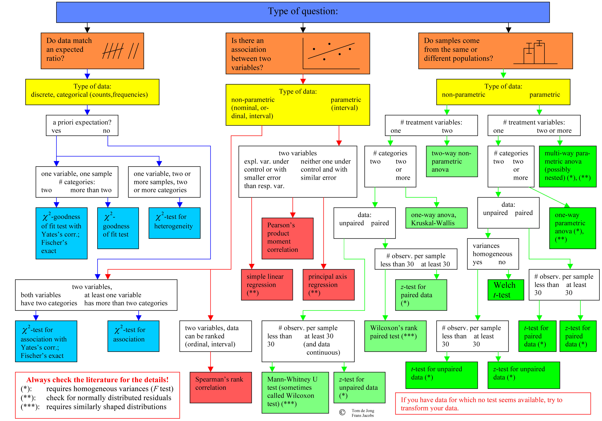

```{r setup, include=FALSE}
#library(plyr)
library(tidyverse)
library(datasets)
library(kableExtra)
library(purrr)
library(scales)
library(forecast)
library(likert)
#library(gghighlight)
library(jmv)
options(htmltools.dir.version = FALSE)
knitr::opts_chunk$set(cache = FALSE, fig.align = "center", dev = "png", fig.retina = 2)
theme_set(theme_gray(base_size = 16))
```

```{r child="header.Rmd"}
```


# Wie wir schätzen
```{r param_data, include=FALSE}
sample_size <- 100
df <-
  data.frame(
    id = 1:sample_size,
    KUT = c(2.1, rnorm(
      sample_size - 1, mean = 3.5, sd = 0.5
    )),
    group = "sample"
  ) %>%
  filter(KUT < 6 && KUT > 1)

df_real <-
  data.frame(
    id = 1:100000,
    KUT = rnorm(sample_size, mean = 3.5, sd = 0.5),
    group = "population"
  )

subs <- function(n = 3) {
  df %>% head(n) %>% bind_rows(df_real)
}

```


```{r echo=FALSE, message=FALSE, warning=FALSE}

my_fn <- function(x) {
  data.frame(yintercept = mean(x))
}

mean_sd <- function(x) {
  data.frame(y = mean(x), ymin = mean(x) - sd(x), ymax = mean(x) + sd(x))
}

my_plot <- function(n, only_dist = F) {
  my_df <- df %>% head(n)
  smean <- mean(my_df$KUT)
  sds <- sd(my_df$KUT)
  
  my_df %>%
    ggplot(aes(x = KUT, y = group)) +
    geom_density() +
    ggbeeswarm::geom_beeswarm(
      groupOnX = F,
      cex = 3,
      size = 3,
      alpha = 0.7,
      beeswarmArgs = list(side = 1)
    ) +
    ggplot2::stat_summary(
      geom = "crossbar",
      fun.data = mean_sd,
      color = "blue",
      width = 0.3
    ) +
    
    geom_function(
      fun = dnorm,
      args = list(m = 3.5, sd = 0.5),
      colour = "red",
      group = "population",
      position = "identity"
    ) +
    geom_crossbar(
      data = df_real,
      x = 3.5,
      xmin = 3,
      xmax = 4,
      group = "population",
      color = "darkred",
      width = 0.3
    ) +
    
    scale_x_continuous(limits = c(1, 6), breaks = 1:6) +
    labs(x = "KUT", y = NULL, title = "Sample and Population Mean") +
    cowplot::theme_minimal_grid() -> p
  
  if (!only_dist) {
    p <- p +
      # our data
      annotate(
        geom = "curve",
        x = 2.55,
        y = 2.3,
        xend = smean - 0.05,
        yend = 2.2,
        curvature = -.3,
        arrow = arrow(length = unit(2, "mm"))
      ) +
      annotate(
        geom = "text",
        x = 2.5,
        y = 2.3,
        label = paste("Sample mean: M =", round(smean, 2)),
        hjust = "right"
      )
    
    if (n > 1) {
      p <- p +
        
        annotate(
          geom = "curve",
          x = 4.5,
          y = 1.7,
          xend = smean - sds + 0.05,
          yend = 1.8,
          curvature = -.5,
          arrow = arrow(length = unit(2, "mm"))
        ) +
        annotate(
          geom = "curve",
          x = 4.5,
          y = 1.7,
          xend = smean + sds + 0.05,
          yend = 1.83,
          curvature = -.4,
          arrow = arrow(length = unit(2, "mm"))
        ) +
        annotate(
          geom = "text",
          x = 4.5,
          y = 1.73,
          label = paste("Sample SD =", round(sds, 2)),
          hjust = "left"
        )
    }
  }
  
  
  p <- p +
    # true data
    annotate(
      geom = "curve",
      x = 2.5,
      y = 1.3,
      xend = 3.45,
      yend = 1.2,
      curvature = -.3,
      arrow = arrow(length = unit(2, "mm"))
    ) +
    annotate(
      geom = "text",
      x = 2.5,
      y = 1.3,
      label = paste("True mean: M = 3.5"),
      hjust = "right"
    ) +
    annotate(
      geom = "curve",
      x = 4.5,
      y = 0.7,
      xend = 3.05,
      yend = 0.8,
      curvature = -.5,
      arrow = arrow(length = unit(2, "mm"))
    ) +
    annotate(
      geom = "curve",
      x = 4.5,
      y = 0.7,
      xend = 4.05,
      yend = 0.8,
      curvature = -.4,
      arrow = arrow(length = unit(2, "mm"))
    ) +
    annotate(
      geom = "text",
      x = 4.5,
      y = 0.7,
      label = paste("True SD = 0.5"),
      hjust = "left"
    ) +
    # true distribution
    annotate(
      geom = "curve",
      x = 2,
      y = 0.7,
      xend = 2.8,
      yend = 0.35,
      curvature = -.2,
      arrow = arrow(length = unit(2, "mm"))
    ) +
    annotate(
      geom = "text",
      x = 2,
      y = 0.7,
      label = paste("True density"),
      hjust = "right"
    )
  
  p
}

my_plot(n = 1, only_dist = T)
  
```


```{r param_estimation, echo=FALSE, message=FALSE, warning=FALSE, results='asis'}
for (i in 1:100) {
  cat(paste0("\n\n---\n# Stichprobe n = ", i))
  print(my_plot(i))
}
```


---

class: inverse, center, middle

# .yellow[Parametrische vs. nicht-parametrische Verfahren]


---

# Was sind Parameter?

$$
	f_{\mu, \sigma}(x) = \frac{1}{\sigma \cdot \sqrt{2\pi}} \cdot e^{-\frac{1}{2} \cdot \left( \frac{x - \mu}{\sigma}\right)^2}
$$

Parameter der Normalverteilung $\mu$ und $\sigma$.


---
# Parametrische Verfahren
Bisherige Verfahren basieren auf der Verteilung der Daten
- t-Test setzt normalverteilte Daten voraus

Wir schätzen *Parameter* der Verteilung und vergleichen Daten mit idealen Verteilungen für Hypothesentests.
- Parameter: Mittelwert, Standardabweichung

## Was sind Parameter?


---

# Was sind parametrische Verfahren?

Nur mit Hilfe von Mittelwert und Standardabweichung allein können wir prüfen, ob z.B. ein Mitelwertsunterschied groß genug ist für ein signifikantes Ergebnis. 


Vorteil:
- einfache Verfahren
- relativ robust gegen Verletzung der Voraussetzung

---
# Nichtparametrische Verfahren
Nicht immer sind Parameter oder Verteilungen der Daten bekannt.
- Nicht-parametrische Verfahren setzen diese nicht voraus.

## Beispiel:
- t-Test und Mann-Whitney U test
- Pearson und Spearman rank correlation
- lineare Regression und ordinale Regression
- ANOVA und Kruskal-Wallis Test


---
## Wann welcher Test?

---
# Tools zum Lernen oder Nachschlagen

Wann welche Methode?
- https://statkat.com (Englisch)
- https://www.methodenberatung.uzh.ch/de.html Methodenberatung Uni Zürich (SPSS)
- Andy Field 

Alternative Softwarelösungen zu R
- SPSS (Nachteil: Kosten, Reproducibility)
- Jamovi (Nachteil: kein Data Cleaning)
- JASP (Nachteil: Fokus auf Bayes'sche Statistik)
- Stata (Nachteil: Kosten)
- etc..

---
class: inverse, center, middle
---
class: inverse, center, middle
## .yellow[ [Zurück zur Übersicht](index.html)]
